## Nama : Andika Ainur Wibowo
## NIM : 2141720238
## Kelas : TI-1F
## No Absen : 07

## Pertemuan 10

**8.2 Praktikum 1 Queue**

Source Code Queue
```java
package SourceCode.Praktikum1;

public class Queue {
    int[] data;
    int front;
    int rear;
    int size;
    int max;
    public Queue(int n){
        max = n;
        data=new int[max];
        size=0;
        front=rear=-1;
    }
    boolean IsFull(){
        if(size==max){
            return true;
        }else{
            return false;
        }
    }
    boolean IsEmpty(){
        if(size==0){
            return true;
        }else{
            return false;
        }
    }
    void peek(){
        if(!IsEmpty()){
            System.out.println("Elemen terdepan: "+data[front]);
        }else{
            System.out.println("Queue masih kosong");
        }
    }
    void print(){
        if(IsEmpty()){
            System.out.println("Queue masih kosong");
        }else{
            int i=front;
            while(i!=rear){
                System.out.print(data[i]+" ");
                i=( i + 1 ) % max;
            }
            System.out.println(data[i]+" ");
            System.out.println("Jumlah elemen = "+size);
        }
    }
    void clear(){
        if(!IsEmpty()){
            front=rear=-1;
            size=0;
            System.out.println("Queue berhasil dikosongkan");
        }else{
            System.out.println("Queue masih kosong");
        }
    }
    void Enqueue(int dt){
        if(IsFull()){
            System.out.println("Queue sudah penuh");
        }else{
            if(IsEmpty()){
                front=rear=0;
            }else{
                if(rear==max-1){
                    rear=0;
                }else{
                    rear++;
                }
            }
            data[rear]=dt;
            size++;
        }
    }
    int Dequeue(){
        int dt=0;
        if(IsEmpty()){
            System.out.println("Queue masih kosong");
        }else{
            dt=data[front];
            size--;
            if(IsEmpty()){
                front = rear = -1;
            }else{
                if(front==max-1){
                    front=0;
                }else{
                    front++;
                }
            }
        }
        return dt;
    }
}
```

Source Code QueueMain praktikum 1
```java
package SourceCode.Praktikum1;
import java.util.Scanner;
public class QueueMain {
    static void menu(){
        System.out.println("Masukkan operasi yang diinginkan");
        System.out.println("1. Enqueue");
        System.out.println("2. Dequeue");
        System.out.println("3. print");
        System.out.println("4. peek");
        System.out.println("5. Clear");
        System.out.println("------------------------");
    }
    public static void main(String[] args) {
        Scanner sc=new Scanner(System.in);
        System.out.print("Masukkan kapasitas Queue");
        int n=sc.nextInt();
        Queue Q=new Queue(n);
        int pilih;
        do{
            menu();
            pilih = sc.nextInt();
            switch(pilih){
                case 1:
                    System.out.print("Masukkan data baru: ");
                    int dataMasuk=sc.nextInt();
                    Q.Enqueue(dataMasuk);
                    break;
                case 2:
                    int dataKeluar=Q.Dequeue();
                    if(dataKeluar !=0){
                        System.out.println("Data yang dikeluarkan: "+dataKeluar);
                        break;
                    }
                case 3:
                    Q.print(); 
                    break;
                case 4:
                    Q.peek();
                    break;
                case 5:
                    Q.clear();
                    break;
            }
        }while(pilih==1||pilih==2||pilih==4||pilih==5);
        sc.close();
    }
}
```

Output Program

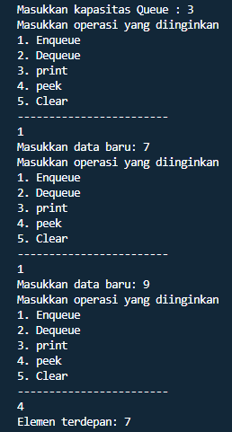

**8.2.1 Pertanyaan**

1. Pada konstruktor, mengapa nilai awal atribut front dan rear bernilai -1, sementara atribut size bernilai 0?

    **Karena nilai -1 pada atribut front dan rear menunjukkan bahwa queue nya masih 
kosong belum terisi apa-apa, dan masih belum ada nilainya maka nilai pertama yang masuk dalam antrian akan ditaruh ke index 0 sedangkan atribut size bernilai 0 karena hal tersebut bertujuan menunjukkan bahwa tidak ada nilai dalam antrian maka jika ada nilai yang dimasukkan size akan berubah mengikuti banyaknya jumlah nilai yang dimasukkan.**

2. Pada method **Enqueue**, jelaskan maksud dan kegunaan dari potongan kode berikut!

    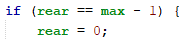

    **Maksud dan kegunaan dari potongan kode diatas adalah untuk menunjukan bahwa 
jika bagian paling belakang atau rear dari antrian sudah mencapai maksimum -1 atau index paling akhir maka rear akan kembali ke index 0. Contohnya jika data array yang dapat menampung 8 nilai maka ketika rear nya sampai indeks ke-7 posisi rear akan dirubah menjadi index 0.**
3. Pada method **Dequeue**, jelaskan maksud dan kegunaan dari potongan kode berikut!

    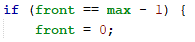

    **Maksud dan kegunaan dari potongan kode di atas adalah jika front berada di index paling akhir yaitu max-1 maka otomatis front akan dipindahkan ke index ke 0.**

4. Pada method **print**, mengapa pada proses perulangan variabel i tidak dimulai dari 0 **(int i=0)**, melainkan **int i=front**?

    **Karena pada Queue posisi front tidak selalu pada indeks ke 0, Jadi posisi front dapat berada di index mana saja**

5. Perhatikan kembali method **print**, jelaskan maksud dari potongan kode berikut!

    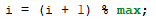

    **Maksud dari kode program diatas adalah untuk memindahkan front yang sudah
diprint dari indeks sebelumnya ke indeks selanjutnya.**

6. Tunjukkan potongan kode program yang merupakan queue overflow!
    ```java
    boolean IsFull(){
        if(size==max){
            return true;
        }else{
            return false;
        }
    }
    ```
    ```java
    void Enqueue(int dt){
        if(IsFull()){
            System.out.println("Queue sudah penuh");
    ```

7. Pada saat terjadi queue overflow dan queue underflow, program tersebut tetap dapat berjalan 
dan hanya menampilkan teks informasi. Lakukan modifikasi program sehingga pada saat terjadi 
queue overflow dan queue underflow, program dihentikan!

    **Dengan menambahkan kode program System.exit(0); pada saat terjadi Queue overflow dan Queue underflow dan perlu mengubah function menu yang diluar main pada class QueueMain menjadi ke dalam Main method**

    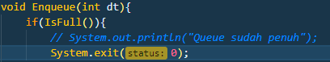

    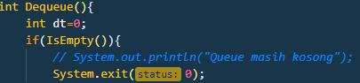

    

    **Output**

    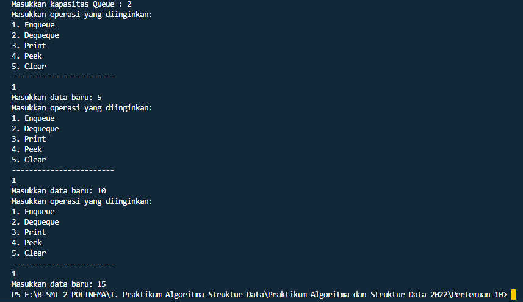


**8.3 Praktikum 2 Queue**

Source Code Nasabah
```java
package SourceCode.Praktikum2;
public class Nasabah{
    String norek;
    String nama;
    String alamat;
    int umur;
    double saldo;
    Nasabah(String norek, String nama, String alamat,int umur, double saldo){
        this.norek=norek;
        this.nama=nama;
        this.alamat=alamat;
        this.umur=umur;
        this.saldo=saldo;
    }
    Nasabah[] data;
    int front;
    int rear;
    int size;
    int max;
    public Nasabah(int n){
        max=n;
        data=new Nasabah[max];
        size=0;
        front=rear=-1;
    }
    boolean IsFull(){
        if(size==max){
            return true;
        }else{
            return false;
        }
    }
    boolean IsEmpty(){
        if(size==0){
            return true;
        }else{
            return false;
        }
    }
    void peek(){
        if(!IsEmpty()){
            System.out.println("Elemen terdepan: "+data[front].norek+" "+data[front].nama+" "
            +data[front].alamat+" "+data[front].umur+" "+data[front].saldo);
        }else{
            System.out.println("Queue masih kosong");
        }
    }
    void print(){
        if(IsEmpty()){
            System.out.println("Queue masih kosong");
        }else{
            int i=front;
            while(i!=rear){
                System.out.println(data[i].norek+" "+data[i].nama+" "
                +data[i].alamat+" "+data[i].umur+" "+data[i].saldo);
                i=( i + 1 ) % max;
            }
            System.out.println(data[i].norek+" "+data[i].nama+" "
            +data[i].alamat+" "+data[i].umur+" "+data[i].saldo);
            System.out.println("Jumlah elemen = "+size);
        }
    }
    void clear(){
        if(!IsEmpty()){
            front=rear=-1;
            size=0;
            System.out.println("Queue berhasil dikosongkan");
        }else{
            System.out.println("Queue masih kosong");
        }
    }
    void Enqueue(Nasabah dt){
        if(IsFull()){
            System.out.println("Queue sudah penuh");
        }else{
            if(IsEmpty()){
                front=rear=0;
            }else{
                if(rear==max-1){
                    rear=0;
                }else{
                    rear++;
                }
            }
            data[rear]=dt;
            size++;
        }
    }
    public Nasabah Dequeue(){
        Nasabah dt=new Nasabah();
        if(IsEmpty()){
            System.out.println("Queue masih kosong");
        }else{
            dt=data[front];
            size--;
            if(IsEmpty()){
                front = rear = -1;
            }else{
                if(front==max-1){
                    front=0;
                }else{
                    front++;
                }
            }
        }
        return dt;
    } Nasabah(){
    }
}   
```

Source Code QueueMain praktikum 2
```java
package SourceCode.Praktikum2;
import java.util.Scanner;
public class QueueMain {
    public static void menu(){
        System.out.println("Pilihan Menu:");
        System.out.println("1. Antrian Baru");
        System.out.println("2. Antrian Keluar");
        System.out.println("3. Cetak Antrian Paling Depan");
        System.out.println("4. Cek Semua Antrian");
        System.out.println("5. Cetak Antrian Paling Belakang");
        System.out.println("------------------------");
    }
    public static void main(String[] args) {
        Scanner sc = new Scanner(System.in);
        
        System.out.print("Masukkan kapasitas queue: ");
        int jumlah = sc.nextInt();
        Nasabah antri = new Nasabah(jumlah);   
        
        int pilih;
        do{
            menu();
            pilih = sc.nextInt();
            sc.nextLine();
            switch (pilih){
                case 1:
                    System.out.print("No Rekening: ");
                    String norek= sc.nextLine();
                    System.out.print("Nama: ");
                    String nama = sc.nextLine();
                    System.out.print("Alamat: ");
                    String alamat = sc.nextLine();
                    System.out.print("Umur: ");
                    int umur = sc.nextInt();
                    System.out.print("Saldo: ");
                    double saldo = sc.nextDouble();
                    Nasabah nb = new Nasabah(norek,nama,alamat,umur,saldo);
                    sc.nextLine();
                    antri.Enqueue(nb);
                    break;
                case 2:
                    Nasabah data = antri.Dequeue();
                    if(!"".equals(data.norek)&&!"".equals(data.nama)&&!"".equals(data.alamat)&& data.umur !=0 && data.saldo !=0){
                        System.out.println("Antrian yang keluar: "+ data.norek +" "+data.nama+" "+data.alamat+" "+data.umur+" "+data.saldo);
                        break;
                }
                case 3:
                    antri.peek();
                    break;
                case 4:
                    antri.print();
                    break;
                }
        }while(pilih == 1 || pilih == 2 || pilih == 3 || pilih == 4);
        sc.close();
    }
}
```
Output Program

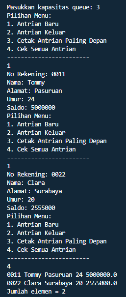

**8.3.1 Pertanyaan**

1. Pada class QueueMain, jelaskan fungsi IF pada potongan kode program berikut!

    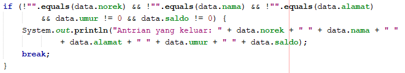

    **jika data didalam norek,nama,alamat,umur,dan saldo tidak kosong maka statment yang akan dijalankan yaitu menghasilkan output data norek,nama,alamat,umur dan saldo**

2. Lakukan modifikasi program dengan menambahkan method baru bernama **peekRear** pada class
Queue yang digunakan untuk mengecek antrian yang berada di posisi belakang! Tambahkan pula
daftar menu **5. Cek Antrian paling belakang** pada class **QueueMain** sehingga method **peekRear**
dapat dipanggil!

**Source Code modifikasi**

Nasabah.java
```java
//Modifikasi praktikum 2
    void peekRear(){
        if(!IsEmpty()){
            System.out.println("ElEMEN TERBELAKANG : " + data[rear].norek + " " + data[rear].nama +" "+ data[rear].alamat+" "+ data[rear].umur+" "+data[rear].saldo);
        }else{
            System.out.println("Queue Masih Kosong!!");
        }
    }
```

QueueMain.java
```java
package SourceCode.Praktikum2;
import java.util.Scanner;
public class QueueMain {
    public static void menu(){
        System.out.println("Pilihan Menu:");
        System.out.println("1. Antrian Baru");
        System.out.println("2. Antrian Keluar");
        System.out.println("3. Cetak Antrian Paling Depan");
        System.out.println("4. Cek Semua Antrian");
        System.out.println("5. Cetak Antrian Paling Belakang");
        System.out.println("------------------------");
    }
    public static void main(String[] args) {
        Scanner sc = new Scanner(System.in);
        
        System.out.print("Masukkan kapasitas queue: ");
        int jumlah = sc.nextInt();
        Nasabah antri = new Nasabah(jumlah);   
        
        int pilih;
        do{
            menu();
            pilih = sc.nextInt();
            sc.nextLine();
            switch (pilih){
                case 1:
                    System.out.print("No Rekening: ");
                    String norek= sc.nextLine();
                    System.out.print("Nama: ");
                    String nama = sc.nextLine();
                    System.out.print("Alamat: ");
                    String alamat = sc.nextLine();
                    System.out.print("Umur: ");
                    int umur = sc.nextInt();
                    System.out.print("Saldo: ");
                    double saldo = sc.nextDouble();
                    Nasabah nb = new Nasabah(norek,nama,alamat,umur,saldo);
                    sc.nextLine();
                    antri.Enqueue(nb);
                    break;
                case 2:
                    Nasabah data = antri.Dequeue();
                    if(!"".equals(data.norek)&&!"".equals(data.nama)&&!"".equals(data.alamat)&& data.umur !=0 && data.saldo !=0){
                        System.out.println("Antrian yang keluar: "+ data.norek +" "+data.nama+" "+data.alamat+" "+data.umur+" "+data.saldo);
                        break;
                }
                case 3:
                    antri.peek();
                    break;
                case 4:
                    antri.print();
                    break;
                 case 5:
                    antri.peekRear();
                }
        }while(pilih == 1 || pilih == 2 || pilih == 3 || pilih == 4 || pilih == 5);
        sc.close();
    }
}
```

**Output program** 

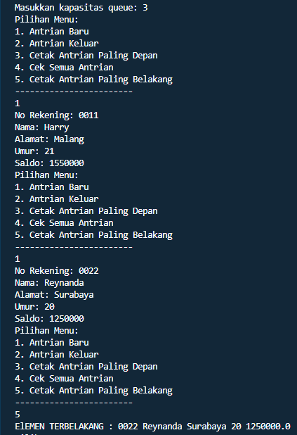


**8.4 Tugas**

1. Tambahkan dua method berikut ke dalam class Queue pada **Praktikum 1**:

    a. Method **peekPosition(data: int) : void**
Untuk menampilkan posisi dari sebuah data di dalam queue, misalnya dengan mengirimkan
data tertentu, akan diketahui posisi (indeks) data tersebut berada di urutan ke berapa

    b. Method **peekAt(position: int) : void**
Untuk menampilkan data yang berada pada posisi (indeks) tertentu
Sesuaikan daftar menu yang terdapat pada class **QueueMain** sehingga kedua method tersebut
dapat dipanggil!

**Berikut kode program yang harus ditambahkan :**

**Source Code modifikasi**
```java
    //Modifikasi Tugas 1 A
    void peekPosition(int d){
        if(!IsEmpty()){
            int abc=0;
            for(int i=0;i<data.length;i++){
                if(d==data[i]){
                    System.out.println("Data "+d+" Berada di index ke "+i);
                    abc++;
                }
            }
            if(abc==0){
                System.out.println("Data "+d+" tidak ditemukan");
            }
        }else{
            System.out.println("Queue masih kosong");
        }
    }
```
```java
//Modifikasi Tugas 1 B
    void peekAt(int posisi){
        if(!IsEmpty()){
            if(data[posisi]==0){
                System.out.println("Data pada index ke "+posisi+" masih kosong");
            }else{
                System.out.println("Data yang ada di index "+posisi+" adalah "+data[posisi]);
            }
        }else{
            System.out.println("Queue masih kosong");
        }
    }
```

**Output Program**

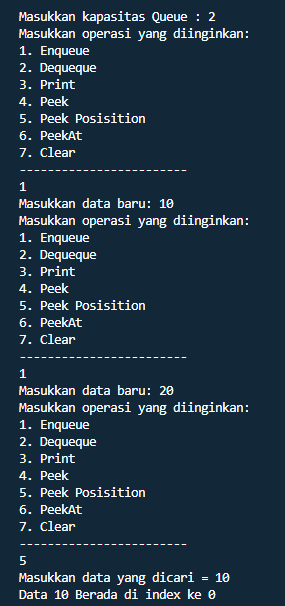

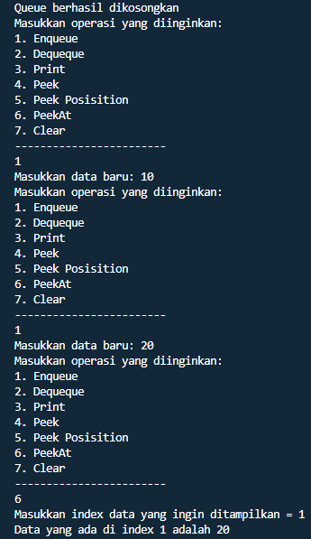


2. Buatlah program antrian untuk mengilustasikan mahasiswa yang sedang meminta tanda tangan 
KRS pada dosen DPA di kampus. Ketika seorang mahasiswa akan mengantri, maka dia harus 
menuliskan terlebih dulu NIM, nama, absen, dan IPK seperti yang digambarkan pada Class 
diagram berikut:

    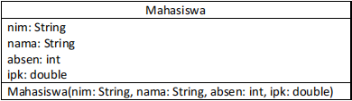

    Class diagram Queue digambarkan sebagai berikut:

    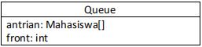

**Source Code Mahasiswa**
```java
package SourceCode.Tugas;

public class Mahasiswa {
    String nim,nama;
    int absen;
    double ipk;

    Mahasiswa(String nim,String nama,int absen,double ipk){
        this.nim =nim;
        this.nama =nama;
        this.absen =absen;
        this.ipk =ipk;
    }
}
```

**Source Code Queue2**
```java
package SourceCode.Tugas;

public class Queue2{
    Mahasiswa[] Q;
    int front,rear,size,max;
    Queue2(int n){
        max =n;
        Q =new Mahasiswa[max];
        size=0;
        front=rear=-1;
    }
    void Create(){
        Q =new Mahasiswa[max];
        size =0;
        front =rear= -1;
    }
    boolean IsEmpty(){
        if(size==0){
            return true;
        }else{
            return false;
        }
    }
    boolean IsFull(){
        if(size==max){
            return true;
        }else{
            return false;
        }
    }
    void peek(){
        if(!IsEmpty()){
            System.out.println("Antrian Terdepan = " + Q[front].nama + " " + Q[front].nim + " " + Q[front].absen + " " + Q[front].ipk);
        }else{
            System.out.println("Queue masih kosong");
        }
    }
    void peekPosition(String ceknim){
        if(!IsEmpty()){
            int i=front;
            int cek=0;
            while(i !=rear){
                if (Q[i].nama.equals(ceknim)){
                    System.out.println("Mahasiswa dengan NIM " + ceknim + " berada di posisi index " + i);
                    cek++;
                }
                i=(i + 1) % max;
            }
            if(Q[i].nama.equals(ceknim)){
                System.out.println(Q[i].nama + " " + Q[i].nim + " " + Q[i].absen + " " + Q[i].ipk);
                cek++;
            }
            if(cek==0){
                System.out.println("Mahasiswa dengan NIM " + ceknim + " tidak ditemukan");
            }

        }else{
            System.out.println("Queue masih kosong");
        }
    }
    void peekRear(){
        if(!IsEmpty()){
            System.out.println("Antrian Terbelakang = " + Q[rear].nama + " " + Q[rear].nim + " " + Q[rear].absen + " " + Q[rear].ipk);
        }else{
            System.out.println("Queue masih kosong");
        }
    }
    void printMahasiswa(int cariindex){
        if(!IsEmpty()){
            if (Q[cariindex]==null){
                System.out.println("Index / Antrian ke-" + cariindex + " Masih Kosong");
            }else{
                System.out.println("Mahasiswa dengan Index / Antrian ke-" + cariindex + " adalah " + Q[cariindex].nama);
            }
        }
    }
    void print(){
        if(IsEmpty()){
            System.out.println("Queue masih kosong");
        }else{
            int i=front;
            while(i !=rear){
                System.out.println(Q[i].nama + " " + Q[i].nim + " " + Q[i].absen + " " + Q[i].ipk);
                i = (i + 1) % max;
            }
            System.out.println(Q[i].nama + " " + Q[i].nim + " " + Q[i].absen + " " + Q[i].ipk);
            System.out.println("Jumlah Elemen = " + size);
        }
    }
    void clear(){
        if(!IsEmpty()){
            front =rear= -1;
            size =0;
            System.out.println("Queue berhasil dikosongkan");
        }else{
            System.out.println("Queue masih kosong");
        }
    }
    void Enqueue(Mahasiswa data){
        if(IsFull()){
            System.out.println("Queue sudah penuh");
            System.exit(0);
        }else{
            if(IsEmpty()){
                front =rear= 0;
            }else{
                if(rear==max - 1){
                    rear =0;
                }else{
                    rear++;
                }
            }
            Q[rear]=data;
            size++;
        }
    }
    Mahasiswa Dequeue(){
        Mahasiswa data =new Mahasiswa("", "", 0, 0);
        if(IsEmpty()){
            System.out.println("Queue masih kosong");
            System.exit(0);
        }else{
            data =Q[front];
            size--;
            if(IsEmpty()){
                front =rear = -1;
            }else{
                if(front==max - 1){
                    front =0;
                }else{
                    front++;
                }
            }
        }
        return data;
    }
}
```

**Source Code QueueMain**
```java
package SourceCode.Tugas;
import java.util.Scanner;
public class QueueMain2 {
    public static void menu(){
        System.out.println("Masukkan Operasi yang diinginkan");
        System.out.println("1. Enqueue");
        System.out.println("2. Dequeue");
        System.out.println("3. Print");
        System.out.println("4. Peek");
        System.out.println("5. Peek Rear");
        System.out.println("6. Peek Position berdasarkan NIM");
        System.out.println("7. Cari Mahasiswa berdasarkan Index");
        System.out.println("--------------------");
    }

    public static void main(String[] args) {
        Scanner sc=new Scanner(System.in);
        System.out.print("Masukkan Kapasitas Queue = ");
        int n =sc.nextInt();
        int pilih;
        Queue2 antri=new Queue2(n);
        do{
            menu();
            pilih =sc.nextInt();
            switch (pilih){
                case 1:
                    sc.nextLine();
                    System.out.print("Nama = ");
                    String nama =sc.nextLine();
                    System.out.print("NIM = ");
                    String nim =sc.nextLine();
                    System.out.print("Nomer Absen = ");
                    int absen =sc.nextInt();
                    System.out.print("IPK = ");
                    double ipk =sc.nextDouble();
                    Mahasiswa p =new Mahasiswa(nama, nim, absen, ipk);
                    antri.Enqueue(p);
                    break;
                case 2:
                    Mahasiswa data =antri.Dequeue();
                    if (!"".equals(data.nama) && !"".equals(data.nim) && data.absen != 0 && data.ipk != 0) {
                        System.out.println("Antrian Yang Keluar = " + data.nama + " " + data.nim + " " + data.absen + " " + data.ipk);
                        break;
                    }
                case 3:
                    antri.print();
                    break;
                case 4:
                    antri.peek();
                    break;
                case 5:
                    antri.peekRear();
                    break;
                case 6:
                    System.out.print("Masukkan NIM yang Dicari = ");
                    String cari_Nim =sc.next();
                    antri.peekPosition(cari_Nim);
                    break;
                case 7:
                    System.out.print("Masukkan Index / Antrian yang ingin dicari datanya = ");
                    int cariindex =sc.nextInt();
                    antri.printMahasiswa(cariindex);
                    break; 
            }
        } while (pilih > 0 || pilih < 8);
    }
}
```

**Output Program**

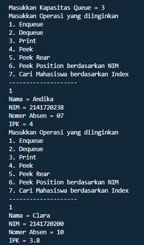

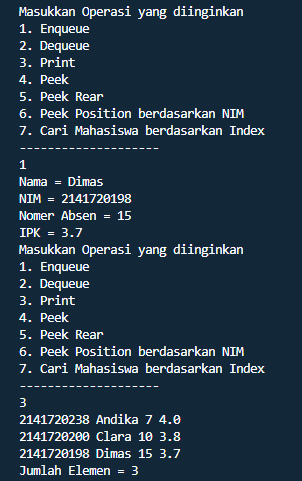

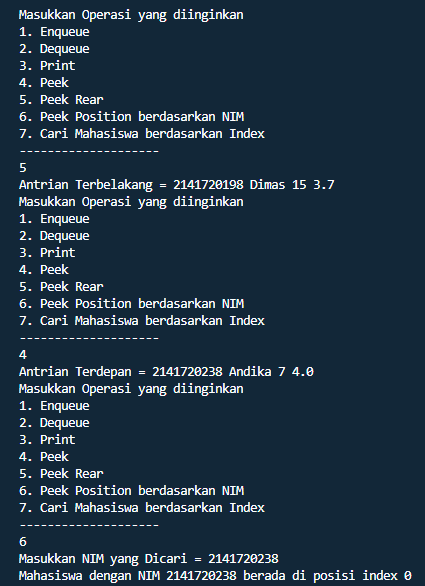

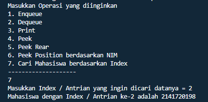


