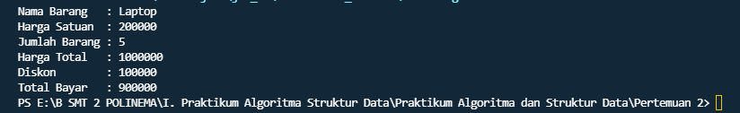
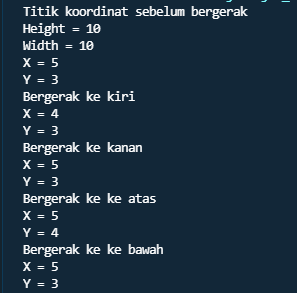

# Laporan Praktikum Pertemuan 2
## Nama  : Andika Ainur Wibowo
## Nim   : 2141720238
## Kelas : TI-1F
## Absen : 07

## **Subbab 2.2**
1. Sebutkan 2 karakteristik class/objek!

    **Karakteristik class : merupakan suatu “Blueprint” atau “Cetakan” untuk menciptakan suatu instance dari object. Class juga merupakan grup suatu object dengan kemiripan attributes/properties, behavior dan relasi ke object lain.**
    **Karakteristik objek : merupakan instance dari class secara umum merepresentasikan (template) sebuah object, sebuah instance adalah representasi nyata dari class itu sendiri.**

2. Kata kunci apakah yang digunakan untuk mendeklarasikan class?
    **Kata kunci :  class "nama class" {}**

3. Perhatikan class Barang yang ada di Praktikum di atas, ada berapa atribut yang dimiliki oleh class
tersebut? Sebutkan! Dan pada baris berapa saja deklarasi atribut dilakukan?

    **Atribut class ada 4 : String namaBarang,  jenisBarang**

    **int stok, hargaSatuan**
    
    **Deklarasi atribut terdapat pada baris 13 dan 14**

4. Ada berapa method yang dimiliki oleh class tersebut? Sebutkan! Dan pada baris berapa saja
deklarasi method dilakukan?
    **method yang dilakukan class Barang yaitu ada 4** 
    **terdapat pada baris 16 sampai 32**

5. Perhatikan method kurangiStok() yang ada di class Barang, modifikasi isi method tersebut
sehingga proses pengurangan hanya dilakukan jika stok masih ada (masih lebih besar dari 0)
    ``` java
    void kurangiStok(int n){
        if(stok>0){
        stok=stok-n;
        }
    ```
6. Menurut Anda, mengapa method tambahStok() dibuat dengan memiliki 1 parameter berupa
bilangan int?

    **Karena, ketika kita ingin menambah stok maka kita membutuhkan suatu parameter berupa int yang akan kita gunakan sebagai bilangan untuk menambah jumlah stok barang**

7. Menurut Anda, mengapa method hitungHargaTotal() memiliki tipe data int?

    **Karena disitu untuk menghitung sebuah nilai menggunakan tipe data int yang dimana tipe data tersebut berisi angka**

8. Menurut Anda, mengapa method tambahStok() memiliki tipe data void?

    **Karena tipe data void tidak memerlukan data kembalian**

## **SubBab 2.3**

1. Pada class BarangMain, pada baris berapakah proses instansiasi dilakukan? Dan apa nama objek
yang dihasilkan?

    **instansiasi dilakukan terdapat pada baris 15**

2. Bagaimana cara mengakses atribut dan method dari suatu objek?
     
     **namaobject.nama_atribut/nama_method();**
    
## **SubBab 2.4**

1. Perhatikan class Barang yang ada di Praktikum 2.4.1, pada baris berapakah deklarasi
konstruktor berparameter dilakukan?

**Deklarasi konstruktor berparameter dilakukan pada baru ke 18**

2. Perhatikan class BarangMain di Praktikum 2.4.1, apa sebenarnya yang dilakukan pada baris
program dibawah ini?


**Pada baris tesebut dilakukannya inisialisasi pada objek**

3. Coba buat objek dengan nama b3 dengan menggunakan konstruktor berparameter dari class 
Barang.
```java
Barang b2=new Barang("Razer","Headshet",350000,15);
```

## **Sub.bab 2.5**
No. 1
Source code
```java
public class Tugas1 {
    public static void main(String[] args) {
        tugas1app a1=new tugas1app();
        a1.nama="Laptop";
        a1.hargaSatuan=200000;
        a1.jumlah=5;
        int x = a1.hitungHargaTotal();
        int y = a1.hitungDiskon(x);
        int z = a1.hitungHargaBayar(x, y);
        System.out.println("Nama Barang   : "+a1.nama);
        System.out.println("Harga Satuan  : "+a1.hargaSatuan);
        System.out.println("Jumlah Barang : "+a1.jumlah);
        System.out.println("Harga Total   : "+x);
        System.out.println("Diskon        : "+y);
        System.out.println("Total Bayar   : "+z);
    }
}
class tugas1app{
    String nama;
    int hargaSatuan,jumlah;

    int hitungHargaTotal(){
      return hargaSatuan*jumlah;
    }
    int hitungDiskon(int n){
        int totalDiskon=0;
        if(n>100000){
            totalDiskon=n*10/100;
        }
        else if(n>50000 && n<=100000){
            totalDiskon=n*5/100;
        }
        else{
            System.out.print("Maaf anda tidak mendapat diskon");
        }
        return totalDiskon;
    }
    int hitungHargaBayar(int total,int diskon){
        int hargaBayar=0;
        hargaBayar=total-diskon;
        return hargaBayar;
    }
}
```

Output Program



No. 2

Source Code

BluePrint Pacman : 
```java
public class Pacman {
    int x,y,width,height;

    void moveLeft(){
        if(x<0 && x>width){
            System.out.print("Error");
        }else {
            System.out.println("Bergerak ke kiri");
            x=x-1;
        }
    }
    void moveRight(){
        if(x<0 && x>width){
            System.out.print("Error");
        }else {
            System.out.println("Bergerak ke kanan");
            x=x+1;
        }
    }
    void moveUp(){
        if(y<0 && y>height){
            System.out.print("Error");
        }else {
            System.out.println("Bergerak ke ke atas");
            y=y+1;
        }
    }
    void moveDown(){
        if(y<0 && y>height){
            System.out.print("Error");
        }else {
            System.out.println("Bergerak ke ke bawah");
            y=y-1;
        }
    }
    void printPosition(){
        System.out.println("X = "+x);
        System.out.println("Y = "+y);
    }
}
```

Main Pacman : 

```java
public class PacmanApp {
    public static void main(String[] args) {
        Pacman p1= new Pacman();
        p1.x=5;
        p1.y=3;
        p1.height=10;
        p1.width=10;
        System.out.println("Titik koordinat sebelum bergerak");
        System.out.println("Height = "+p1.height);
        System.out.println("Width = "+p1.width);
        p1.printPosition();
        p1.moveLeft();
        p1.printPosition();
        p1.moveRight();
        p1.printPosition();
        p1.moveUp();
        p1.printPosition();
        p1.moveDown();
        p1.printPosition();
    }
}
```

Output Program : 




