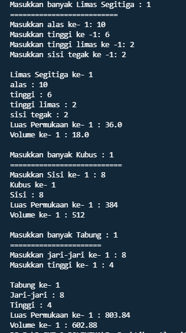

# Laporan Praktikum Pertemuan 2
## Nama  : Andika Ainur Wibowo
## Nim   : 2141720238
## Kelas : TI-1F
## Absen : 07

### **SubBab 3.2 Membuat Array dari Object, Mengisi dan Menampilkan**
**Pertanyaan :**
1. Berdasarkan uji coba 3.2, apakah class yang akan dibuat array of object harus selalu memiliki
atribut dan sekaligus method?Jelaskan!

Jawaban: **Tidak, karena dalam class array of object tidak mengharuskan memiliki atribut sekaligus method tergantung kondisi yang kita perlukan.** 

2. Apakah class PersegiPanjang memiliki konstruktor?Jika tidak, kenapa dilakukan pemanggilan
konstruktur pada baris program berikut : 


Jawaban: **Sebetulnya pada array of object persegi panjang kita telah memanggil default konstruktor, karena default konstruktor tidak memiliki parameter maka kita tidak wajib memberikan nilai pada parameternya.**

3. Apa yang dimaksud dengan kode berikut ini:


Jawaban : **kode tersebut adalah instansiasi dari array of object**

4. Apa yang dimaksud dengan kode berikut ini:


Jawaban : **kode tersebut adalah inisialisasi/pengisian sebuah nilai terhadap pparray[1] atau indeks yang pertama.**

5. Mengapa class main dan juga class PersegiPanjang dipisahkan pada uji coba 3.2?

Jawaban: **karena agar memudahkan kita dalam membuat programnya dan tidak membingungkan kita saat merubah atribut atau method dalam object persegi panjang**

### **SubBab 3.3 Menerima Input Isian Array Menggunakan Looping**
**Pertanyaan :**
1. Apakah array of object dapat diimplementasikan pada array 2 Dimensi?

jawaban : **Ya bisa,array of object dapat di implementasikan array 2 dimensi.**

2. Jika jawaban soal no satu iya, berikan contohnya! Jika tidak, jelaskan!

Jawaban : **Array of object dapat diimplementasikan pada array dua dimensi, dimana sama seperti mengimplementasikan array dua dimensi pada umumnya.**

**implementasi array of object 2 dimensi dapat di lihat pada source code di bawah ini**
```java
import SourceCode.coba2dimensi;

public class maincoba2 {
    public static void main(String[] args) {
        coba2dimensi [][] coba = new coba2dimensi[2][2];

        for(int i=0;i<2;i++){
            for(int j=0;j<2;j++){
                coba[i][j]= new coba2dimensi();
                if(i==0&&j==0){
                coba[i][j].namaDepan="Andika";
                coba[i][j].namaBelakang="Ainur";
                }
                else if(i==1&&j==1){
                coba[i][j].namaDepan="Budi";
                coba[i][j].namaBelakang="Santoso";
                }
            }
        }
        for(int i=0;i<2;i++){
        System.out.println("Nama ke "+i);
        System.out.println("Nama depan : "+coba[i][i].namaDepan);
        System.out.println("Nama belakang : "+coba[i][i].namaBelakang);
            }
    }
}
```

3. Jika diketahui terdapat class Persegi yang memiliki atribut sisi bertipe integer, maka kode
dibawah ini akan memunculkan error saat dijalankan. Mengapa?


Jawaban : **Tentu saja akan terjadi error karena array of objectnya belum ter instansiasi.** 

**contoh : Persegi [0] pgArray = new Persegi();**

4. Modifikasi kode program pada praktikum 3.3 agar length array menjadi inputan dengan Scanner!

Jawaban : 
```java
package SourceCode;
import java.util.Scanner;
public class ArrayObjects{
    public static void main(String[] args) {
        Scanner sc = new Scanner(System.in);
        System.out.print("Masukkan banyak persegi panjang : ");
        int k=sc.nextInt();
        PersegiPanjang [] ppArray = new PersegiPanjang[k];
    for(int i=0;i<k;i++){
        ppArray[i]=new PersegiPanjang();
        System.out.println("Persegi Panjang ke-"+i);
        System.out.print("Masukkan Panjang: ");
        ppArray[i].panjang=sc.nextInt();
        System.out.print("Masukkan Lebar: ");
        ppArray[i].lebar=sc.nextInt();
    }
    for(int i=0;i<k;i++){
        System.out.println("Persegi Panjang ke-"+i);
        System.out.println("Panjang : "+ppArray[i].panjang+", Lebar : "+ppArray[i].lebar);
    }
    sc.close();
}
}
```

5. Apakah boleh Jika terjadi duplikasi instansiasi array of objek, misalkan saja instansiasi dilakukan
pada ppArray[i] sekaligus ppArray[0]?Jelaskan !

Jawaban : **Tidak boleh, karena akan terjadi error terhadap system. System akan bingung membaca program kita terdapat 2x instansiasi pparray[0].**

### **SubBab 3.4 Operasi Matematika Atribut Object Array**
**Pertanyaan :**
1. Dapatkah konstruktor berjumlah lebih dalam satu kelas? Jelaskan dengan contoh! 

Jawaban : **Bisa, kita dapat menggunakan constructor overloading sebagai pembedanya adalah tipe parameter dan atau jumlah parameternya**

Contoh : 
``` java
public class Siswa{
    int nomorIndukSiswa,noTelfon;
    String nama,sekolah;
Siswa(String s,int ntlp){
    this.s=Sekolah;
    this.ntlp=noTelpon;
}
Siswa(int nis,String n){
    this.nis=nomorIndukSiswa;
    this.n=nama
}
}
```
2. Jika diketahui terdapat class Segitiga seperti berikut ini:

Tambahkan konstruktor pada class Segitiga tersebut yang berisi parameter int a, int t
yang masing-masing digunakan untuk mengisikan atribut alas dan tinggi.

Jawaban : 
``` java
public class Segitiga {
    public int alas,tinggi;
    
    Segitiga(int a,int t){
        alas = a;
        tinggi = t;
    }
}
```
3. Tambahkan method hitungLuas() dan hitungKeliling() pada class Segitiga
tersebut

Jawaban : 
``` java
int hitungLuas(){
    return alas*tinggi/2;
}
double hitungKeliling(){
    return alas+alas+alas;
}
```
4. Pada fungsi main, buat array Segitiga sgArray yang berisi 4 elemen, isikan masing-masing
atributnya sebagai berikut:

Jawaban : 
``` java
Segitiga[] sgArray = new Segitiga [4];
sgArray[0]= new Segitiga(10, 4);
sgArray[1]= new Segitiga(20, 10);
sgArray[2]= new Segitiga(15, 6);
sgArray[3]= new Segitiga(25, 10);
```

5.Kemudian menggunakan looping, cetak luas dan keliling dengan cara memanggil method
hitungLuas() dan hitungKeliling().

Jawaban :
``` java
for(int i=0;i<4;i++){
System.out.println("Luas Segitiga ke "+i+" : "+ sgArray[i].hitungLuas());
System.out.println("Keliling Segitiga ke "+i+" : "+sgArray[i].hitungKeliling());
}
```
Output : 


## **SubBab 3.5 Latihan Praktikum**

## Soal NO 1 

**Source Code**

**class Limas Segitiga**
```java
package SourceCode;

public class LimasSegitiga {
    int alas,tinggi,tinggiLimas,sisiTegak;
    public LimasSegitiga(int a,int t,int tL,int sT){
        alas=a;
        tinggi=t;
        tinggiLimas=tL;
        sisiTegak=sT;
    }
    double luasPermukaan(){
        return 0.5*alas*tinggi+3*sisiTegak;
    }
    double volume(){
        return 0.3*(0.5*alas*tinggi)*tinggiLimas;
    }
    
}
```

## **class Kubus**
```java
package SourceCode;

public class Kubus {
    public int sisi;
    public Kubus(int s){
        sisi=s;
    }
    public int Volume(){
        return sisi*sisi*sisi;
    }
    public int luasPermukaan(){
        return 6*(sisi*sisi);
    }
}
```
## **class Tabung**
```java
package SourceCode;

public class Tabung {
    int jari,tinggi;
    public Tabung(int j,int t){
        jari=j;
        tinggi=t;
    }
    public double luasPermukaan(){
        return 3.14*(jari*jari)*tinggi;
    }
    public double volume(){
        return 2*3.14*jari*(jari+tinggi);
    }
}
```
## **main class BangunRuang**
```java
package SourceCode;
import java.util.Scanner;

public class BangunRuangMain {
    public static void main(String[] args) {
        Scanner in = new Scanner(System.in);
        System.out.print("Masukkan banyak Limas Segitiga : ");
        int k=in.nextInt();
        System.out.println("==========================");
        LimasSegitiga[] kArray = new LimasSegitiga[k];
        for(int i=0;i<kArray.length;i++){
            System.out.print("Masukkan alas ke- "+(i+1)+": ");
            int al=in.nextInt();
            System.out.print("Masukkan tinggi ke -"+(i+1)+": ");
            int ti=in.nextInt();
            System.out.print("Masukkan tinggi limas ke -"+(i+1)+": ");
            int tli=in.nextInt();
            System.out.print("Masukkan sisi tegak ke -"+(i+1)+": ");
            int sti=in.nextInt();
            kArray[i]=new LimasSegitiga(al, ti, tli, sti);
        }
        for(int i=0;i<kArray.length;i++){
            System.out.println();
            System.out.println("Limas Segitiga ke- "+(i+1));
            System.out.println("alas : "+kArray[i].alas);
            System.out.println("tinggi : "+kArray[i].tinggi);
            System.out.println("tinggi limas : "+kArray[i].tinggiLimas);
            System.out.println("sisi tegak : "+kArray[i].sisiTegak);
            System.out.println("Luas Permukaan ke- "+(i+1)+" : "+kArray[i].luasPermukaan());
            System.out.println("Volume ke- "+(i+1)+" : "+kArray[i].volume());
        }
        System.out.println();
        System.out.print("Masukkan banyak Kubus : ");
        int ku=in.nextInt();
        System.out.println("===========================");
        Kubus [] kbArray = new Kubus[ku];
        for(int i=0;i<kbArray.length;i++){
            System.out.print("Masukkan Sisi ke- "+(i+1)+" : ");
            int si=in.nextInt();
            kbArray[i]=new Kubus(si);
        }
        for(int i=0;i<kbArray.length;i++){
            System.out.println("Kubus ke- "+(i+1));
            System.out.println("Sisi : "+kbArray[i].sisi);
            System.out.println("Luas Permukaan ke- "+(i+1)+" : "+kbArray[i].luasPermukaan());
            System.out.println("Volume ke- "+(i+1)+" : "+kbArray[i].Volume());
        }
        System.out.println();
        System.out.print("Masukkan banyak Tabung : ");
        int ta=in.nextInt();
        System.out.println("======================");
        Tabung[] tabArray=new Tabung[ta];
        for(int i=0;i<tabArray.length;i++){
            System.out.print("Masukkan jari-jari ke- "+(i+1)+" : ");
            int jr=in.nextInt();
            System.out.print("Masukkan tinggi ke- "+(i+1)+" : ");
            int t=in.nextInt();
            tabArray[i]=new Tabung(jr, t);
        }
        for(int i=0;i<tabArray.length;i++){
            System.out.println();
            System.out.println("Tabung ke- "+(i+1));
            System.out.println("Jari-jari : "+tabArray[i].jari);
            System.out.println("Tinggi : "+tabArray[i].tinggi);
            System.out.println("Luas Permukaan ke- "+ (i+1)+" : "+tabArray[i].luasPermukaan());
            System.out.println("Volume ke- "+(i+1)+" : "+tabArray[i].volume());
        }
        in.close();
    }
}
```

**Output** 




## Soal NO 2

**Source Code**

**class Tanah**
```java
package SourceCode;

public class Tanah {
    int lebar,panjang;
    int luasTanah(){
        return panjang*lebar;
    }
}
```

**class TanahMain**
```java
package SourceCode;
import java.util.Scanner;
public class TanahMain {
    public static void main(String[] args) {
        Scanner input=new Scanner(System.in);
        System.out.print("Masukkan jumlah tanah : ");
        int inputan=input.nextInt();
        Tanah [] tanArray=new Tanah[inputan];
        System.out.println();
        for(int i=0;i<tanArray.length;i++){
            tanArray[i]=new Tanah();
            System.out.println("Tanah ke- "+(i+1));
            System.out.print("Panjang tanah : ");
            tanArray[i].panjang=input.nextInt();
            System.out.print("Lebar tanah : ");
            tanArray[i].lebar=input.nextInt();
        }
        System.out.println();
        int tanahTerluas=0;
        int pLuas=0;
        for(int i=0;i<tanArray.length;i++){
            System.out.println("Luas Tanah ke- "+(i+1)+" : "+tanArray[i].luasTanah());
            if(tanArray[i].luasTanah()>tanahTerluas){
                tanahTerluas=tanArray[i].luasTanah();
                pLuas=i;
            }
        }System.out.println("Tanah Terluas : "+"Tanah "+(pLuas+1));
        input.close();
    }
}
```

**Output**


## Soal No 3

**Source Code**

**class Mahasiswa**
```java
package SourceCode;

public class Mahasiswa {
    String nama,jenisKelamin;
    int nim;
    double ipk;
}
```

**class MahasiswaMain**
```java
package SourceCode;
import java.util.Scanner;
public class MahasiswaMain {
    public static void main(String[] args) {
        Scanner inS=new Scanner(System.in);
        Scanner ni=new Scanner(System.in);
        Scanner ip=new Scanner(System.in);
        Mahasiswa [] mahaArray=new Mahasiswa[3];
        for(int i=0;i<3;i++){
            mahaArray[i]=new Mahasiswa();
            System.out.println("Masukkan Data Mahasiswa ke- "+(i+1));
            System.out.print("Masukkan Nama\t: ");
            mahaArray[i].nama=inS.nextLine();
            System.out.print("Masukkan NIM\t: ");
            mahaArray[i].nim=ni.nextInt();
            System.out.print("Masukkan Jenis Kelamin : ");
            mahaArray[i].jenisKelamin=inS.nextLine();
            System.out.print("Masukkan IPK\t: ");
            mahaArray[i].ipk=ip.nextDouble();
            System.out.println();
        }
        for(int i=0;i<3;i++){
            System.out.println("Data Mahasiswa ke- "+(i+1));
            System.out.println("Nama\t: "+mahaArray[i].nama);
            System.out.println("NIM \t: "+mahaArray[i].nim);
            System.out.println("Jenis Kelamin : "+mahaArray[i].jenisKelamin);
            System.out.println("Nilai IPK : "+mahaArray[i].ipk);
            System.out.println();
        }
        inS.close();
        ni.close();
        ip.close();
    }
}
```

**Output**


