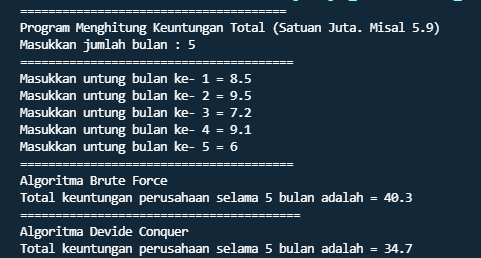

## Nama      : Andika Ainur Wibowo
## Kelas     : TI-1F
## No. Absen : 07
#
# **Jobsheet 5**
**4.2.1 Menghitung Nilai Faktorial dengan Algoritma Brute Force dan Divide and Conquer**

Faktorial
```java
package SourceCode;

public class Faktorial {
    public int nilai;
public int faktorialBF(int n){
    int fakto=1;
    for(int i=1;i<=n;i++){
        fakto*=i;
    }
    return fakto;
}
public int faktorialDC(int n){
    if(n==1){
        return 1;
    }
    else{
        int fakto=n*faktorialDC(n-1);
        return fakto;
    }
}
}
```

Main Faktorial

```java
package SourceCode;
import java.util.Scanner;
public class MainFaktorial {
    public static void main(String[] args) {
        Scanner in=new Scanner(System.in);
        System.out.println("===============================================");
        System.out.print("Masukkan jumlah elemen  yang ingin dihitung : ");
        int elemen = in.nextInt();
        Faktorial [] fk=new Faktorial[elemen];
        for(int i=0;i<elemen;i++){
            fk[i]=new Faktorial();
            System.out.print("Masukkan niai data ke- "+(i+1)+" : ");
            fk[i].nilai=in.nextInt();
        }
        System.out.println("===============================================");
        System.out.println("Hasil Faktorial dengan Brute Force");
        for(int i=0;i<elemen;i++){
            System.out.println("Faktorial dari nilai "+fk[i].nilai+" adalah : "+fk[i].faktorialBF(fk[i].nilai));
        }
        System.out.println("===============================================");
        System.out.println("Hasil Faktorial dengan Divide and Conquer");
        for(int i=0;i<elemen;i++){
            System.out.println("Faktorial dari nilai "+fk[i].nilai+" adalah : "+fk[i].faktorialDC(fk[i].nilai));
    }
    System.out.println("===============================================");
    in.close();
}
}
```
**4.2.2 Verifikasi Hasil Percobaan**


**4.2.3 Pertanyaan**

1. Jelaskan mengenai base line Algoritma Divide Conquer untuk melakukan pencarian nilai faktorial!
**Dalam base line Algoritma Divide Conquer pada class factorial menggunakan pemilihan if (n==1) return 1; yang artinya jika nilai yang akan dimasukkan nantinya adalah 1 maka hasil yang akan ditampilkan olehprogram main nantinya adalah 1 dan berfungsi sebagai batas dari divide conquer dimana perulangan kali akan berakhir saat n sudah samadengan 1.**
2. Pada implementasi Algoritma Divide and Conquer Faktorial apakah lengkap terdiri dari 3 tahapan 
divide, conquer, combine? Jelaskan masing-masing bagiannya pada kode program!

    **Sudah lengkap, dapat dilihat terdiri dari 3 tahapan :**

    **Devide : ditujukan oleh adanya pemecahan masalah menjadi 2 masalah yang diisyaratkan dengan kondisi pemilihan if-else dimana if beperan sebagai base case dan else sebagai rekursif call.**

    Code : 

    

    **Conquer : ditujukan oleh adanya penyelesaian masalah 
secara reqursif dimana masalah diselesaikan masing-masing yang telah diisyaratkan pada 
codingan dalam else yang memberikan rumus int fakto = n * faktorialDC(n-1);**

    Code :

     

    **Combine : ditujukan oleh adanya penarikan hasil 
keseluruhan berupa return atau pengembalian nilai dari proses rekursif pada tahap conquer yang
diisyaratkan pada return fakto; di else dalam method faktorialDC();**

    Code :

    
3. Apakah memungkinkan perulangan pada method faktorialBF() dirubah selain menggunakan 
for?Buktikan!

    **Bisa, berikut saya mencoba dengan looping jenis while dan program masih berjalan dengan baik.**

    Code :

    

    Output : 

    
4. Tambahkan pegecekan waktu eksekusi kedua jenis method tersebut!
```java
    package SourceCode;
import java.util.Scanner;
import java.util.TimeZone;
public class MainFaktorial {
    public static void main(String[] args) {
        Scanner in=new Scanner(System.in);
        long awal=System.currentTimeMillis(); 
        System.out.println("Waktu awal : "+String.valueOf(awal)+" milidetik");
        System.out.println("===============================================");
        System.out.print("Masukkan jumlah elemen  yang ingin dihitung : ");
        int elemen = in.nextInt();
        Faktorial [] fk=new Faktorial[elemen];
        for(int i=0;i<elemen;i++){
            fk[i]=new Faktorial();
            System.out.print("Masukkan niai data ke- "+(i+1)+" : ");
            fk[i].nilai=in.nextInt();
        }
        System.out.println("===============================================");
        System.out.println("Hasil Faktorial dengan Brute Force");
        for(int i=0;i<elemen;i++){
            System.out.println("Faktorial dari nilai "+fk[i].nilai+" adalah : "+fk[i].faktorialBF(fk[i].nilai));
        }
        System.out.println("===============================================");
        System.out.println("Hasil Faktorial dengan Divide and Conquer");
        for(int i=0;i<elemen;i++){
            System.out.println("Faktorial dari nilai "+fk[i].nilai+" adalah : "+fk[i].faktorialDC(fk[i].nilai));
    }
    long akhir=System.currentTimeMillis(); 
        System.out.println("Waktu akhir : "+String.valueOf(akhir)+" milidetik");
        long elapsedTime=akhir-awal;
        System.out.println("exceution time:"+String.valueOf(elapsedTime)+"milidetik");
    System.out.println("===============================================");
    in.close();
}
}
```
Output : 


5. Buktikan dengan inputan elemen yang di atas 20 angka, apakah ada perbedaan waktu eksekusi?

    **Elemen dibawah 20 :**

    

    **Elemen diatas 20 :**

    

    **Kesimpulan : Ada perbedaan waktu eksekusi yang sangat kentara/terlihat pada program dimana pada elemen yang berjumlah 3 waktu eksekusi yang diperlukan lebih sedikit daripada waktu eksekusi yang dibutuhkan oleh elemen yang berjumlah diatas 20 angka**


**4.3 Menghitung Hasil Pangkat dengan Algoritma Brute Force dan Divide and Conquer**

Code Program Pangkat
```java
package SourceCode;

public class Pangkat {
    public int nilai,pangkat;
    public int pangkatBF(int a,int n){
        int hasil=1;
        for(int i=0;i<n;i++){
            hasil*=a;
        }
        return hasil;
    }
    public int pangkatDC(int a,int n){
        if(n==0){
            return 1;
        }
        else{
            if(n%2==1){//bilangan ganjil
                return(pangkatDC(a,n/2)*pangkatDC(a,n/2)*a);
            }
            else//bilangan genap
            return(pangkatDC(a,n/2)*pangkatDC(a,n/2));
        }
    }
}
```

Code Program PangkatMain
```java
package SourceCode;
import java.util.Scanner;
public class MainPangkat {
    public static void main(String[] args) {
        Scanner in = new Scanner(System.in);
        System.out.println("=====================================================");
        System.out.print("Masukkan jumlah elemen yang ingin dihitung : ");
        int elemen=in.nextInt();
        Pangkat[] png=new Pangkat[elemen];
        for(int i=0;i<elemen;i++){
            png[i]=new Pangkat();
            System.out.print("Masukkan nilai yang akan dipangkatkan ke- "+(i+1)+" : ");
            png[i].nilai=in.nextInt();
            System.out.print("Masukkan nilai pemangkat ke- "+(i+1)+" : ");
            png[i].pangkat=in.nextInt();        
        }
        System.out.println("=====================================================");
        System.out.println("Hasil pangkat dengan Brute Force");
        for(int i=0;i<elemen;i++){
            System.out.println("Nilai "+png[i].nilai+" pangkat "+png[i].pangkat+" adalah : "+png[i].pangkatBF(png[i].nilai, png[i].pangkat));
        }
        System.out.println("=====================================================");
        System.out.println("Hasil pangkat dengan Divide and Conquer");
        for(int i=0;i<elemen;i++){
            System.out.println("Nilai "+png[i].nilai+" pangkat "+png[i].pangkat+" adalah : "+png[i].pangkatDC(png[i].nilai, png[i].pangkat));    
        }
        in.close();
        }
        
}
```
**4.3.2 Verifikasi Hasil Percobaan**


**4.3.3 Pertanyaan**
1. Jelaskan mengenai perbedaan 2 method yang dibuat yaitu PangkatBF() dan PangkatDC()!

    **Pada method pangkatBF() operasi mencari hitung hasil pangkat dilakukan dengan cara bruteforce yang dilakukan dengan iterative/perulangan/looping dan algoritma brute forcenya adalah 
mendeklarasikan dahulu hasil = 1 lalu melakukan perulangan dengan batas n (pangkatnya) dan 
dalam perulangan tersebut dilakukan looping dari hasil tadi di kali dengan a (bilangan yang akan dipangkat) dan perulangan akan terus berlanjut hingga < n sehingga a akan menghasilkan nilai 
hasil dari pemangkatannya.**

    **Pada method pangkatDC() operasi mencari hitung hasil pangkat dilakukan dengan cara divide conquer yang dilakukan dengan rekursif dan algoritma divide conquer yang dilakukan terbagi dalam 3 tahap yaitu : divide => memecah masalah jadi masalah yang diimplementasikan dalam pemilihan kondisi berupa if-else pada method, lalu ada conquer => penyelesaian dari 
    setiap masalah yang tercantum pada else dan terakhir ada combine => menggabungkan 
    kembali menjadi sebuah solusi yang diimplementasikan pada return an di else.**
2. Pada method PangkatDC() terdapat potongan program sebagai berikut:

Jelaskan arti potongan kode tersebut

    Jika n (pangkat bilangan) dimodulus 2 hasilnya adalah 1 maka returnnya adalah hasil dari (pangkatDC(a,n/2)pangkatDC(a, n/2)*a) karena bilangan pangkatnya adalah ganjil
    Jika n (pangkat bilangan) dimodulus 2 hasilnya adalah tidak sama dengan 1 maka returnnya adalah hasil dari (pangkatDC(a,n/2)*pangkatDC(a, n/2) karena bilangan pangkatnya adalah genap

3. Apakah tahap combine sudah termasuk dalam kode tersebut?Tunjukkan!

    **Sudah, tahap combine dalam kode tersebut ditunjukan pada sintaks return atau pengembalian nilai**
4. Modifikasi kode program tersebut, anggap proses pengisian atribut dilakukan dengan 
konstruktor.

Code Konstruktor:
```java
 public int pangkatBF(int a,int n){
        int hasil=1;
        for(int i=0;i<n;i++){
            hasil*=a;
        }
        return hasil;
    }
```
Hasil :


5. Tambahkan menu agar salah satu method yang terpilih saja yang akan dijalankan!

Source Code:
```java
package SourceCode;
import java.util.Scanner;
public class MainPangkat {
    public static void main(String[] args) {
        Scanner in = new Scanner(System.in);
        char keluar;
        Pangkat[] png = new Pangkat[5];
        png[0] =  new Pangkat(4,7);
        png[1] =  new Pangkat(3,6);
        png[2] =  new Pangkat(9,4);   
        png[3] =  new Pangkat(3,9);
        png[4] =  new Pangkat(10,2);
        do{
        System.out.println("===================================================");
        System.out.println("   Hitung Pangkat Brute Force dan Divide Conquer");
        System.out.println("===================================================");
        System.out.println("Menu Hitung: ");
        System.out.println("1. Hitung BruteFoce"); 
        System.out.println("2. Hitung Divide Conquer");
        System.out.println("3. Keluar");
        System.out.print("Pilih Menu : ");
        int menu=in.nextInt();
        switch (menu){
            case 1 :
            System.out.println("Hasil Pangkat dengan Brute Force");
             for (int i=0;i<png.length;i++){
                 System.out.println("Nilai "+png[i].nilai+" pangkat "+png[i].pangkat+" adalah "+png[i].pangkatBF(png[i].nilai, png[i].pangkat));
            }
            break;
            case 2 :
            System.out.println("Hasil Pangkat dengan Divide and Conquer");
            for (int i=0;i<png.length;i++){
                System.out.println("Nilai "+png[i].nilai+" pangkat "+png[i].pangkat +" adalah " +png[i].pangkatDC(png[i].nilai, png[i].pangkat));
            }
            break;
            case 3 :
            break;
            default :
            System.out.println("Mohon maaf, Menu yang anda masukkan TIDAK ADA !");
            break;
            }if(menu == 3){
                keluar = 'T';
            }else{
                System.out.print("\nKembali ke Menu Utama ? [Y/T] : ");            
                keluar = in.next().charAt(0);
            }
        }while(keluar == 'Y' || keluar == 'y');
        System.out.println("============================="); 
        System.out.println("-=-=-=-Terima Kasih!-=-=-=-=-");
        System.out.println("============================="); 
        in.close();
    }
}
```

Output : 


**4.4 Menghitung Sum Array dengan Algoritma Brute Force dan Divide and Conquer**

Code Program Sum
```java
package SourceCode;

public class Sum {
    public int elemen;
    public double keuntungan[];
    public double total;

    Sum(int elemen){
        this.elemen=elemen;
        this.keuntungan=new double[elemen];
        this.total=0;
    }
    double totalBF(double arr[]){
        for(int i=0;i<elemen;i++){
            total+=arr[i];
        }
        return total;
    }
    double totalDC(double arr[], int l, int r){
        if(l==r){
            return arr[1];
        }else if(l<r){
            int mid=(l+r)/2;
            double lsum=totalDC(arr,l,mid-l);
            double rsum=totalDC(arr,r,mid+l);
            return lsum+rsum+arr[mid];
        }
        return 0;
    }
}
```

Code Program MainSum
```java
package SourceCode;
import java.util.Scanner;
public class MainSum {
    public static void main(String[] args) {
        Scanner in = new Scanner(System.in);
        System.out.println("======================================");
        System.out.println("Program Menghitung Keuntungan Total (Satuan Juta. Misal 5.9)");
        System.out.print("Masukkan jumlah bulan : ");
        int elm = in.nextInt();
        Sum sm = new Sum(elm);
        System.out.println("=======================================");
        for(int i=0;i<sm.elemen;i++){
            System.out.print("Masukkan untung bulan ke- "+(i+1)+" = ");
            sm.keuntungan[i]=in.nextDouble();
        }
        System.out.println("=======================================");
        System.out.println("Algoritma Brute Force");
        System.out.println("Total keuntungan perusahaan selama "+sm.elemen+"bulan adalah = "+sm.totalBF(sm.keuntungan));
        System.out.println("========================================");
        System.out.println("Algoritma Devide Conquer");
        System.out.println("Total keuntungan perusahaan selama "+sm.elemen+"bulan adalah = "+sm.totalDC(sm.keuntungan, 0, sm.elemen-1));
        in.close();
}
}
```

**4.4.2 Verifikasi Hasil Percobaan**



**4.4.3 Pertanyaan**
1. Berikan ilustrasi perbedaan perhitungan keuntungan dengan method TotalBF() ataupun 
TotalDC()

    **Pada totalBF() menggunakan fungsi iterative/perulangan untuk melakukan penjumlahan semua elemen array[i] yang nantinya dimasukkan pada operasi penjumlahan variable total dan di 
    returnkan variable totalnya. Nilai dari variable total adalah hasil penjumlahan seluruh elemen 
    array[i].**

    **Pada totalDC() perhitungan keuntungan menggunakan fungsi rekursif untuk melakukan proses 
    divide yang diimplementasikan dengan adanya if-else if-else, lalu melakukan tahap conquer untuk menyelesaikan setiap masalah tersebut dimana jika l==r maka return arr[l], jika l<r maka ada variable baru yang diberi nama mid yang berasal dari (l+r)/2 dan mereturn kan hasil penjumlahan lsum + rsum + arr[mid], dan terakhir jika bukan keduanya maka return 0. Lalu pada tahap akhir atau combine maka semua hasil penyelesaian tadi dijadikan satu menjadi solusi.**

2. Perhatikan output dari kedua jenis algoritma tersebut bisa jadi memiliki hasil berbeda di 
belakang koma. Bagaimana membatasi output di belakang koma agar menjadi standar untuk 
kedua jenis algoritma tersebut.

Code yang dirubah :
```java
System.out.println("=======================================");
        System.out.println("Algoritma Brute Force");
        System.out.printf("Total keuntungan perusahaan selama "+sm.elemen+" bulan adalah = %.2f",sm.totalBF(sm.keuntungan));
        System.out.println("\n========================================");
        System.out.println("Algoritma Devide Conquer");
        System.out.printf("Total keuntungan perusahaan selama "+sm.elemen+" bulan adalah = %.2f",sm.totalDC(sm.keuntungan, 0, sm.elemen-1));
```
Output :


3. Mengapa terdapat formulasi return value berikut?Jelaskan!

**Untuk mereturnkan semua hasil dari penjumlahan keuntungan dari lsum (penjumlahan left/kiri) lalu dengan rsum (penjumlahan right/kanan) dan dengan arr[mid] (penjumlahan mid/tengah), sehingga dari penjumlahan ketiganya bisa diketemukan berapa banyak keuntungan yang didapat dari perusahaan tersebut dalam rentang waktu n bulan.**
4. Kenapa dibutuhkan variable mid pada method TotalDC()?

    **Karena perhitungan keuntungan pada method totalDC() tersebut membagi bagiannya menjadi left(l) dan right(r) dan dibutuhkan variable mid untuk menghitungan semua bagian tengahnya. Misalkan 
    array = 1,2,3,4,5  maka l adalah indeks 0/awal dan r adalah indeks 4/terakhir dan l masih belum == dengan r maka dibagi menjadi 2 bagian dan mid = indeks 2 karena (l+r)/2.
    Lalu pada bagian left berarti dimulai dari indeks l(l=0) dan diakhiri indeks mid-1, sedangkan pada 
    bagian right dimulai dari indeks mid dan diakhiri r (r=4). Dan terus menerus dibagi 2 hingga indeks l==r dan mereturnkan nilai tersebut.**
5. Program perhitungan keuntungan suatu perusahaan ini hanya untuk satu perusahaan saja. 
Bagaimana cara menghitung sekaligus keuntungan beberapa bulan untuk beberapa 
perusahaan.(Setiap perusahaan bisa saja memiliki jumlah bulan berbeda-beda)? Buktikan 
dengan program!
```java
package SourceCode;
import java.util.Scanner;
public class MainSum {
    public static void main(String[] args) {
    Scanner in=new Scanner(System.in);
    System.out.println("===================================");
    System.out.println("Program menghitung keuntungan total (Satuan juta, misal 5.9)");
    System.out.print("Masukkan banyak perusahaan: ");
    int pers =in.nextInt();
    Sum[] sm =new Sum[pers];

    for(int i=0;i<sm.length;i++ ){
        System.out.print("Masukkan jumlah bulan untuk perusahan ke-" + (i+1) + ": " );
        int elm =in.nextInt();
        sm[i] =new Sum(elm);
        for(int j=0;j<sm[i].elemen;j++){
            System.out.print("Masukkan untung bulan ke-" +(j+1) + " = ");
            sm[i].keuntungan[j]=in.nextDouble(); 
        }
        System.out.println("===================================");
        System.out.println("Algoritma Brute Force");
        System.out.println("Total keuntungan perusahaan selama " + sm[i].elemen + " bulan adalah = " + sm[i].totalBF(sm[i].keuntungan));
        System.out.println("===================================");
        System.out.println("Algoritma Divide & Conquer");
        System.out.println("Total keuntungan perusahaan selama " + sm[i].elemen + " bulan adalah = " + sm[i].totalDC(sm[i].keuntungan, 0, sm[i].elemen-1));
}
in.close();
}
}
```
Output :


**4.5 Latihan Praktikum**

Code Program Bem
```java
package SourceCode;

public class Bem {
    public int vote,jumlahVote,jumlahKandidat=4;
    public String kandidat;
    public static int nilai,acc,control=0;
    public static int[] array=new int[10000];

    public static int hitungHasil(int js,int k1,int k2,int k3,int k4) {
        if (nilai==5){
            return 1;
        }
        if (nilai==1 && k1>0){
            array[control] =nilai;
            control++;
            nilai++;
            return hitungHasil(js,k1 - 1,k2,k3,k4);
        } else if (nilai==2 && k2>0){
            array[control] =nilai;
            control++;
            nilai++;
            return hitungHasil(js,k1,k2 - 1,k3,k4);
        } else if (nilai==3 && k3>0){
            array[control]=nilai;
            control++;
            nilai++;
            return hitungHasil(js,k1,k2,k3 - 1,k4);
        } else if (nilai==4 && k4>0){
            array[control] =nilai;
            control++;
            nilai++;
            return hitungHasil(js,k1,k2,k3,k4 - 1);
        } else if (k1==0 && k2==0 && k3==0 && k4==0){
            if (array[acc]==array[acc+1] && acc+1<js){
                return array[acc];
            } else if (acc+2<js){
                acc +=2;
                return hitungHasil(js,k1,k2,k3,k4);
            } else{
                return 0;
            }
        } else{
            nilai++;
            return hitungHasil(js,k1,k2,k3,k4);
        }
    }
}
```
Code Program BemMain
```java
package SourceCode;
import java.util.Scanner;
public class BemMain {
    public static void main(String[] args){
        Scanner in=new Scanner(System.in);

        System.out.println("===================================================");
        System.out.println("=-=-=-=-=Pemilihan Ketua BEM Tahun 2022=-=-=-=-=-=");
        System.out.println("===================================================");
        Bem ktBem=new Bem();
        Bem[] tabP=new Bem[ktBem.jumlahKandidat];
        for(int i=0;i<ktBem.jumlahKandidat;i++){
            tabP[i]=new Bem();
            System.out.print("Nama Kandidat ke- "+(i+1)+" : ");
            tabP[i].kandidat=in.nextLine();
        }
        System.out.println("========================================");
        for(int i=0;i<ktBem.jumlahKandidat;i++) {
            System.out.print("Masukkan Jumlah Suara kandidat ke-" +(i+1)+" : ");
            tabP[i].vote=in.nextInt();
            ktBem.jumlahVote+=tabP[i].vote;
        }
        System.out.println("========================================");
        int hasil=Bem.hitungHasil(ktBem.jumlahVote,tabP[0].vote,tabP[1].vote,tabP[2].vote,tabP[3].vote);
        if(hasil==0){
            System.out.println("Masing-masing kandidat memiliki mayoritas yang hampir sama");
        }else{
            System.out.println("Ketua BEM yang terpilih adalah " +tabP[hasil-1].kandidat);
        }
        in.close();
    }
}
```

Hasil Kode Program :

