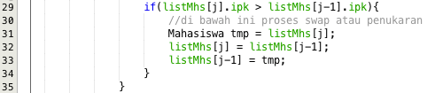
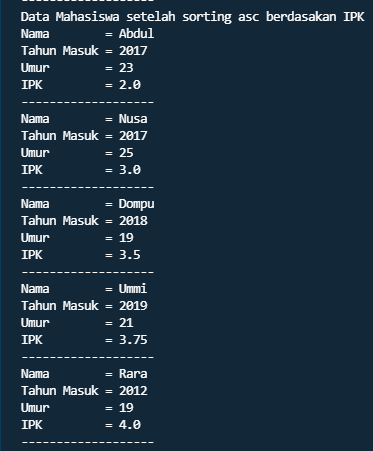

## Nama : Andika Ainur Wibowo
## Kelas : TI-1F
## No Absen : 07

# Jobsheet 6
**5.2 Mengurutkan Data Mahasiswa Berdasarkan IPK Menggunakan Bubble Sort**

SourceCode Mahasiswa.java

```java
package SourceCode;
public class Mahasiswa{
    String nama;
    int thnMasuk,umur;
    double ipk;

    Mahasiswa(String n,int t, int u, double i){
        nama=n;
        thnMasuk=t;
        umur=u;
        ipk=i;
    }
    void tampil(){
        System.out.println("Nama        = "+nama);
        System.out.println("Tahun Masuk = "+thnMasuk);
        System.out.println("Umur        = "+umur);
        System.out.println("IPK         = "+ipk);
    }
}
```

SourceCode DaftarMahasiswaBerprestasi.java

```java
package SourceCode;
public class DaftarMahasiswaBerprestasi{
    Mahasiswa listMhs[]=new Mahasiswa[5];
    int idx;
    void tambah(Mahasiswa m){
        if(idx<listMhs.length){
            listMhs[idx]=m; // selama id belum  mencapai , maka object mahasiswa dapat terus dimasukkan array listMhs
            idx++;
        }else{
            System.out.println("Data sudah penuh!!!");
        }
    }
    void tampil(){
        for(Mahasiswa m:listMhs){
            m.tampil();
            System.out.println("-------------------");
        }
    }
    void bubbleSort(){
        for(int i=0;i<listMhs.length-1;i++){
            for(int j=1;j<listMhs.length-i;j++){
                if(listMhs[j].ipk>listMhs[j-1].ipk){
                    //proses penukaran
                    Mahasiswa tmp=listMhs[j];
                    listMhs[j]=listMhs[j-1];
                    listMhs[j-1]=tmp;
                }
            }
        }
    }
    void selectionSort(){
        for(int i=0;i<listMhs.length-1;i++){
            int idxMin=i;
            for(int j=i+1;j<listMhs.length;j++){
                if(listMhs[j].ipk<listMhs[idxMin].ipk){
                    idxMin=j;
                }
            }
            //Swap
            Mahasiswa tmp=listMhs[idxMin];
            listMhs[idxMin]=listMhs[i];
            listMhs[i]=tmp;
        }
    }
    void insertionSort(boolean asc){
        for(int i=1;i<listMhs.length;i++){
            Mahasiswa temp=listMhs[i];
            int j=i;
            if(asc){
            //while(j>0 && listMhs[j-1].ipk>temp.ipk){
            //    listMhs[j]=listMhs[j-1];
            //    j--;
            //}
            for(;j>0 && listMhs[j-1].ipk>temp.ipk;j--){
                listMhs[j]=listMhs[j-1];
            }
        }else{
            for(;j>0 && listMhs[j-1].ipk<temp.ipk;j--){
                listMhs[j]=listMhs[j-1];
            }
        }
            listMhs[j]=temp;
        }
    }
}
```
SourceCode MahasiswaMain.java
```java
package SourceCode;
import java.util.Scanner;
public class MahasiswaMain {
    public static void main(String[] args) {
        Scanner in=new Scanner(System.in);
        DaftarMahasiswaBerprestasi list=new DaftarMahasiswaBerprestasi();
        Mahasiswa m1=new Mahasiswa("Nusa", 2017, 25, 3);
        Mahasiswa m2=new Mahasiswa("Rara", 2012, 19, 4);
        Mahasiswa m3=new Mahasiswa("Dompu", 2018, 19, 3.5);
        Mahasiswa m4=new Mahasiswa("Abdul", 2017, 23, 2);
        Mahasiswa m5=new Mahasiswa("Ummi", 2019, 21, 3.75);

        list.tambah(m1);
        list.tambah(m2);
        list.tambah(m3);
        list.tambah(m4);
        list.tambah(m5);

        System.out.println("Data Mahasiswa sebelum sorting = ");
        list.tampil();

        //System.out.println("Data Mahasiswa setelah sorting desc berdasakan IPK");
        //list.bubbleSort();
        //list.tampil();

        //System.out.println("Data Mahasiswa setelah sorting asc berdasarkan IPK");
        //list.selectionSort();
        //list.tampil();
        boolean pilih;
        System.out.println("1. Asc (Terkecil ke Terbesar)");
        System.out.println("2. Dsc (Terbesar ke Terkecil)");
        System.out.println("=-=-=-=-=-=-=-=-=-=-=-=-=-=-");
        System.out.print("Masukkan pilihan : ");
        int input=in.nextInt();
        if(input==1){
            pilih=true;
        }
        else{
            pilih=false;
        }
        System.out.println("Data Mahasiswa setelah sorting asc/dsc berdasarkan IPK");
        list.insertionSort(pilih);
        list.tampil();
        in.close();
    }
}
```

**5.2.3 Pertanyaan**

1. Terdapat di method apakah proses bubble sort?

    **proses bubble sort terdapat pada method bubbleSort() , yang  mana method tersebut terdapat pada line ke 19 sampai 30, tepatnya pada class DaftarMahasiswaBerprestasi**

    
2. Terdapat di method apakah proses selection sort?
    
    **Pada Praktikum 1 selection sort tidak ada, namun  Proses selection sort terdapat pada prasktikum 2, tepatnya di method selectionSort(), yang  mana method tersebut terdapat pada line ke 31 sampai 44 tepatnya pada class DaftarMahasiswaBerprestasi.**

    

3. Apakah yang dimaksud proses swap? Tuliskan potongan program untuk melakukan
proses swap tersebut!

    **Seperti namanya roses swap adalah proses di mana pengurutan/penukaran terjadi, proses ini melakukan penukaran/pengurutan nilai pada sorting. Unutk kode programnya dapat di lihat pada class DaftarMahasiswaBerprestasi . proses swap terjadi pada 3 method pada clas tersebut, yakni pada method bubbleSort,selectionSort, dan insertionSort.**

BubbleSort  


SelectionSort


InsertionSort


4. Di dalam method bubbleSort(), terdapat baris program seperti di bawah ini:

Untuk apakah proses tersebut?

    **Baris kode di atas di pergunakan untuk melakukan perbandingan  terlebih dahulu yang mana akan di cek nilai dari listMhs indeks ke 1 apakah lebih besar dari listMhs indeks ke 0 jika iya maka dilakukan pertukaran yang terdapat pada kode baris ke 31 sampai 35**

5. Perhatikan perulangan di dalam bubbleSort() di bawah ini:


    a. Apakah perbedaan antara kegunaan perulangan i dan perulangan j?

    **perbedaan dari perulangani dengan perulangan j yakni, pada perulangan i di pergunakan untuk melakukan looping sebanyak listMhs.length- 1. Sementara itu unutk yang perulangan j di pergunakan untuk proses swap/penukaran nilai yang bertujuan untuk melakukan pengurutan, yang mana dalah hal ini menggunakan metode bubble sort**

    b. Mengapa syarat dari perulangan i adalah i<listMhs.length-1 ?

    **Karena pada perulangan ini i di berikan nilai 0 terlebih dahulu supaya bisa mencakup index ke – 0 , kemudian di gunakan i<listMhs.length-1 karena panjang dari listMhs yakni 5, dan di kurang 1 karena pada index terakhir tidak perlu di lakukan pengurutan**

    c. Mengapa syarat dari perulangan j adalah j<listMhs.length-i ?

    **tahapan bubblesort akan dilakukan sebanyak 4 kali, karena jika masuk pada nilai terakhir dimana sebelumnya sudah dilakukan perbandingan nilai, maka perulangan tidak perlu dilakukan karena nilai tersebut sudah pada tempatnya**

    d. Jika banyak data di dalam listMhs adalah 50, maka berapakali perulangan i akan 
    berlangsung? Dan ada berapa Tahap bubble sort yang ditempuh?

    **Maka perulangan i akan berlangsung 49 kali dan bubble sort yang di tempuh sebanyak 1225 kali**

**5.3 Mengurutkan Data Mahasiswa Berdasarkan IPK Menggunakan Selection Sort**

Jika pada praktikum yang sebelumnya kita telah mengurutkan data mahasiwa 
berdasarkan IPK menggunakan Bubble Sort secara descending, pada kali ini kita akan 
mencoba untuk menambahkan fungsi pengurutan menggunakan Selection Sort.

SourceCode 
```java
void selectionSort(){
        for(int i=0;i<listMhs.length-1;i++){
            int idxMin=i;
            for(int j=i+1;j<listMhs.length;j++){
                if(listMhs[j].ipk<listMhs[idxMin].ipk){
                    idxMin=j;
                }
            }
            //Swap
            Mahasiswa tmp=listMhs[idxMin];
            listMhs[idxMin]=listMhs[i];
            listMhs[i]=tmp;
        }
    }
```

**5.3.3. Pertanyaan**

Di dalam method selection sort, terdapat baris program seperti di bawah ini:


Untuk apakah proses tersebut, jelaskan!

Jawaban : **proses tersebut di maksudkan untuk melakukan pengurutan suatu nilai dengan metode Ascending (terkecil ke terbesar), pada baris kode 42 dilakukan inisialisasi terhadap variable idxMin dan di beri nilai dengan i. Pada baris kode ke 43 di lakukan perulangan int j di beri nilai i+1 yang menandakan j=1. Pada baris kode ke 44 terjadi pemilihan yang berisi jika listMhs indeks ke 1 kurang dari listMhs indeks ke 0 maka terjadi pertukaran nilai nah pada baris kode 45, nilai variable idxMin akan di ubah menjadi nilai yang terdapat pada j**


**5.4 Mengurutkan Data Mahasiswa Berdasarkan IPK Menggunakan Insertion Sort**

Yang terakhir akan diimplementasikan Teknik sorting menggunakan Insertion Sort, 
dengan mengurutkan IPK mahasiswa secara ascending.

Source Code
```java
void insertionSort(){
        for(int i=1;i<listMhs.length;i++){
            Mahasiswa temp=listMhs[i];
            int j=i;
            if(asc){
            while(j>0 && listMhs[j-1].ipk>temp.ipk){
               listMhs[j]=listMhs[j-1];
               j--;
            }
            listMhs[j]=temp;
        }
    }
```
Hasil Percobaan:




**5.4.3 Pertanyaan**

Ubahlah fungsi pada InsertionSort sehingga fungsi ini dapat melaksanakan proses sorting 
dengan cara ascending atau decending, anda dapat melakukannya dengan menambahkan 
parameter pada pemanggilan fungsi insertionSort.

```java
void insertionSort(boolean asc){
        for(int i=1;i<listMhs.length;i++){
            Mahasiswa temp=listMhs[i];
            int j=i;
            if(asc){
            for(;j>0 && listMhs[j-1].ipk>temp.ipk;j--){
                listMhs[j]=listMhs[j-1];
            }
        }else{
            for(;j>0 && listMhs[j-1].ipk<temp.ipk;j--){
                listMhs[j]=listMhs[j-1];
            }
        }
            listMhs[j]=temp;
        }
```
Hasil Program :


**5.5 Latihan Praktikum**

Sebuah yang bergerak dalam bidang penjualan tiket pesawat sedang mengembangkan 
backend untuk sistem pemesanan tiket, salah satu fiturnya adalah menampilkan daftar tiket 
yang tersedia berdasarkan pilihan filter yang diinginkan user. Daftar tiket ini harus dapat di 
sorting berdasarkan harga dimulai dari harga termurah ke harga tertinggi. 
Implementasikanlah class diagram berikut ini kedalam bahasa pemrograman java kemudian 
buatlah proses sorting data untuk harga tiket menggunakan algoritma bubble sort dan 
selection sort.


SourceCode Tiket.java
```java
package SourceCode;
public class Tiket {
    String maskapai,asal,tujuan;
    int harga;

    Tiket(String m,int h,String a,String t ){
        maskapai=m;
        harga=h;
        asal=a;
        tujuan=t;
    }
    void tampil(){
        System.out.println("=-=-=-=-=-=-=-=-=-=-=-=-=");
        System.out.println(" Sistem Pemesanan Tiket");
        System.out.println("=-=-=-=-=-=-=-=-=-=-=-=-=");
        System.out.println("Nama Maskapai : "+maskapai);
        System.out.println("Harga         : Rp"+harga);
        System.out.println("Asal          : "+asal);
        System.out.println("Tujuan        : "+tujuan);
    }
}
```

SourceCode TiketService.java
```java
package SourceCode;
public class TiketService {
    Tiket[] tikets=new Tiket[5];
    int ti;

    void tambah(Tiket m) {
        if (ti<tikets.length) {
            tikets[ti]=m;
            ti++;
        } else {
            System.out.println("ticket sudah penuh!");
        }
    }
    void tampilAll(){
        for(Tiket m:tikets){
            m.tampil();
        }
    }
    void bubbleSort(){
        for(int i=0;i<tikets.length-1;i++){
            for(int j=1;j<tikets.length-i;j++){
                if(tikets[j].harga<tikets[j-1].harga){
                    Tiket tmp=tikets[j];
                    tikets[j]=tikets[j-1];
                    tikets[j-1]=tmp;
                }
            }
        }
    }
    void selectionSort(){
        for(int i=0;i<tikets.length-1;i++){
            int idxMin=i;
                for(int j=i+1;j<tikets.length;j++){
                    if(tikets[j].harga>tikets[idxMin].harga){
                        idxMin=j;
                    }
                }
                Tiket tmp=tikets[idxMin];
                    tikets[idxMin]=tikets[i];
                    tikets[i]=tmp;
            }
        }
    }  

```

SourceCode MainTiket.java
```java
package SourceCode;
import java.util.Scanner;
public class MainTiket{
    public static void main(String[] args) {
        Scanner in=new Scanner(System.in);
        TiketService dika=new TiketService();
        Tiket t1=new Tiket("Batik Air",750000,"Jakarta","Malang");
        Tiket t2=new Tiket("Garuda Indonesia", 1050000, "Balikpapan", "Jakarta");
        Tiket t3=new Tiket("Lion Air", 650000, "Bali", "Surabaya");
        Tiket t4=new Tiket("Susi Air", 100000, "Banjarmasin", "Surabaya");
        Tiket t5=new Tiket("Sriwijaya Air", 900000, "Surabaya", "Jakarta");

        dika.tambah(t1);
        dika.tambah(t2);
        dika.tambah(t3);
        dika.tambah(t4);
        dika.tambah(t5);

        System.out.println("=-=-=-=-=-=-=-=-=-=-=-=-=-=-=");
        System.out.println("   Data Sebelum Sorting");
        System.out.println("=-=-=-=-=-=-=-=-=-=-=-=-=-=-=");
        dika.tampilAll();
        System.out.println();
        System.out.println("=-=-=-=-=-=-=-=-=-=-=-=-=");
        System.out.println("1. Ascending (BubbleSort)");
        System.out.println("2. Descending (SelectionSort)");
        System.out.print("Masukkan Pilihan Menu : ");
        int pil=in.nextInt();
        if(pil==1){
            System.out.println("=-=-=-=-=-Data Setelah Sorting Ascending-=-=-=-=-=-=");
            dika.bubbleSort();
            dika.tampilAll();
        }
        else{
            System.out.println("=-=-=-=-=-Data Setelah Sorting Descending-=-=-=-=-=-=");
            dika.selectionSort();
            dika.tampilAll();;
        }
        
        in.close();
    }
}
```

Hasil Program : 


