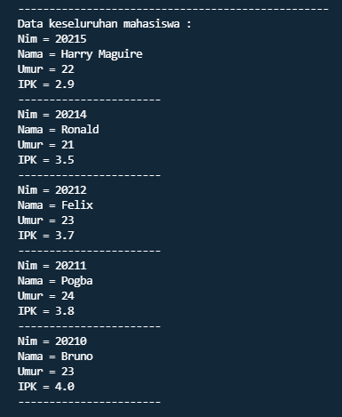
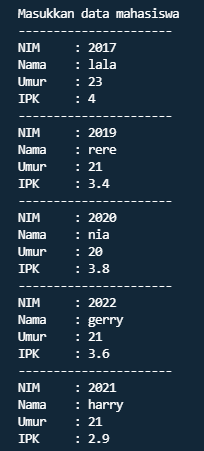

## Nama : Andika Ainur Wibowo
## Kelas : TI-1F
## No Absen : 07

# Pertemuan 7
**6.2. Searching / Pencarian Menggunakan Agoritma Sequential Search**

**6.2.1. Percobaan Sequential Search**

SourceCode Mahasiswa.java
```java
package SourceCode;
public class Mahasiswa{
    int nim,umur;
    String nama;
    double ipk;
    
    Mahasiswa(int ni,String n, int u, double i){
        nim=ni;
        nama=n;
        umur=u;
        ipk=i;
    }
    void tampil(){
        System.out.println("Nim = "+nim);
        System.out.println("Nama = "+nama);
        System.out.println("Umur = "+umur);
        System.out.println("IPK = "+ipk);
    }

}
```

SourceCode PencarianMhs.java
```java
package SourceCode;
public class PencarianMhs{
    Mahasiswa listMhs[]=new Mahasiswa[5];
    int idx;

    void tambah(Mahasiswa m){
        if(idx<listMhs.length){
            listMhs[idx]=m;
            idx++;
        }else{
            System.out.println("Data sudah penuh!!");
        }
    }
    void tampil(){
        for(Mahasiswa m:listMhs){
            m.tampil();
            System.out.println("-----------------------");
        }
    }
    public void Tampilposisi(int x, int pos){
        if(pos!=-1){
            System.out.println("Data : "+x+" ditemukan pada indeks "+pos);
        }
        else{
            System.out.println("Data : "+x+" tidak ditemukan");
        }
    }
    public void TampilData(int x, int pos){
        if(pos!=-1){
            System.out.println("Nim\t : "+x);
            System.out.println("Nama\t : "+listMhs[pos].nama);
            System.out.println("Umur\t : "+listMhs[pos].umur);
            System.out.println("IPK\t : "+listMhs[pos].ipk);
        }else{
            System.out.println("Data "+x+" tidak ditemukan");
        }
    }
}
```

SourceCode MahasiswaMain.java
```java
package SourceCode;
import java.util.Scanner;
public class MahasiswaMain {
    public static void main(String[] args) {
        Scanner s = new Scanner(System.in);
        Scanner s1 = new Scanner(System.in);
        PencarianMhs data=new PencarianMhs();
        int jumMhs=5;
        System.out.println("-----------------------------------------------------");
        System.out.println("Masukkan data mahasiswa secara urut dari NIM Terkecil");
        for(int i=0;i<jumMhs;i++){
            System.out.println("----------------------");
            System.out.print("NIM\t: ");
            int nim=s.nextInt();
            System.out.print("Nama\t: ");
            String nama=s1.nextLine();
            System.out.print("Umur\t: ");
            int umur=s.nextInt();
            System.out.print("IPK\t: ");
            double ipk=s.nextDouble();
            Mahasiswa m= new Mahasiswa(nim, nama, umur, ipk);
            data.tambah(m);
        }
            System.out.println("--------------------------------------------------");
            System.out.println("Data keseluruhan mahasiswa : ");
            data.tampil();

            System.out.println("__________________________________________________");
            System.out.println("__________________________________________________");
            System.out.println("Pencarian Data");
            System.out.println("Masukkan nim Mahasiswa yang dicari: ");
            System.out.print("NIM : ");
            int cari=s.nextInt();
            System.out.println("Menggunakan sequential search");
            int posisi=data.FindSeqSearch(cari);
            data.Tampilposisi(cari, posisi);
            data.TampilData(cari, posisi);
            s.close();
            s1.close();
    }
}
```
Output : 


**6.2.3. Pertanyaan**

1. Jelaskan perbedaan metod TampilData dan Tampilposisi pada class PencarianMhs

    **Perbedaan metod antara keduanya ialah : TampilData digunakan untuk menampilkan data yang dicari dan meliputi nama,NIM,umur,IPK.
    Sedangkan metod Tampilposisi digunakan untuk menampilkan posisi data yang dicari.**
2. Jelaskan fungsi break pada kode program dibawah ini! 

    

    **Fungsi break pada program tersebut ialah : ketika listMhs[j].nim equals dengan data yang dicari maka perulangan akan dihentikan  karena data sudah ditemukan.**
3. Jika Data Nim yang dimasukkan tidak terurut dari kecil ke besar. Apakah program masih dapat 
berjalan? Apakah hasil yang dikeluarkan benar? Mengapa demikian!

    **Program akan tetap berjalan dan hasilnya akurat. Mengapa demikian? Karena menggunakan metode sequential search yang dimana metode tersebut tidak perlu di urutkan terlebih dahulu datanya.**

**6.3. Searching / Pencarian Menggunakan Binary Search** 

**6.3.1. Percobaan Binary Search**

SouceCode Binary
```java
public int FindBinarySearch(int cari, int left, int right) {
        int mid;
        if (right >= left) {
            mid = (left + right) / 2;
            if (cari == listMhs[mid].nim) {
                return (mid);
            } else if (listMhs[mid].nim > cari) {
                return FindBinarySearch(cari, left, mid - 1);
            } else {
                return FindBinarySearch(cari, mid + 1, right);
            }
        }
        return -1;
    }
```
SourceCode Main
```java
package SourceCode;
import java.util.Scanner;
public class MahasiswaMain {
    public static void main(String[] args) {
        Scanner s = new Scanner(System.in);
        Scanner s1 = new Scanner(System.in);
        PencarianMhs data=new PencarianMhs();
        int jumMhs=5;
        System.out.println("-----------------------------------------------------");
        System.out.println("Masukkan data mahasiswa secara urut dari NIM Terkecil");
        for(int i=0;i<jumMhs;i++){
            System.out.println("----------------------");
            System.out.print("NIM\t: ");
            int nim=s.nextInt();
            System.out.print("Nama\t: ");
            String nama=s1.nextLine();
            System.out.print("Umur\t: ");
            int umur=s.nextInt();
            System.out.print("IPK\t: ");
            double ipk=s.nextDouble();
            Mahasiswa m= new Mahasiswa(nim, nama, umur, ipk);
            data.tambah(m);
        }
            System.out.println("--------------------------------------------------");
            System.out.println("Data keseluruhan mahasiswa : ");
            data.tampil();

            System.out.println("__________________________________________________");
            System.out.println("__________________________________________________");
            System.out.println("Pencarian Data");
            System.out.println("Masukkan nim Mahasiswa yang dicari: ");
            System.out.print("NIM : ");
            int cari=s.nextInt();
            System.out.println("Menggunakan sequential search");
            int posisi=data.FindSeqSearch(cari);
            data.Tampilposisi(cari, posisi);
            data.TampilData(cari, posisi);

            System.out.println("===================================================");
            System.out.println("Menggunakan Binary Search");
            posisi = data.FindBinarySearch(cari, 0, jumMhs - 1);
            data.Tampilposisi(cari, posisi);
            data.TampilData(cari, posisi);
            s.close();
            s1.close();
    }
}
```

Output :


**6.3.3. Pertanyaan**

1. Tunjukkan pada kode program yang mana proses divide dijalankan!

2. Tunjukkan pada kode program yang mana proses conquer dijalankan!

3. Jika data Nim yang dimasukkan tidak urut. Apakah program masih dapat berjalan? Mengapa 
demikian!
    
    **Program masih bisa berjalan akan tetapi pada binary search akan terjadi tidak ditemukannya data karena pada metode binary search diharuskan mengurutkan data terlebih dahulu. Berikut output program :**
    


4. Jika Nim yang dimasukkan dari NIM terbesar ke terkecil (missal : 20215, 20214, 20212, 20211, 
    20210) dan elemen yang dicari adalah 20210. Bagaimana hasil dari binary search? Apakah 
sesuai? Jika tidak sesuai maka ubahlah kode program binary seach agar hasilnya sesuai

    **Tidak sesuai,untuk modifikasi program dibawah ini :**


    **Jadi yang perlu dirubah hanya pada pembandingan antara listMhs[mid].nim dengan data yang dicari yang awalnya jika mid listMhs[mid].nim > cari di rubah menjadi listMhs[mid].nim < cari. mengapa demikian? karena pada soal no 4 data yang diinputkan yaitu secara descending**





5. Modifikasilah program diatas yang mana jumlah mahasiswa yang di inputkan sesuai dengan 
masukan dari keyboard.
Source Code PencarianMhs.java
```java
package SourceCode;
public class PencarianMhs{
    Mahasiswa listMhs[];
    int idx;

    void tambah(Mahasiswa m){
        if(idx<listMhs.length){
            listMhs[idx]=m;
            idx++;
        }else{
            System.out.println("Data sudah penuh!!");
        }
    }
    void tampil(){
        for(Mahasiswa m:listMhs){
            m.tampil();
            System.out.println("-----------------------");
        }
    }
    public int FindSeqSearch(int cari){
        int posisi = -1;
        for(int j=0;j<listMhs.length;j++){
            if(listMhs[j].nim==cari){
                posisi=j;
                break;
            }
        }
        return posisi;
    }
    public void Tampilposisi(int x, int pos){
        if(pos!=-1){
            System.out.println("Data : "+x+" ditemukan pada indeks "+pos);
        }
        else{
            System.out.println("Data : "+x+" tidak ditemukan");
        }
    }
    public void TampilData(int x, int pos){
        if(pos!=-1){
            System.out.println("Nim\t : "+x);
            System.out.println("Nama\t : "+listMhs[pos].nama);
            System.out.println("Umur\t : "+listMhs[pos].umur);
            System.out.println("IPK\t : "+listMhs[pos].ipk);
        }else{
            System.out.println("Data "+x+" tidak ditemukan");
        }
    }
    public int FindBinarySearch(int cari, int left, int right){
        int mid;
        if (right >= left){
            mid = (left + right) / 2;
            if (cari == listMhs[mid].nim){
                return (mid);
            }else if (listMhs[mid].nim < cari){
                return FindBinarySearch(cari, left, mid - 1);
            }else{
                return FindBinarySearch(cari, mid + 1, right);
            }
        }
        return -1;
    }
}
```
SourceCode MahasiswaMain.java
```java
package SourceCode;
import java.util.Scanner;
public class MahasiswaMain {
    public static void main(String[] args) {
        Scanner s = new Scanner(System.in);
        Scanner s1 = new Scanner(System.in);
        PencarianMhs data=new PencarianMhs();
        System.out.print("Masukkan jumlah data Mahasiswa : ");
        int jumMhs = s.nextInt();
        Mahasiswa[] inputan=new Mahasiswa[jumMhs];
        data.listMhs=inputan;
        System.out.println("-----------------------------------------------------");
        System.out.println("Masukkan data mahasiswa secara urut dari NIM Terkecil");
        for(int i=0;i<jumMhs;i++){
            System.out.println("----------------------");
            System.out.print("NIM\t: ");
            int nim=s.nextInt();
            System.out.print("Nama\t: ");
            String nama=s1.nextLine();
            System.out.print("Umur\t: ");
            int umur=s.nextInt();
            System.out.print("IPK\t: ");
            double ipk=s.nextDouble();
            Mahasiswa m= new Mahasiswa(nim, nama, umur, ipk);
            data.tambah(m);
        }
            System.out.println("--------------------------------------------------");
            System.out.println("Data keseluruhan mahasiswa : ");
            data.tampil();

            System.out.println("__________________________________________________");
            System.out.println("__________________________________________________");
            System.out.println("Pencarian Data");
            System.out.println("Masukkan nim Mahasiswa yang dicari: ");
            System.out.print("NIM : ");
            int cari=s.nextInt();
            System.out.println("Menggunakan sequential search");
            int posisi=data.FindSeqSearch(cari);
            data.Tampilposisi(cari, posisi);
            data.TampilData(cari, posisi);

            System.out.println("===================================================");
            System.out.println("Menggunakan Binary Search");
            posisi = data.FindBinarySearch(cari, 0, jumMhs - 1);
            data.Tampilposisi(cari, posisi);
            data.TampilData(cari, posisi);
            s.close();
            s1.close();
    }
}
```
Output :


**6.4. Percobaan Pengayaan Divide and Conquer**
**6.4.1. Percobaan Merge Sort**

SourceCode MergeSorting
```java
package SourceCode;
public class MergeSorting {
    public void mergeSort(int[] data){
        this.sort(data, 0, data.length - 1);
    }

    public void merge(int data[], int left, int middle, int right) {
        int[] temp=new int[data.length];
        for(int i=left; i <= right;i++){
            temp[i]=data[i];
        }
        int a =left;
        int b =middle + 1;
        int c =left;

        // membandingkan setiap bagian
        while(a <=middle && b <=right){
            if(temp[a] <=temp[b]) {
                data[c] =temp[a]; a++;
            }else{
                data[c] = temp[b]; b++;
            }
            c++;
        }
        int s =middle-a;
        for(int i =0;i <= s;i++){
            data[c+i] = temp[a+i];
        }
    }
    // membagi menjadi 2 bagian dan dibagi kembali hingga tidak dapat dibagi kembali
    void sort(int data[], int left, int right){
        if(left < right){
            int middle =(left+right)/2;
            sort(data, left, middle);
            sort(data, middle+1, right);
            merge(data, left, middle, right);
        }

    }

    public void printArray(int arr[]){
        int n =arr.length;
        for (int i =0;i < n;i++) {
            System.out.print(arr[i]+" ");
        }
        System.out.println();
    }
}
```
SourceCode SortMain.java
```java
package SourceCode;
public class SortMain {
    public static void main(String[] args) {
                int data[] ={10, 40, 30, 50, 70, 20, 100, 90};
                System.out.println("Sorting dengan merge sort");
                MergeSorting mSort = new MergeSorting();
                System.out.println("Data awal");
                mSort.printArray(data);
                mSort.mergeSort(data);
                System.out.println("Setelah diurutkan");
                mSort.printArray(data);
    }
}
```
Output : 


**6.5. Latihan Praktikum**
1. Modifikasi percobaan searching diatas dengan ketentuan berikut ini
- Sebelum dilakukan searching dengan binary search data harus dilakukan pengurutan dengan 
menggunakan algoritma sorting (pilih salah satu algoritma sorting dari pertemuan 
sebelumnya)
SourceCode PencarianMhs.java
```java
package SourceCode;
public class PencarianMhs{
    Mahasiswa listMhs[]=new Mahasiswa[5];
    int idx;

    void tambah(Mahasiswa m){
        if(idx<listMhs.length){
            listMhs[idx]=m;
            idx++;
        }else{
            System.out.println("Data sudah penuh!!");
        }
    }
    void tampil(){
        for(Mahasiswa m:listMhs){
            m.tampil();
            System.out.println("-----------------------");
        }
    }
    void selectionSort(){
        for(int i=0;i<listMhs.length-1;i++){
            int idxMin=i;
            for(int j=i+1;j<listMhs.length;j++){
                if(listMhs[j].nim>listMhs[idxMin].nim){
                    idxMin=j;
                }
            }
            Mahasiswa tmp=listMhs[idxMin];
            listMhs[idxMin]=listMhs[i];
            listMhs[i]=tmp;
        }
    }
    public void Tampilposisi(int x, int pos){
        if(pos!=-1){
            System.out.println("Data : "+x+" ditemukan pada indeks "+pos);
        }
        else{
            System.out.println("Data : "+x+" tidak ditemukan");
        }
    }
    public void TampilData(int x, int pos){
        if(pos!=-1){
            System.out.println("Nim\t : "+x);
            System.out.println("Nama\t : "+listMhs[pos].nama);
            System.out.println("Umur\t : "+listMhs[pos].umur);
            System.out.println("IPK\t : "+listMhs[pos].ipk);
        }else{
            System.out.println("Data "+x+" tidak ditemukan");
        }
    }
    public int FindBinarySearch(int cari, int left, int right){
        int mid;
        if (right >= left){
            mid = (left + right) / 2;
            if(cari == listMhs[mid].nim){
                return (mid);
            }else if(listMhs[mid].nim > cari){
                return FindBinarySearch(cari, left, mid - 1);
            }else{
                return FindBinarySearch(cari, mid + 1, right);
            }
        }
        return -1;
    }
}
```
SourceCode MahasiswaMain.java
```java
package SourceCode;
import java.util.Scanner;
public class MahasiswaMain {
    public static void main(String[] args) {
        Scanner s = new Scanner(System.in);
        Scanner s1 = new Scanner(System.in);
        PencarianMhs data=new PencarianMhs();
        int jumMhs=5;
        System.out.println("-----------------------------------------------------");
        System.out.println("Masukkan data mahasiswa");
        for(int i=0;i<jumMhs;i++){
            System.out.println("----------------------");
            System.out.print("NIM\t: ");
            int nim=s.nextInt();
            System.out.print("Nama\t: ");
            String nama=s1.nextLine();
            System.out.print("Umur\t: ");
            int umur=s.nextInt();
            System.out.print("IPK\t: ");
            double ipk=s.nextDouble();
            Mahasiswa m= new Mahasiswa(nim, nama, umur, ipk);
            data.tambah(m);
        }
            System.out.println("--------------------------------------------------");
            System.out.println("Data keseluruhan mahasiswa : ");
            data.tampil();
            System.out.println("Data Keseluruhan setelah Sorting dsc sesuai NIM: ");
            data.selectionSort();
            data.tampil();
            System.out.println("__________________________________________________");
            System.out.println("__________________________________________________");
            System.out.println("Pencarian Data");
            System.out.println("Masukkan NIM Mahasiswa yang dicari: ");
            System.out.print("NIM : ");
            int cari=s.nextInt();
            System.out.println("===================================================");
            System.out.println("Menggunakan Binary Search");
            int posisi = data.FindBinarySearch(cari, 0, jumMhs - 1);
            data.Tampilposisi(cari, posisi);
            data.TampilData(cari, posisi);
            s.close();
            s1.close();
    }
}
```
Output : 




2. Modifikasi percobaan searching diatas dengan ketentuan berikut ini
- Pencarian dilakukan berdasarkan Nama Mahasiswa (gunakan Algoritma Sequential Search)
- Jika terdapat nama yang sama? Bagaimana keluaran dari kode program ketika pencarian 
dilakukan pada nama yang sama!

SourceCode Mahasiswa.java
```java
package SourceCode;
public class Mahasiswa{
    int nim,umur;
    String nama;
    double ipk;
    
    Mahasiswa(int ni,String n, int u, double i){
        nim=ni;
        nama=n;
        umur=u;
        ipk=i;
    }
    void tampil(){
        System.out.println("Nim = "+nim);
        System.out.println("Nama = "+nama);
        System.out.println("Umur = "+umur);
        System.out.println("IPK = "+ipk);
    }

}
```
SourceCode PencarianMhs.java
```java
package SourceCode;
public class PencarianMhs{
    Mahasiswa listMhs[]=new Mahasiswa[5];
    int idx;

    void tambah(Mahasiswa m){
        if(idx<listMhs.length){
            listMhs[idx]=m;
            idx++;
        }else{
            System.out.println("Data sudah penuh!!");
        }
    }
    void tampil(){
        for(Mahasiswa m:listMhs){
            m.tampil();
            System.out.println("-----------------------");
        }
    }
    
    public int FindSeqSearch(String cari){
        int posisi = -1;
        for(int j=0;j<listMhs.length;j++){
            if(cari.equals(listMhs[j].nama)){
                posisi=j;
                break;
            }
        }
        return posisi;
    }
    public void Tampilposisi(String x, int pos){
        if(pos!=-1){
            System.out.println("Data : "+x+" ditemukan pada indeks "+pos);
        }
        else{
            System.out.println("Data : "+x+" tidak ditemukan");
        }
    }
    public void TampilData(String x, int pos){
        if(pos!=-1){
            System.out.println("NIM\t : "+listMhs[pos].nim);
            System.out.println("Nama\t : "+x);
            System.out.println("Umur\t : "+listMhs[pos].umur);
            System.out.println("IPK\t : "+listMhs[pos].ipk);
        }else{
            System.out.println("Data "+x+" tidak ditemukan");
        }
    }
}
```
SourceCode MahasiswaMain.java
```java
package SourceCode;
import java.util.Scanner;
public class MahasiswaMain {
    public static void main(String[] args) {
        Scanner s = new Scanner(System.in);
        Scanner s1 = new Scanner(System.in);
        PencarianMhs data=new PencarianMhs();
        int jumMhs=5;
        System.out.println("-----------------------------------------------------");
        System.out.println("Masukkan data mahasiswa secara urut dari NIM Terkecil");
        for(int i=0;i<jumMhs;i++){
            System.out.println("----------------------");
            System.out.print("NIM\t: ");
            int nim=s.nextInt();
            System.out.print("Nama\t: ");
            String nama=s1.nextLine();
            System.out.print("Umur\t: ");
            int umur=s.nextInt();
            System.out.print("IPK\t: ");
            double ipk=s.nextDouble();
            Mahasiswa m= new Mahasiswa(nim, nama, umur, ipk);
            data.tambah(m);
        }
            System.out.println("--------------------------------------------------");
            System.out.println("Data keseluruhan mahasiswa : ");
            data.tampil();

            System.out.println("__________________________________________________");
            System.out.println("__________________________________________________");
            System.out.println("Pencarian Data");
            System.out.println("Masukkan nama Mahasiswa yang dicari: ");
            System.out.print("nama : ");
            String cari=s1.nextLine();
            System.out.println("Menggunakan sequential search");
            int posisi=data.FindSeqSearch(cari);
            data.Tampilposisi(cari, posisi);
            data.TampilData(cari, posisi);
            s.close();
            s1.close();
    }
}
```
Output :


3. Terdapat sebuah data array 1 dimensi sebagai berikut

Buatlah program untuk mengurutkan array tersebut (boleh memilih metode pengurutan) 
selanjutnya lakukan pencarian dan mencetak isi array yang nilainya terbesar, dan mencetak ada 
berapa buah nilai terbesar tersebut serta berada dilokasi mana saja nilai terbesar tersebut! 
(menggunakan binary search)

SourceCode LatArray3.java
```java
package SourceCode;
public class LatArray3{
     int[] data;
     int max=0;
     int posisi;
     int jumlah=0;

    LatArray3(int arr[]){
        data=arr;
    }

    void tampil(){
        for(int i=0;i<data.length;i++){
            System.out.print(data[i]+"  ");
        }
        System.out.println();
    }
    void selectionSort(){
        for(int i=0;i<data.length-1;i++){
            int idxMin=i;
            for(int j=i+1;j<data.length;j++){
                if(data[j]>data[idxMin]){
                    idxMin=j;
                }
            }
            int tmp=data[idxMin];
            data[idxMin]=data[i];
            data[i]=tmp;
        }
    }
    int Search(int cari, int left, int right){
        int mid;
        if(right >=left){
            mid=(left+right)/2;
            if(cari==data[mid]){
                return(mid);
            }else if(data[mid] >cari) {
                return Search(cari, mid + 1, right);
            }else{
                return Search(cari, left, mid - 1);
            }
        }
        return -1;
    }

    int nilaiTerbesar(){
        for(int i =0;i<data.length;i++){
            if (data[i]>max){
                max=data[i];
            }
        }
        System.out.println("Nilai terbesarnya adalah : " +max);
        return max;
    }

    void tampilPosisi(int pos){
        for(int i=0;i<data.length;i++){
            if(data[i] == max){
                jumlah++;
            }
        }
        System.out.print("dengan jumlah " +jumlah);
        System.out.println();
        posisi=max;
        for(int i=0;i<data.length;i++){
            if(posisi==data[i]){
                pos=i;
                System.out.println("Data ditemukan pada indeks ke-" +pos);
            }
        }
    }
}
```
SourceCode LatArrayMain.java
```java
package SourceCode;
public class LatArrayMain{
    public static void main(String[] args){
        int bilangan[]={12,17,2,1,70,50,90,17,2,90};
        LatArray3 array=new LatArray3(bilangan);
        int jumlah=10;
        int max=0;
        System.out.println("====================================");
        System.out.println("-=-=-=-=-=-=-=-=DATA-=-=-=-=-=-=-=-=");
        array.tampil();
        array.selectionSort();
        System.out.println("====================================");
        System.out.println("         Setelah di sorting");
        System.out.println("====================================");
        array.tampil();
        System.out.println("====================================");
        array.nilaiTerbesar();
        array.Search(max, 0, jumlah - 1);
        array.tampilPosisi(max);
    }
}
```

Output:


