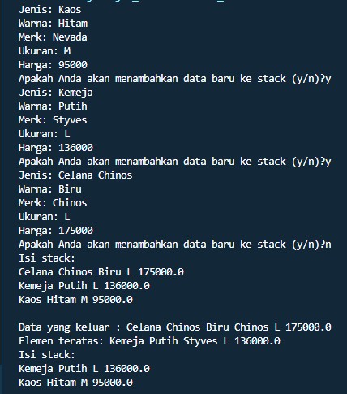
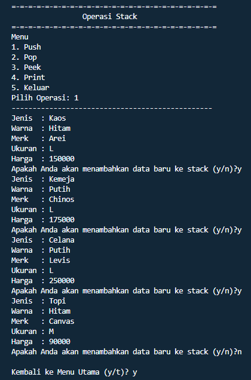
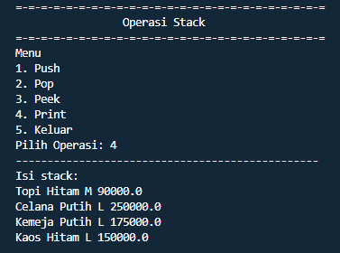
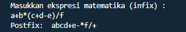
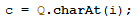
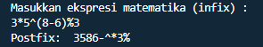
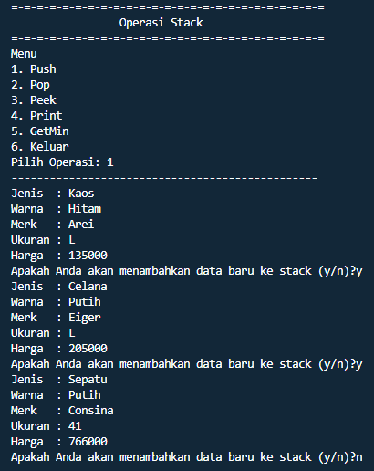
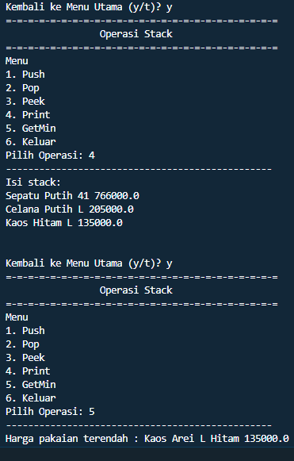

## Nama : Andika Ainur Wibowo
## NIM : 2141720238
## Kelas : TI-1F
## No Absen : 07

## Pertemuan 9

**7.2 Praktikum 1 Stack**

SourceCode Pakaian
```java
package SourceCode;
public class Pakaian {
    String jenis,warna,merk,ukuran;
    double harga;
    
    Pakaian(String jenis, String warna, String merk, String ukuran, double harga){
        this.jenis =jenis;
        this.warna =warna;
        this.merk =merk;
        this.ukuran =ukuran;
        this.harga =harga;
    }
}
```

SourceCode Stack
```java
package SourceCode;
public class Stack{
    int size;
    int top;
    Pakaian data [];
    
     public Stack(int size){
         this.size = size;
         data = new Pakaian[size];
         top = -1;
     }
     public boolean IsEmpty(){
       if (top ==  -1){
           return true;
       }  else {
           return false;
       }
     }
      public boolean IsFull(){
       if (top == size -1){
           return true;
       }  else {
           return false;
       }
     }
      public void push (Pakaian pkn){
          if(!IsFull()){
              top++;
              data[top] = pkn;
          }else {
              System.out.println("Isi stack penuh!!");
          }
      }
      public void pop(){
          if (!IsEmpty()){
              Pakaian x = data[top];
              top--;
              System.out.println("Data yang keluar : " + x.jenis + " " + x.warna + " " + x.merk + " " + x.ukuran + " " + x.harga);
          } else {
              System.out.println("Stack masih kosong");
          }
      }
      public void peek (){
          System.out.println("Elemen teratas: " + data[top].jenis + " " + data[top].warna + " " + data[top].merk + " " + data[top].ukuran + " " + data[top].harga);
      }
      public void print(){
          System.out.println("Isi stack: ");
          for(int i = top; i >= 0; i--){
              System.out.println(data[i].jenis + " " + data[i].warna + " " + data[i].ukuran + " " + data[i].harga + " ");
            }
          System.out.println("");
      }
      public void clear(){
          if(!IsEmpty()){
              for (int i = top ; i >= 0; i--){
                  top--;
              }
              System.out.println("Stack sudah dikosongkan");
          }else{
              System.out.println("Stack masih kosong");          
          }
    }
}
```

SourceCode StackMain
```java
package SourceCode;
import java.util.Scanner;
public class StackMain {
    public static void main(String[] args) {
        Scanner sc=new Scanner(System.in);
        Stack stk =new Stack(10);
        char pilih;
         do{
       System.out.print("Jenis: ");
       String jenis =sc.nextLine();
       System.out.print("Warna: ");
       String warna =sc.nextLine();
       System.out.print("Merk: ");
       String merk =sc.nextLine();
       System.out.print("Ukuran: ");
       String ukuran =sc.nextLine();
       System.out.print("Harga: ");
       double harga =sc.nextDouble();
       
       Pakaian p =new Pakaian(jenis,warna,merk,ukuran,harga);
       System.out.print("Apakah Anda akan menambahkan data baru ke stack (y/n)?");
       pilih =sc.next().charAt(0);
       sc.nextLine();
       stk.push(p);
       }
       while (pilih == 'y');
       stk.print();
       stk.pop();
       stk.peek();
       stk.print();
       sc.close();
    }
}
```
Output Program



**7.2.1 Pertanyaan**

1. Berapa banyak data pakaian yang dapat ditampung di dalam stack? Tunjukkan potongan kode
program untuk mendukung jawaban Anda tersebut!

    **Banyak data yang dapat ditampung yaitu 10 berikut kode programnya** ```javaStack stk =new Stack(10);```

2. Perhatikan class StackMain, pada saat memanggil fungsi push, parameter yang dikirimkan adalah
p. Data apa yang tersimpan pada variabel p tersebut?

    **Data yang tersimpan dalam variable p yaitu meliputi Jenis, Warna, Merk, Ukuran, dan Harga.**

3. Apakah fungsi penggunaan do-while yang terdapat pada class StackMain?

    **Fungsi do-while digunakan sebagai perulangan untuk melakukan menambahkan data pada array 
Pakaian.**

4. Modifikasi kode program pada class StackMain sehingga pengguna dapat memilih operasioperasi pada stack (push, pop, peek, atau print) melalui pilihan menu program dengan
memanfaatkan kondisi IF-ELSE atau SWITCH-CASE!

SourceCode Modifikasi
```java
package SourceCode;
import java.util.Scanner;
public class StackMain {
    public static void main(String[] args) {
        Scanner sc=new Scanner(System.in);
        Scanner in=new Scanner(System.in);
        Scanner in1=new Scanner(System.in);
        Stack stk =new Stack(10);
    //Modifikasi Praktikum 1
        char keluar;
        do{
      System.out.println("=-=-=-=-=-=-=-=-=-=-=-=-=-=-=-=-=-=-=-=-=-=-=-=-=");
      System.out.println("\t\t Operasi Stack ");
      System.out.println("=-=-=-=-=-=-=-=-=-=-=-=-=-=-=-=-=-=-=-=-=-=-=-=-=");
      System.out.println("Menu");
      System.out.println("1. Push");
      System.out.println("2. Pop");
      System.out.println("3. Peek");
      System.out.println("4. Print");
      System.out.println("5. Keluar");
      System.out.print("Pilih Operasi: ");
      int menu =sc.nextInt();
      System.out.println("------------------------------------------------");
      switch (menu){
      case 1: 
         char pilih;
         do{
       System.out.print("Jenis  : ");
       String jenis =in1.nextLine();
       System.out.print("Warna  : ");
       String warna =in1.nextLine();
       System.out.print("Merk   : ");
       String merk =in1.nextLine();
       System.out.print("Ukuran : ");
       String ukuran =in1.nextLine();
       System.out.print("Harga  : ");
       double harga =in.nextDouble();
       
       Pakaian p =new Pakaian(jenis, warna, merk, ukuran, harga);
       System.out.print("Apakah Anda akan menambahkan data baru ke stack (y/n)?");
       pilih =sc.next().charAt(0);
       sc.nextLine();
       stk.push(p);
       }while (pilih == 'y');
        break;
        case 2:
            stk.pop();
            break;
        case 3:
            stk.peek();
            break;
        case 4:
            stk.print();
            break;
        case 5:
            System.out.println("=-=-=-=-TerimaKasih-=-=-=-=");
            break;
        default :
        System.out.println("Menu yang anda masukkan tidak ada!");
        break;
        }if(menu == 5){
        keluar ='t';
        }
        else{
            System.out.print("\nKembali ke Menu Utama (y/t)? ");
            keluar =sc.next().charAt(0);
        }
    }while(keluar == 'Y' || keluar == 'y');
    sc.close();
    in.close();
    in1.close();
    }
}
```
Output Program




**7.3 Praktikum 2 Stack**

SourceCode Postfix
```java
package SourceCode;
public class Postfix{
    int n;
    int top;
    char[]stack;
    public  Postfix(int total){
        n=total;
        top =-1;
        stack =new char[n];
        push('(');
    }
    public void push(char c){
       top++; 
       stack[top]=c;
    }
    public char pop(){
        char item =stack[top];
        top--;
        return item;
    }
    public boolean IsOperand(char c){
        if((c>= 'A' && c <= 'Z') || (c >= 'a'&& c <= 'z') || (c >= '0' && c <= '9') || c == ' ' || c == '.'){ 
            return true;
        }else{
            return false;
        }
    }
    public boolean IsOperator(char c){
        if( c == '^' || c == '%' || c == '/' || c == '*' || c == '-' || c == '+'){
            return true;
        }else{
            return false;
        }
    }
    public int derajat(char c){
        switch (c){
            case '^':
                return 3;
            case '%':
                return 2;
            case'/':
                return 2;
            case '*':
                return 2;
            case '-':
                return 1;
            case '+':
                return 1;
            default:
                return 0;
        }
    }
    public String konversi(String Q){
        String P =" ";
        char c;
        for(int i = 0; i < n; i++){
            c =Q.charAt(i);
            if(IsOperand(c)){
                P = P+c;
            }
            if (c == '('){
                push(c);
            }
            if ( c == ')'){
                while( stack[top] != '('){
                    P = P+ pop();
                }
                pop();
            }
            if (IsOperator(c)){
                while (derajat(stack[top]) >=  derajat(c)){
                    P = P+pop();
                }
                push(c);
            }
        }
        return P;
    }
}
```

SourceCode PostfixMain
```java
package SourceCode;
import java.util.Scanner;
public class PostfixMain {
    public static void main(String[] args) {
        Scanner sc =new Scanner(System.in);
        String P,Q;
        System.out.println("Masukkan ekspresi matematika (infix) : ");
        Q =sc.nextLine();
        Q =Q.trim();
        Q =Q + ")";
        int total =Q.length();
        Postfix post =new Postfix(total);
        P =post.konversi(Q);
        System.out.println("Postfix: "+P);
        sc.close();
    }
}
```
Output Program



**7.3.2 Pertanyaan**
1. Perhatikan class Postfix, jelaskan alur kerja method derajat!

    **Method derajat digunkan untuk mengetahui seberapa besar nilai operator yang digunakan. 
    Sebuah data (operator) yang bertipe char akan masuk ke dalam method derajat lalu dicek satu persatu dalam switch case. Jika operator sama dengan ^ maka akan mereturnkan nilai 3 atau nilai tertinggi dari sebuah derajat operator. Jika operator sama dengan % maka akan 
    mereturn nilai 2. Jika operator sama dengan / maka akan mereturn nilai 2. Jika operator sama dengan * maka akan mereturn nilai 2. Jika operator sama dengan - atau + maka akan mereturn nilai 1. Dan jika tidak ada kesamaan operator yang diinputkan dengan perbandingan dalam switch case maka akan mereturn nilai 0 - Hal ini dilakukan untuk member keputusan apakah operator yang dimasukkan**

2. Apa fungsi kode program berikut?


    **Variabel c digunakan untuk meyimpan data char i ke dalam variable Q melalui sintaks charAt(i)**

3. Jalankan kembali program tersebut, masukkan ekspresi 3*5^(8-6)%3. Tampilkan hasilnya!

    

4. Pada soal nomor 3, mengapa tanda kurung tidak ditampilkan pada hasil konversi? Jelaskan!

    **Karena () hanya sebagai pembatas atau penanda dalam sintaks infix yang dirubah ke postfix.**

**7.4 Tugas**
1. Perhatikan dan gunakan kembali kode program pada Praktikum 1. Tambahkan method getMin
pada class Stack yang digunakan untuk mencari dan menampilkan data pakaian dengan harga 
terendah dari semua data pakaian yang tersimpan di dalam stack!

Penambahan Method getMin 
```java
public void getMin(){
         double hrgMin =data[0].harga;
         int id =0;
         for(int i = 1; i <= top; i++){
             if (hrgMin > data[i].harga){
             id =i;
             hrgMin =data[i].harga;
            }
        }
        System.out.println("Harga pakaian terendah : " + data[id].jenis + " " + data[id].merk + " " + data[id].ukuran + " " + data[id].warna + " " + data[id].harga);
    }
```
Output Program




2. Setiap hari Minggu, Dewi pergi berbelanja ke salah satu supermarket yang berada di area 
rumahnya. Setiap kali selesai berbelanja, Dewi menyimpan struk belanjaannya di dalam laci. 
Setelah dua bulan, ternyata Dewi sudah mempunyai delapan struk belanja. Dewi berencana 
mengambil lima struk belanja untuk ditukarkan dengan voucher belanja.
Buat sebuah program stack untuk menyimpan data struk belanja Dewi, kemudian lakukan juga 
proses pengambilan data struk belanja sesuai dengan jumlah struk yang akan ditukarkan dengan 
voucher. Informasi yang tersimpan pada struk belanja terdiri dari:

     Nomor transaksi

     Tanggal pembelian

     Jumlah barang yang dibeli

     Total harga bayar

    Tampilkan informasi struk belanja yang masih tersimpan di dalam stack!

SourceCode Belanja 
```java
package SourceCode;
public class Belanja {
    int size;
    int top;
    StrukBelanja data[];
    
        public Belanja(int size){
        this.size = size;
        data = new StrukBelanja[size];
        top = -1;
        }

        public boolean IsEmpty(){
        if(top == -1){
            return true;
        }else{
            return false;
        }
    }

        public boolean IsFull(){
        if(top == size - 1){
            return true;
        }else{
            return false;
        }
    }

        public void push(StrukBelanja sb){
        if(!IsFull()){
            top++;
            data[top] = sb;
        }else{
            System.out.println("Isi stack penuh!");
        }
    }

        public void pop(){
        if(!IsEmpty()){
            StrukBelanja x = data[top];
            top--;
            System.out.println("Data yang keluar: " + x.idStruk + " " + x.tanggal + " " + x.namaBarang + " " + x.jmlh + " " + x.total);
        }else{
            System.out.println("Stock masih kosong");
        }
    }

        public void peek(){
        System.out.println("Elemen teratas: " + data[top].idStruk +"."+ " " + data[top].tanggal + " " + data[top].namaBarang + " " + data[top].jmlh + " " + data[top].total);
    }

        public void print(){
        System.out.println("Isi stack: ");
        for(int i = top; i >= 0; i--){
        System.out.println(data[i].idStruk + " " + data[i].tanggal + " " + data[i].namaBarang + " " + data[i].jmlh + " " + data[i].total);
    }
        System.out.println("");
    }
        public void clear(){
            if(!IsEmpty()){
            for(int i = top; i >= 0; i--){
                top--;
            }
            System.out.println("Stock sudah dikosongkan");
            }else{
            System.out.println("Stock masih kosong");
        }
    }
}
```

SourceCode StrukBelanja
```java
package SourceCode;
public class StrukBelanja {
    String idStruk, tanggal, namaBarang;
    int jmlh, total;

    StrukBelanja(String id, String tgl, String nb, int j, int t){
    idStruk =id;
    tanggal =tgl;
    namaBarang =nb;
    jmlh =j;
    total =t;
    }
}
```

SourceCode StrukBelanjaMain
```java
package SourceCode;
import java.util.Scanner;
public class StrukBelanjaMain {
    public static void main(String[] args) {
        Scanner sc =new Scanner(System.in);
        Scanner in =new Scanner(System.in);

        System.out.println("=-=-=-=-=-=-=-=-=-=-=-=-=-=-=-=-=-=-=-=-=-=-=-=-=");
        System.out.println("\t\tStruk Belanja");
        System.out.println("=-=-=-=-=-=-=-=-=-=-=-=-=-=-=-=-=-=-=-=-=-=-=-=-=");
        System.out.print("Banyak Struk: ");
        int banyak = sc.nextInt();
        System.out.println("----------------------------------------------------");
        Belanja blj = new Belanja(banyak);

        int totalHarga = 0;
        int jml, harga;
        for (int i = 0; i < banyak; i++) {
        System.out.print("Nomor Transaksi: ");
        String id =in.nextLine();
        System.out.print("Tanggal Pembelian: ");
        String tanggal =in.nextLine();
        System.out.print("Nama Barang: ");
        String nb =in.nextLine();
        System.out.print("Jumlah Barang: ");
        jml = sc.nextInt();
        System.out.print("Harga Barang: ");
        harga = sc.nextInt();
        totalHarga =jml * harga;
        StrukBelanja bb =new StrukBelanja(id, tanggal, nb, jml,harga);
        blj.push(bb);
        System.out.print("Total Harga: "+ totalHarga);
        System.out.println();
        }

     char keluar;
     do{
    System.out.println("=-=-=-=-=-=-=-=-=-=-=-=-=-=-=-=-=-=-=-=-=-=-=-=-=");
    System.out.println("\t\tMenu List");
    System.out.println("=-=-=-=-=-=-=-=-=-=-=-=-=-=-=-=-=-=-=-=-=-=-=-=-=");
    System.out.println("1. Menampilkan struk teratas");
    System.out.println("2. Mengambil 5 struk untuk ditukar kupon");
    System.out.println("3. Menampilkan sisa struk");
    System.out.println("4. Keluar");
    System.out.print("Pilih menu :");
    int menu =sc.nextInt();
    System.out.println("------------------------------------------------");
    switch (menu){
        case 1:
            blj.peek();
            blj.print();
            break;
        case 2:
            blj.pop();
            blj.pop();
            blj.pop();
            blj.pop();
            blj.pop();
            break;
        case 3:
            blj.print();
            break;
         case 4:
            System.out.println("------Terimakasih------");
            break;
            default :
            System.out.println("Menu yang anda masukkan tidak tersedia!!!");
            break;
        }   if(menu == 4) {keluar = 't';}
            else{
                System.out.print("\nKembali ke Menu Utama (y/t)? ");
                keluar = sc.next().charAt(0);
            }
        }       while(keluar == 'Y' || keluar == 'y');
        sc.close();
        in.close();
    }   
}
```

Output Program 


