## Nama : Andika Ainur Wibowo
## NIM : 2141720238
## Kelas : TI-1F
## No Absen : 07

## Pertemuan 11 Linked List

**Praktikum 1**
Source Code Node
```java
package SourceCode.Minggu_11;
public class Node{
    int data;
    Node next;
    public Node(int nilai, Node berikutnya){
        this.data =nilai;
        this.next =berikutnya;
    }
}
```

Source Code SingleLinkedList
```java
package SourceCode.Minggu_11;
public class SingleLinkedList{
    Node head; //posisi awal linked list
    Node tail; //posisi akhir linked list
    public boolean isEmpty(){
        return head == null;
    }

    public void print(){
        if(!isEmpty()){
            Node tmp = head;
            System.out.print("Isi Linked List:\t");
            while (tmp != null){
                System.out.print(tmp.data + "\t");
                tmp = tmp.next;
            }
            System.out.println("");
        }else{
            System.out.println("Linked List Kosong!!");
        }
    }

    public void addFirst(int input){
        Node ndInput =new Node(input, null);
        if(isEmpty()){
            head = ndInput;
            tail = ndInput;
        }else{
            ndInput.next = head;
            head = ndInput;
        }
    }

    public void addLast(int input){
        Node ndInput = new Node(input, null);
        if(isEmpty()){
            head = ndInput;
            tail = ndInput;
        }else{
            tail.next = ndInput;
            tail = ndInput;
        }
    }

    public void insertAfter(int key, int input){
        Node ndInput = new Node(input, null);
        Node temp = head;
        do{
            if(temp.data == key){
                ndInput.next = temp.next;
                temp.next = ndInput;
                if(ndInput.next == null){
                    tail = ndInput;
                }
                break;
            }
            temp = temp.next;
        }while(temp != null);
    }

    public void insertAt(int index, int input){
        if(index < 0){
            System.out.println("Indeks Salah!!");
        }else if(index == 0){
            addFirst(input);
        }else{
            Node temp = head;
            for(int i = 0; i < index - 1; i++){
                temp = temp.next;
            }
            temp.next = new Node(input, temp.next);
            if(temp.next.next == null){
                tail = temp.next;
            }
        }
    }
}
```

Source Code SSLMain
```java
package SourceCode.Minggu_11;
public class SLLMain{
    public static void main(String[] args){
        SingleLinkedList singLL=new SingleLinkedList();
        //Praktikum 1
        singLL.print();
        singLL.addFirst(890);
        singLL.print();
        singLL.addLast(760);
        singLL.print();
        singLL.addFirst(700);
        singLL.print();
        singLL.insertAfter(700, 999);
        singLL.print();
        singLL.insertAt(3, 833);
        singLL.print();
    }
}
```

Output Program

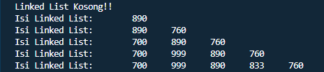

**Pertanyaan Praktikum 1**
1. Mengapa hasil compile kode program di baris pertama menghasilkan “Linked List Kosong”?

    **Hal tersebut di sebabkan karena linked list belum ada isian data dan yang di compile terlebih dahulu adalah method print**

2. Pada step 10, jelaskan kegunaan kode berikut
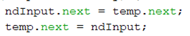

    **Kode tersebut untuk menunjukkan temp.next ke ndInput.next**

3. Perhatikan class **SingleLinkedList**, pada method **insertAt** Jelaskan kegunaan kode berikut
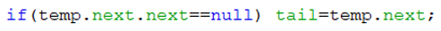

    **Maksud dari kode program tersebut adalah jika temp.next.next tersebut bernilai null atau tidak ada, maka
tail atau posisi terakhir adalah temp.next.**

**Praktikum 2 Modifikasi SLL**

Source Code SingleLinkedList

```java
package SourceCode.Minggu_11;
public class SingleLinkedList{
    Node head; //posisi awal linked list
    Node tail; //posisi akhir linked list
    public boolean isEmpty(){
        return head == null;
    }

    public void print(){
        if(!isEmpty()){
            Node tmp = head;
            System.out.print("Isi Linked List:\t");
            while (tmp != null){
                System.out.print(tmp.data + "\t");
                tmp = tmp.next;
            }
            System.out.println("");
        }else{
            System.out.println("Linked List Kosong!!");
        }
    }

    public void addFirst(int input){
        Node ndInput =new Node(input, null);
        if(isEmpty()){
            head = ndInput;
            tail = ndInput;
        }else{
            ndInput.next = head;
            head = ndInput;
        }
    }

    public void addLast(int input){
        Node ndInput = new Node(input, null);
        if(isEmpty()){
            head = ndInput;
            tail = ndInput;
        }else{
            tail.next = ndInput;
            tail = ndInput;
        }
    }

    public void insertAfter(int key, int input){
        Node ndInput = new Node(input, null);
        Node temp = head;
        do{
            if(temp.data == key){
                ndInput.next = temp.next;
                temp.next = ndInput;
                if(ndInput.next == null){
                    tail = ndInput;
                }
                break;
            }
            temp = temp.next;
        }while(temp != null);
    }

    public void insertAt(int index, int input){
        if(index < 0){
            System.out.println("Indeks Salah!!");
        }else if(index == 0){
            addFirst(input);
        }else{
            Node temp = head;
            for(int i = 0; i < index - 1; i++){
                temp = temp.next;
            }
            temp.next = new Node(input, temp.next);
            if(temp.next.next == null){
                tail = temp.next;
            }
        }
    }
    //Praktikum 2
    public int getData(int index){
        Node tmp = head;
        for(int i = 0; i < index; i++){
            tmp = tmp.next;
        }
        return tmp.data;
    }

    public int indexOf(int key){
        Node tmp = head;
        int index = 0;
        while(tmp != null && tmp.data != key){
            tmp = tmp.next;
            index++;
        }
        if(tmp == null){
            return -1;
        }else{
            return index;

        }
    }

    public void removeFirst(){
        if(isEmpty()){
            System.out.println("Linked List masih kosong, tidak dapat dihapus");
        }else if(head == tail){
            head = tail = null;
        }else{
            head = head.next;
        }
    }

    public void removeLast(){
        if (isEmpty()){
            System.out.println("Linked List masih kosong, tidak dapat dihapus");
        }else if(head == tail){
            head = tail = null;
        }else{
            Node temp = head;
            while(temp.next != tail){
                temp = temp.next;
            }
            temp.next = null;
            tail = temp;
        }
    }

    public void remove(int key){
        if(isEmpty()){
            System.out.println("Linked List masih kosong, tidak dapat di hapus");
        }else{
            Node temp = head;
            while(temp != null){
                if((temp.data == key) && (temp == head)){
                    this.removeFirst();
                    break;
                }else if(temp.next.data == key){
                    temp.next = temp.next.next;
                    if(temp.next == null){
                        tail = temp;
                    }
                    break;
                }
                temp = temp.next;
            }
        }
    }

    public void removeAt(int index){
        if(index == 0){
            removeFirst();
        }else{
            Node temp = head;
            for(int i = 0; i < index - 1; i++){
                temp = temp.next;
            }
            temp.next = temp.next.next;
            if(temp.next == null){
                tail = temp;
            }
        }
    }
}
```

Source Code SLLMain

```java
package SourceCode.Minggu_11;
public class SLLMain{
    public static void main(String[] args){
        SingleLinkedList singLL=new SingleLinkedList();
        //Praktikum 1
        singLL.print();
        singLL.addFirst(890);
        singLL.print();
        singLL.addLast(760);
        singLL.print();
        singLL.addFirst(700);
        singLL.print();
        singLL.insertAfter(700, 999);
        singLL.print();
        singLL.insertAt(3, 833);
        singLL.print();

        //Praktikum 2
        System.out.println("Data pada indeks ke-1 = " + singLL.getData(1));
        System.out.println("Data 3 berada pada indeks ke-" + singLL.indexOf(760));
        singLL.remove(999);
        singLL.print();
        singLL.removeAt(0);
        singLL.print();
        singLL.removeFirst();
        singLL.print();
        singLL.removeLast();
        singLL.print();
    }
}
```

Output Program

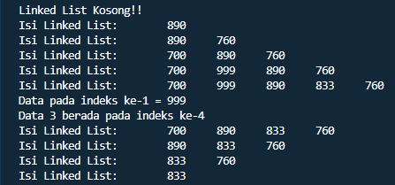

**Pertanyaan Praktikum 2**
1. Mengapa digunakan keyword break pada fungsi remove? Jelaskan!
    **Keyword break pada method remove berfungsi untuk keluar dari loop.
Untuk break pertama bertujuan mengecek apabila data yang ingin dihapus ada di head dan ditemukan maka akan berhenti dan keluar, untuk break kedua apabila data yang ingin dihapus ada di tengah dan di temukan maka akan berhenti dan keluar**
2. Jelaskan kegunaan kode dibawah pada method remove
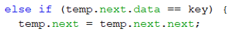

    **kode program tersebut berfungsi untuk menyambungkan node.next ke node.next.next agar pointernya tidak terputus antara node 1 ke node ke n**

3. Apa saja nilai kembalian yang dapat  dikembalikan pada method indexOf? Jelaskan maksud masing-masing kembalian tersebut!

    **jika tmp==null maka akan mengembalikan nilai -1 atau data kosong, dan jika tidak ada kondisi yang terpenuhi
sama sekali maka akan mengembalikan nilai dari index yaitu 0.**

**Tugas**
1. Buat method insertBefore untuk menambahkan node sebelum keyword yang diinginkan

Source Modifikasi 
```java
package SourceCode.Minggu_11;

public class Tugas1_SingleLinkedList {
    Tugas1_Node head;//posisi awal linked list
    Tugas1_Node tail;//posisi akhir linked list

    public boolean isEmpty(){
        return head == null;
    }

    public void print(){
        if (!isEmpty()){
            Tugas1_Node tmp = head;
            System.out.print("Isi Linked List :\t");
            while (tmp != null) {
                System.out.print(tmp.data + "\t");
                tmp = tmp.next;
            }
            System.out.println("");
        }else{
            System.out.println("Linked List Kosong");
        }
    }

    public void addFirst(int input){
        Tugas1_Node ndInput = new Tugas1_Node(input, null);
        if(isEmpty()) {//jika linked list kosong
            head = ndInput;//head dan tail sama dengan node input
            tail = ndInput;
        }else{
            ndInput.next = head;
            head = ndInput;
        }
    }

    public void addLast(int input){
        Tugas1_Node ndInput = new Tugas1_Node(input, null);
        if (isEmpty()){
            head = ndInput;//head dan tail sama dengan node input
            tail = ndInput;
        }else{
            tail.next = ndInput;
            tail = ndInput;
        }
    }

    public void insertAfter(int key, int input){
        Tugas1_Node ndInput = new Tugas1_Node(input, null);
        Tugas1_Node temp = head;
        do{
            if(temp.data == key){
                ndInput.next = temp.next;
                temp.next = ndInput;
                if(ndInput.next == null){
                    tail = ndInput;
                }
                break;
            }
            temp =temp.next;
        }while(temp != null);
    }

    public void insertBefore(int key, int input){
        Tugas1_Node ndInput =new Tugas1_Node(input, null);
        Tugas1_Node temp =head;
        while(temp != null){
            if((temp.data == key) && (temp == head)){
                this.addFirst(input);
                System.out.println("Berhasil Menambahkan Data");
                //jika insert pada awal linked list maka memanggil method addFirst          
                break;
            }else if (temp.next.data == key){
                ndInput.next = temp.next;
                temp.next = ndInput;
                System.out.println("Berhasil Menambahkan Data.");
                break;
            }
            temp = temp.next;
        }
    }

    public void insertAt(int index, int input){
        if(index < 0){
            System.out.println("Indeks salah");
        }else if (index == 0){
            addFirst(input);
        }else{
            Tugas1_Node temp = head;
            for (int i = 0; i < index - 1; i++){
                temp = temp.next;
            }
            temp.next = new Tugas1_Node(input, temp.next);
            if(temp.next.next == null){
                tail = temp.next;
            }
        }
    }

    public int getData(int index){
        Tugas1_Node tmp = head;
        for(int i = 0; i < index; i++){
            tmp = tmp.next;
        }
        return tmp.data;
    }

    public int indexOf(int key){
        Tugas1_Node tmp = head;
        int index = 0;
        while (tmp != null && tmp.data != key){
            tmp = tmp.next;
            index++;
        }
        if(tmp == null){
            return -1;
        }else{
            return index;
        }
    }

    public void removeFirst(){
        if(isEmpty()){
            System.out.println("Linked List masih Kosong, tidak dapat dihapus!");
        }else if(head == tail){
            head = tail = null;
        }else{
            head = head.next;
        }
    }

    public void removeLast(){
        if(isEmpty()){
            System.out.println("Linked List masih Kosong, tidak dapat dihapus!");
        }else if(head == tail){
            head = tail = null;
        }else{
            Tugas1_Node temp = head;
            while (temp.next != tail){
                temp = temp.next;
            }
            temp.next = null;
            tail = temp;
        }
    }

    public void remove(int key){
        if(isEmpty()){
            System.out.println("Linked List masih Kosong, tidak dapat dihapus!");
        }else{
            Tugas1_Node temp = head;
            while(temp != null){
                if((temp.data == key) && (temp == head)){
                    this.removeFirst();
                    break;
                }else if(temp.next.data == key){
                    temp.next = temp.next.next;
                    if(temp.next == null){
                        tail = temp;
                    }
                    break;
                }
                temp = temp.next;
            }
        }
    }

    public void removeAt(int index){
        if (index == 0) {
            removeFirst();
        } else {
            Tugas1_Node temp = head;
            for (int i = 0; i < index - 1; i++) {
                temp = temp.next;
            }
            temp.next = temp.next.next;
            if (temp.next == null) {
                tail = temp;
            }
        }
    }
}
```

Source Code Tugas1_SLLMain
```java
package SourceCode.Minggu_11;

public class Tugas1_SLLMain {
    public static void main(String[] args) {
        Tugas1_SingleLinkedList singLL = new Tugas1_SingleLinkedList();
        singLL.print();;
        singLL.addFirst(890);
        singLL.print();
        singLL.addLast(760);
        singLL.print();
        singLL.addFirst(700);
        singLL.print();
        singLL.insertAfter(700, 999);
        singLL.print();
        singLL.insertAt(3, 833);
        singLL.print();
        singLL.insertBefore(760, 50);
        singLL.print();

        System.out.println("Data pada indeks ke-1 = " + singLL.getData(1));
        System.out.println("Data 3 berada pada index ke- " + singLL.indexOf(760));

        singLL.remove(999);
        singLL.print();
        singLL.removeAt(0);
        singLL.print();
        singLL.removeFirst();
        singLL.print();
        singLL.removeLast();
        singLL.print();
    }
}
```

Output Program

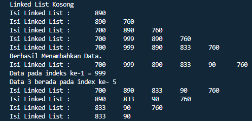

2. Implementasikan ilustrasi Linked List Berikut. Gunakan 4 macam  penambahan data yang telah dipelajari sebelumnya untuk menginputkan data.
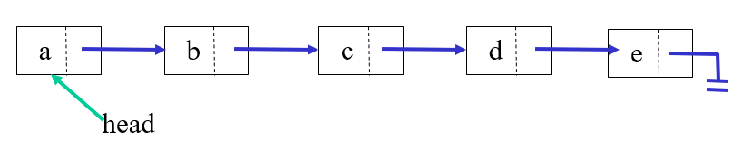

Source Code Tugas2_Single Linked List
```java
package SourceCode.Minggu_11;

public class Tugas2_SingleLinkedList {
    Tugas2_Node head;//posisi awal linked list
    Tugas2_Node tail;//posisi akhir linked list

    public boolean isEmpty(){
        return head == null;
    }

    public void print(){
        if(!isEmpty()){
            Tugas2_Node tmp = head;
            System.out.print("Isi Linked List :\t");
            while (tmp != null) {
                System.out.print(tmp.data + "\t");
                tmp = tmp.next;
            }
            System.out.println("");
        }else{
            System.out.println("Linked List Kosong");
        }
    }

    public void addFirst(char input){
        Tugas2_Node ndInput = new Tugas2_Node(input,null);
        if(isEmpty()){//jika linked list kosong
            head = ndInput;//head dan tail sama dengan node input
            tail = ndInput;
        }else{
            ndInput.next = head;
            head = ndInput;
        }
    }

    public void addLast(char input){
        Tugas2_Node ndInput = new Tugas2_Node(input,null);
        if(isEmpty()){
            head = ndInput;//head dan tail sama dengan node input
            tail = ndInput;
        }else{
            tail.next = ndInput;
            tail = ndInput;
        }
    }

    public void insertAfter(char key, char input){
        Tugas2_Node ndInput = new Tugas2_Node(input,null);
        Tugas2_Node temp = head;
        do{
            if(temp.data == key){
                ndInput.next = temp.next;
                temp.next = ndInput;
                if (ndInput.next == null){
                    tail = ndInput;
                }
                break;
            }
            temp = temp.next;
        } while (temp != null);
    }

    public void insertAt(int index, char input){
        if(index < 0){
            System.out.println("Indeks salah");
        }else if(index == 0){
            addFirst(input);
        }else{
            Tugas2_Node temp = head;
            for(int i = 0; i < index - 1; i++){
                temp = temp.next;
            }
            temp.next = new Tugas2_Node(input, temp.next);
            if(temp.next.next == null){
                tail = temp.next;
            }
        }
    }

    public void insertBefore(char key, char input){
        Tugas2_Node ndInput = new Tugas2_Node(input,null);
        Tugas2_Node temp = head;
        while(temp != null){
            if((temp.data == key) && (temp == head)){
                this.addFirst(input);
                break;
            }else if(temp.next.data == key){
                ndInput.next = temp.next;
                temp.next = ndInput;
                break;
            }
            temp = temp.next;
        }
    }
}
```

Source Code Tugas2_SLLMain
```java
package SourceCode.Minggu_11;

public class Tugas2_SLLMain {
    public static void main(String[] args) {
        Tugas2_SingleLinkedList SLL = new Tugas2_SingleLinkedList();
        SLL.addFirst('a');
        SLL.print();
        SLL.addLast('e');
        SLL.print();
        SLL.insertAfter('a', 'c');
        SLL.print();
        SLL.insertBefore('e', 'd');
        SLL.print();
        SLL.insertAt(1, 'b');
        SLL.print();
    }
}
```

Output Program

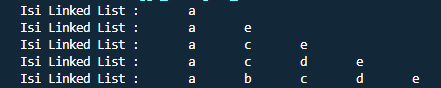

3. Buatlah Implementasi Stack berikut menggunakan  Single Linked List

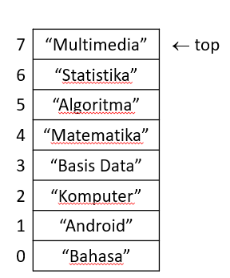 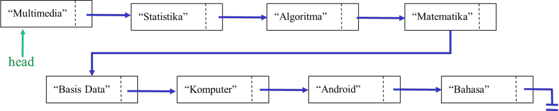

Source Code Tugas3_SingleLinkedList

```java
package SourceCode.Minggu_11;

public class Tugas3_SingleLinkedList {
    Tugas3_Node head;
    Tugas3_Node tail;

    public boolean isEmpty(){
        return head == null;
    }

    public void print(){
        if(!isEmpty()){
            Tugas3_Node tmp = head;
            System.out.println("");
            while (tmp != null){
                System.out.println(tmp.data);
                tmp = tmp.next;
            }
            System.out.println();
        }else{
            System.out.println("Stack Masih Kosong");
        }
    }

    public void peek(){
        if(!isEmpty()){
            Tugas3_Node tmp = head;

            System.out.println("Isi Stack Teratas = " + tmp.data);

        }else{
            System.out.println("Stack Masih Kosong");
        }
    }

    public void pushFirst(String input){
        Tugas3_Node ndInput = new Tugas3_Node(input, null);
        if(isEmpty()){//jika linked list kosong
            head = ndInput;//head dan tail sama dengan node input
            tail = ndInput;
        }else{
            ndInput.next = head;
            head = ndInput;
        }
    }
}
```

Source Code Tugas3_SLLMain

```java
package SourceCode.Minggu_11;

public class Tugas3_SLLMain {
    public static void main(String[] args) {
        Tugas3_SingleLinkedList singLL = new Tugas3_SingleLinkedList();
        singLL.pushFirst("Bahasa");
        singLL.print();
        singLL.pushFirst("Android");
        singLL.print();
        singLL.pushFirst("Komputer");
        singLL.print();
        singLL.pushFirst("Basis Data");
        singLL.print();
        singLL.pushFirst("Matematika");
        singLL.print();
        singLL.pushFirst("Algoritma");
        singLL.print();
        singLL.pushFirst("Statistika");
        singLL.print();
        singLL.pushFirst("Multimedia");

        System.out.println("Isi stack : ");
        singLL.print();
        singLL.peek();
    }
}
```

Output program

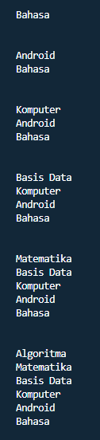

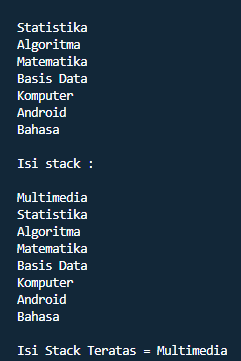

4. Buatlah implementasi program  antrian untuk mengilustasikan mahasiswa yang sedang meminta tanda tangan KRS pada dosen DPA di kampus pada tugas jobsheet 8 menggunakan LinkedList.
Implementasikan Queue pada antrian  mahasiswa dengan menggunakan konsep LinkedList!

Source Code Tugas4_SingleLinkedList
```java
package SourceCode.Minggu_11;

public class Tugas4_SingleLinkedList {
    Tugas4_Node head;
    Tugas4_Node tail;
    boolean IsEmpty(){
        return head==null;
    }
    void tambahData(String nim, String nama, int absen, double ipk){
        Tugas4_Node ndInput = new Tugas4_Node(nim,nama,absen,ipk, null);
        if(IsEmpty()){
            head = ndInput;
            tail = ndInput;
        }else{
            tail.next = ndInput;
            tail = ndInput;
        }
    }
    void print(){
        if (!IsEmpty()){
            Tugas4_Node tmp = head;
            int antrian = 0;
            System.out.println("Antrian : ");
            while (tmp != null) {
                System.out.println("Mahasiswa ke-" + (antrian+1) + " = " + tmp.nim + " " + tmp.nama + " " + tmp.absen+ " " + tmp.ipk);
                tmp = tmp.next;
                antrian++;
            }
            System.out.println("");
        }else{
            System.out.println("Antrian masih Kosong");
        }
    }
    void AntrianTerdepan(){
        if(!IsEmpty()){
            Tugas4_Node tmp = head;
            System.out.println("Antrian Terdepan = " + tmp.nim + " " + tmp.nama + " " + tmp.absen + " " + tmp.ipk);
        }else{
            System.out.println("Queue masih kosong");
        }
    }
    void AntrianBelakang(){
        if(!IsEmpty()){
            Tugas4_Node tmp = head;
            while(tmp != null){
                if(tmp == tail){
                    System.out.println("Antrian paling belakang : \n" + tmp.nim + " " + tmp.nama + " " + tmp.absen + " " + tmp.ipk);
                }
                tmp = tmp.next;
            }
        }else{
            System.out.println("Antrian Masih Kosong");
        }
    }
    void cariDataNim(String key){
        Tugas4_Node tmp = head;
        int index = 0;
        while(tmp != null && (!(tmp.nim.equals(key)))){
            tmp = tmp.next;
            index++;
        }
        if(tmp == null){
            System.out.println("Antrian Kosong");
        }else{
            System.out.println("Data " + key + " berada pada index ke " + index);
        }
        System.out.println("Data Mahasiswa : \n" + tmp.nim + " " + tmp.nama + " " + tmp.absen + " " + tmp.ipk);
    }
    void cariDataIndex(int index) {
        if (IsEmpty()) {
            System.out.println("Antrian Masih Kosong");
        } else {
            Tugas4_Node tmp = head;
            for (int i = 0; i < index; i++) {
                tmp = tmp.next;
            }
            System.out.println("Data pada Index ke-" + index + " adalah " + tmp.nim + " " + tmp.nama + " " + tmp.absen + " " + tmp.ipk);
        }
    }
    void remove(){
        if (IsEmpty()){
            System.out.println("Antrian Masih Kosong, tidak dapat dihapus!");
        }else if(head == tail){
            head = tail = null;
        }else{
            Tugas4_Node temp = head;
            while(temp.next != tail){
                temp = temp.next;
            }
            temp.next = null;
            tail = temp;
        }
    }    
}
```

Source Code Tugas4_SLLMain
```java
package SourceCode.Minggu_11;
import java.util.Scanner;
public class Tugas4_SLLMain {
    public static void main(String[] args) {
        Tugas4_SingleLinkedList singLL = new Tugas4_SingleLinkedList();
        Scanner sc = new Scanner(System.in);
        Scanner in = new Scanner(System.in);
        Scanner st = new Scanner(System.in);
        char pilih;
        int menu;
    do{
        System.out.println("Pilihan Menu");
        System.out.println("1. Tambah Data");
        System.out.println("2. Lihat Antrian Paling Depan");
        System.out.println("3. Lihat Antrian Paling Belakang");
        System.out.println("4. Mencari Data Mahasiswa Melalui Index");
        System.out.println("5. Mencari Data Mahasiswa Melalui NIM");
        System.out.println("6. Tampilkan Data");
        System.out.println("7. Hapus Data Terakhir");
        System.out.println("8. EXIT");
        System.out.print("Masukkan Pilihan Menu (1-8): ");
        menu = sc.nextInt();
        System.out.println("");
        if(menu < 1 || menu > 8){
            System.out.println("Masukkan Pilihan Menu Yang Benar!");
        }
    switch (menu){
        case 1:
        do{
            System.out.print("Masukkan NIM \t\t: ");
            String nim = st.nextLine();
            System.out.print("Nama Mahasiswa \t\t: ");
            String nama = st.nextLine();
            System.out.print("Absen Mahasiswa \t: ");
            int absen = in.nextInt();
            System.out.print("IPK Mahasiswa \t\t: ");
            double ipk = in.nextDouble();
            System.out.print("Apakah anda ingin menambah data baru? (y/n):");
            pilih = sc.next().charAt(0);
            singLL.tambahData(nim,nama,absen,ipk);
            System.out.println("");
            }while(pilih == 'y' || pilih == 'Y');
            break;
        case 2:
            singLL.AntrianTerdepan();
            System.out.println(" ");
            break;
        case 3:
            singLL.AntrianBelakang();
            System.out.println(" ");
            break;
        case 4:
            System.out.print("Masukkan Index Pada Data Yang Dicari : ");
            int idx = sc.nextInt();
            singLL.cariDataIndex(idx);
            System.out.println(" ");
            break;
        case 5:
            System.out.print("Masukkan NIM Mahasiswa Yang Ingin Dicari : ");
            String no = st.nextLine();
            singLL.cariDataNim(no);
            System.out.println(" ");
            break;
        case 6:
            singLL.print();
            System.out.println(" ");
            break;
            
        case 7:
            singLL.remove();
            System.out.println(" ");
            break;
            }
        }while(menu > 0 && menu < 8);
        System.out.println("Thank You:P");
    }
}
```

Output Program

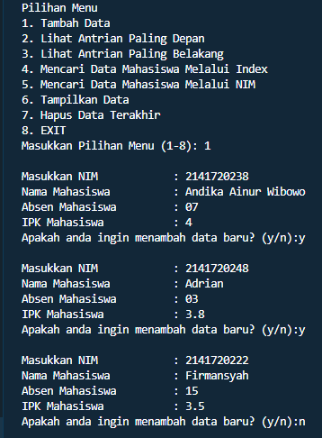

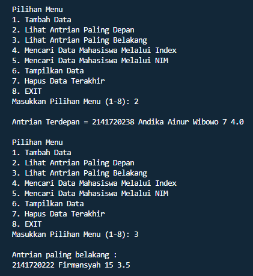

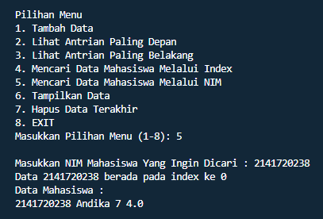

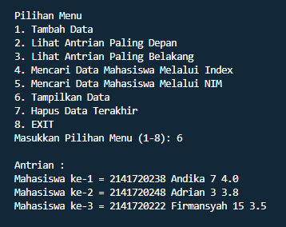

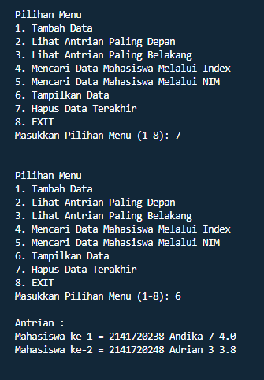


