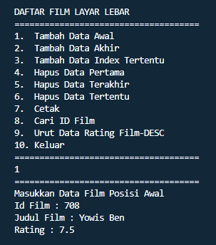

## Nama : Andika Ainur Wibowo
## NIM : 2141720238
## Kelas : TI-1F
## No Absen : 07

## Pertemuan 12 Double Linked List

**Praktikum 1**

Source Code node
```java
package SourceCode.Praktikum1;
public class Node {
    int data;
    Node prev;
    Node next;

    Node(Node prev, int data, Node next) {
        this.prev = prev;
        this.data = data;
        this.next = next;
    }
}
```

Source Code DLL
```java
package SourceCode.Praktikum1;

public class DoubleLinkedList {
    Node head;
    int size;

    public DoubleLinkedList() {
        head = null;
        size = 0;
    }

    public boolean isEmpty() {
        return head == null;
    }

    public void addFirst(int item) {
        if (isEmpty()) {
            head = new Node(null, item, null);
        } else {
            Node newNode = new Node(null, item, head);
            head.prev = newNode;
            head = newNode;
        }
        size++;
    }

    public void addLast(int item) {
        if (isEmpty()) {
            addFirst(item);
        } else {
            Node current = head;
            while (current.next != null) {
                current = current.next;
            }
            Node newNode = new Node(current, item, null);
            current.next = newNode;
            size++;
        }
    }

    public void add(int item, int index) throws Exception {
        if (isEmpty()) {
            addFirst(item);
        } else if (index < 0 || index > size) {
            throw new Exception("Nilai index di luar batas");
        } else {
            Node current = head;
            int i = 0;
            while (i < index) {
                current = current.next;
                i++;
            }
            if (current.prev == null) {
                Node newNode = new Node(null, item, current);
                current.prev = newNode;
                head = newNode;
            } else {
                Node newNode = new Node(current.prev, item, current);
                newNode.prev = current.prev;
                newNode.next = current;
                current.prev.next = newNode;
                current.prev = newNode;
            }
        }
        size++;
    }

    public int size() {
        return size;
    }

    public void clear() {
        head = null;
        size = 0;
    }

    public void print() {
        if (!isEmpty()) {
            Node tmp = head;
            while (tmp != null) {
                System.out.print(tmp.data + "\t");
                tmp = tmp.next;
            }
            System.out.println("\nBerhasil Diisi");
        } else {
            System.out.println("Linked List Kosong");
        }
    }
}
```
Source Code DLL Main
```java
package SourceCode.Praktikum1;

public class DoubleLinkedListMain {
    public static void main(String[] args) throws Exception{
        DoubleLinkedList dll = new DoubleLinkedList();
        dll.print();
        System.out.println("Size : " + dll.size);
        System.out.println("===============================");
        dll.addFirst(3);
        dll.addLast(4);
        dll.addFirst(7);
        dll.print();
        System.out.println("Size : " + dll.size);
        System.out.println("===============================");
        dll.add(40, 1);
        dll.print();
        System.out.println("Size : " + dll.size);
        System.out.println("===============================");
        dll.clear();
        dll.print();
        System.out.println("Size : " + dll.size);
    }
}
```

Output Program


**Pertanyaan Praktikum 1**

1. Jelaskan perbedaan antara single linked list dengan double linked lists!

    **Perbedaan antara single linked list dengan double linked list yakni hanya terletak pada pointernya saja, pada single linked list pointer hanya ada 1 yaitu next, sementara pada double linked list ada 2 pointer yakni next dan previsious/prev.**

2. Perhatikan class Node, didalamnya terdapat atribut next dan prev. Untuk apakah atribut tersebut?

    **Atribut next berguna untuk menunjuk kepada node berikutnya, dan atribut prev berguna untuk menunjuk kepada node sebelumnya**

3. Perhatikan konstruktor pada class DoubleLinkedLists. Apa kegunaan inisialisasi atribut head dan 
size seperti pada gambar berikut ini?

    

    **Dilakukan inisialisai atribut head==null dilakukan untuk menunjukkan bahwa head belum menunjuk ke node
    manapun. Sedangkan size diinisialisasi untuk menyimpan jumlah data pada linked list.**

4. Pada method addFirst(), kenapa dalam pembuatan object dari konstruktor class Node prev dianggap sama dengan null? 
Node newNode = new Node(null, item, head);

    **pembuatan object dari konstruktor class Node prev dianggap sama dengan null karena, operasi addFirst digunakan untuk penambahan data/node di awal atau di index 0. Yang mana dalam hal ini, data yang ditambahkan ke node baru prevnya akan bernilai null karena pointer prev pada node tersebut tidak menunjuk ke node manapun.**

5. Perhatikan pada method addFirst(). Apakah arti statement head.prev = newNode ?

    **arti statement head.prev = newNode yakni pointer prev pada data yang sudah ada pada linked list akan menunjuk ke node yang baru.**

6. Perhatikan isi method addLast(), apa arti dari pembuatan object Node dengan mengisikan 
parameter prev dengan current, dan next dengan null?
Node newNode = new Node(current, item, null);

    **current digunakan untuk menyimpan node yang sebelumnya, dimana jika dilakukan penambahan data pada index terakhir, maka pointer prev pada node yang ditambahkan akan menunjuk ke node yang sebelumnya.**

**Praktikum 2**

Source Code Node
```java
package SourceCode.Praktikum2;

public class Node {
    int data;
    Node prev;
    Node next;

    Node(Node prev, int data, Node next) {
        this.prev = prev;
        this.data = data;
        this.next = next;
    }
}
```

Source Code DLL
```javapackage SourceCode.Praktikum2;

public class DoubleLinkedList {
    Node head;
    int size;

    public DoubleLinkedList() {
        head = null;
        size = 0;
    }

    public boolean isEmpty() {
        return head == null;
    }

    public void addFirst(int item) {
        if (isEmpty()) {
            head = new Node(null, item, null);
        } else {
            Node newNode = new Node(null, item, head);
            head.prev = newNode;
            head = newNode;
        }
        size++;
    }

    public void addLast(int item) {
        if (isEmpty()) {
            addFirst(item);
        } else {
            Node current = head;
            while (current.next != null) {
                current = current.next;
            }
            Node newNode = new Node(current, item, null);
            current.next = newNode;
            size++;
        }
    }

    public void add(int item, int index) throws Exception {
        if (isEmpty()) {
            addFirst(item);
        } else if (index < 0 || index > size) {
            throw new Exception("Nilai index di luar batas");
        } else {
            Node current = head;
            int i = 0;
            while (i < index) {
                current = current.next;
                i++;
            }
            if (current.prev == null) {
                Node newNode = new Node(null, item, current);
                current.prev = newNode;
                head = newNode;
            } else {
                Node newNode = new Node(current.prev, item, current);
                newNode.prev = current.prev;
                newNode.next = current;
                current.prev.next = newNode;
                current.prev = newNode;
            }
        }
        size++;
    }

    public int size() {
        return size;
    }

    public void clear() {
        head = null;
        size = 0;
    }

    public void print() {
        if (!isEmpty()) {
            Node tmp = head;
            while (tmp != null) {
                System.out.print(tmp.data + "\t");
                tmp = tmp.next;
            }
            System.out.println("\nBerhasil Diisi");
        } else {
            System.out.println("Linked List Kosong");
        }
    }

    public void removeFirst() throws Exception {
        if (isEmpty()) {
            throw new Exception("Linked List masih kosong, tidak dapat dihapus");
        } else if (size == 1) {
            removeLast();
        } else {
            head = head.next;
            head.prev = null;
            size--;
        }
    }

    public void removeLast() throws Exception {
        if (isEmpty()) {
            throw new Exception("Linked List masih kosong, tidak dapatdihapus");
        } else if (head.next == null) {
            head = null;
            size--;
            return;
        }
        Node current = head;
        while (current.next.next != null) {
            current = current.next;
        }
        current.next = null;
        size--;
    }

    public void remove(int index) throws Exception {
        if (isEmpty()) {
            throw new Exception("Nilai index di luar batas");
        } else if (index == 0) {
            removeFirst();
        } else {
            Node current = head;
            int i = 0;
            while (i < index) {
                current = current.next;
                i++;
            }
            if (current.next == null) {
                current.prev.next = null;
            } else if (current.prev == null) {
                current = current.next;
                current.prev = null;
                head = current;
            } else {
                current.prev.next = current.next;
                current.next.prev = current.prev;
            }
            size--;
        }
    }
}
```

Source Code DLL Main
```java
package SourceCode.Praktikum2;

public class DoubleLinkedListMain {
    public static void main(String[] args) throws Exception {
        DoubleLinkedList dll = new DoubleLinkedList();
        dll.print();
        System.out.println("Size : " + dll.size);
        System.out.println("===============================");
        dll.addLast(50);
        dll.addLast(40);
        dll.addLast(10);
        dll.addLast(20);
        dll.print();
        System.out.println("Size : " + dll.size);
        System.out.println("===============================");
        dll.removeFirst();
        dll.print();
        System.out.println("Size : " + dll.size);
        System.out.println("===============================");
        dll.removeLast();
        dll.print();
        System.out.println("Size : " + dll.size);
        System.out.println("===============================");
        dll.remove(1);
        dll.print();
        System.out.println("Size : " + dll.size);
    }
}
```

Output Program


**Pertanyaan Praktikum 2**

1. Apakah maksud statement berikut pada method removeFirst()?
head = head.next;
head.prev = null;

    **yakni ketika dilakukan penghapusan node pada index pertama, maka posisi head akan berpindah posisi ke node yang selanjutnya, dan pointer prev pada head akan bernilai null atau tidak menunjuk ke node manapun**

2. Bagaimana cara mendeteksi posisi data ada pada bagian akhir pada method removeLast()?

    **Cara mendeteksi posisi data ada pada bagian akhir pada method removeLast() yakni dengan melihat apakah pointer next pada node bernilai null atau tidak. Jika pointer next pada node bernilai null maka bisa dipastikan bahwa data tersebut berada pada bagian akhir.**

3. Jelaskan alasan potongan kode program di bawah ini tidak cocok untuk perintah remove!

    

    **karena potongan kode tersebut lebih cocok digunakan untuk removeFirst dimana tmp menyimpan data setelah head, lalu head.next menyimpan data tmp.next. Kemudian pointer prev pada tmp.next menunjuk ke head// karena tidak jelas dalam penunjukannya serta ambigu sehingga tidak cocok di gunakan untuk perintah remove.**

4. Jelaskan fungsi kode program berikut ini pada fungsi remove!

    

    **pointer next pada current/node sebelumnya akan menunjuk ke current/node selanjutnya, dan pointer prev pada current/node selanjutnya akan menunjuk ke current/node sebelumnya**

**Praktikum 3**

Source Code Node
```java
package SourceCode.Praktikum3;

public class Node {
    int data;
    Node prev;
    Node next;

    Node(Node prev, int data, Node next) {
        this.prev = prev;
        this.data = data;
        this.next = next;
    }
}
```

Source Code DLL
```java
package SourceCode.Praktikum3;

public class DoubleLinkedList {
    Node head;
    int size;

    public DoubleLinkedList() {
        head = null;
        size = 0;
    }

    public boolean isEmpty() {
        return head == null;
    }

    public void addFirst(int item) {
        if (isEmpty()) {
            head = new Node(null, item, null);
        } else {
            Node newNode = new Node(null, item, head);
            head.prev = newNode;
            head = newNode;
        }
        size++;
    }

    public void addLast(int item) {
        if (isEmpty()) {
            addFirst(item);
        } else {
            Node current = head;
            while (current.next != null) {
                current = current.next;
            }
            Node newNode = new Node(current, item, null);
            current.next = newNode;
            size++;
        }
    }

    public void add(int item, int index) throws Exception {
        if (isEmpty()) {
            addFirst(item);
        } else if (index < 0 || index > size) {
            throw new Exception("Nilai index di luar batas");
        } else {
            Node current = head;
            int i = 0;
            while (i < index) {
                current = current.next;
                i++;
            }
            if (current.prev == null) {
                Node newNode = new Node(null, item, current);
                current.prev = newNode;
                head = newNode;
            } else {
                Node newNode = new Node(current.prev, item, current);
                newNode.prev = current.prev;
                newNode.next = current;
                current.prev.next = newNode;
                current.prev = newNode;
            }
        }
        size++;
    }
    public int size() {
        return size;
    }

    public void clear() {
        head = null;
        size = 0;
    }

    public void print() {
        if (!isEmpty()) {
            Node tmp = head;
            while (tmp != null) {
                System.out.print(tmp.data + "\t");
                tmp = tmp.next;
            }
            System.out.println("\nBerhasil Diisi");
        } else {
            System.out.println("Linked List Kosong");
        }
    }

    public void removeFirst() throws Exception {
        if (isEmpty()) {
            throw new Exception("Linked List masih kosong, tidak dapat dihapus");
        } else if (size == 1) {
            removeLast();
        } else {
            head = head.next;
            head.prev = null;
            size--;
        }
    }

    public void removeLast() throws Exception {
        if (isEmpty()) {
            throw new Exception("Linked List masih kosong, tidak dapat dihapus");
        } else if (head.next == null) {
            head = null;
            size--;
            return;
        }
        Node current = head;
        while (current.next.next != null) {
            current = current.next;
        }
        current.next = null;
        size--;
    }

    public void remove(int index) throws Exception {
        if (isEmpty()) {
            throw new Exception("Nilai index di luar batas");
        } else if (index == 0) {
            removeFirst();
        } else {
            Node current = head;
            int i = 0;
            while (i < index) {
                current = current.next;
                i++;
            }
            if (current.next == null) {
                current.prev.next = null;
            } else if (current.prev == null) {
                current = current.next;
                current.prev = null;
                head = current;
            } else {
                current.prev.next = current.next;
                current.next.prev = current.prev;
            }
            size--;
        }
    }

    public int getFirst() throws Exception {
        if (isEmpty()) {
            throw new Exception("Linked List kosong");
        }
        return head.data;
    }

    public int getLast() throws Exception {
        if (isEmpty()) {
            throw new Exception("Linked List kosong");
        }
        Node tmp = head;
        while (tmp.next != null) {
            tmp = tmp.next;
        }
        return tmp.data;
    }

    public int get(int index) throws Exception {
        if (isEmpty() || index >= size) {
            throw new Exception("Nilai index di luar batas");
        }
        Node tmp = head;
        for (int i = 0; i < index; i++) {
            tmp = tmp.next;
        }
        return tmp.data;
    }
}
```

Source Code DLL Main

```java
package SourceCode.Praktikum3;

public class DoubleLinkedListMain {
    public static void main(String[] args) throws Exception {
        DoubleLinkedList dll = new DoubleLinkedList();
        dll.print();
        System.out.println("Size : " + dll.size);
        System.out.println("===============================");
        dll.addFirst(3);
        dll.addLast(4);
        dll.addFirst(7);
        dll.print();
        System.out.println("Size : " + dll.size);
        System.out.println("===============================");
        dll.add(40, 1);
        dll.print();
        System.out.println("Size : " + dll.size);
        System.out.println("===============================");
        System.out.println("Data awal pada Linked List adalah :" + dll.getFirst());
        System.out.println("Data akhir pada Linked List adalah :" + dll.getLast());
        System.out.println("Data indeks ke-1 pada Linked List adalah :" + dll.get(1));
    }
}
```

Output Program


**Pertanyaan Praktikum 3**

1. Jelaskan method size() pada class DoubleLinkedLists!

    **method size() pada class DoubleLinkedLists akan mereturn nilai 0 jika linked list dalam kondisi kosong atau tidak  ada datanya.**

2. Jelaskan cara mengatur indeks pada double linked lists supaya dapat dimulai dari indeks ke- 1!

    **dengan cara melakukan perulangan dan diinisilisasikan index sama dengan 1.**

3. Jelaskan perbedaan karakteristik fungsi Add pada Double Linked Lists dan Single Linked Lists! 

    **yakni jika pada single linked list operasi terbagi menjadi beberapa fungsi (insertafter, insertbefore, dan insert at), sedangkan pada double linked list menjadi satu fungsi yang berdasarkan indeks. Indeks yang akan ditambahkan dapat disisipkan di awal maupun akhir dari double linked list.**

4. Jelaskan perbedaan logika dari kedua kode program di bawah ini!
    

    **Pada gambar A Jika atribut size atau jumlah data bernilai 0, maka akan mereturn true atau kondisi tersebut adalah true.Jika tidak maka kondisi tersebut adalah false. sedangkan pada gambar B Jika head atau data pada index pertama bernilai null, maka kondisi tersebut adalah true.**

**Tugas**

Tugas no 1

**Source Code Node**
```java
package SourceCode.Tugas;

public class Tugas1Node {
    String nama;
    int nomor;
    Tugas1Node prev, next;

    Tugas1Node(Tugas1Node prev, int nomor, String nama, Tugas1Node next) {
        this.prev = prev;
        this.nama = nama;
        this.nomor = nomor;
        this.next = next;
    }
}
```

Source Code DLL
```java
package SourceCode.Tugas;

public class Tugas1DoubleLinkedList {
    Tugas1Node front, rear;
    int size;

    public Tugas1DoubleLinkedList() {
        front = null;
        rear = null;
        size = 0;
    }

    public boolean isEmpty() {
        return front == null;
    }

    public void Enqueue(int nomor, String nama) {
        Tugas1Node newNode = new Tugas1Node(null, nomor, nama, null);
        if (isEmpty()) {
            front = newNode;
            rear = newNode;
        } else {
            rear.next = newNode;
            rear = newNode;
        }
        size++;
    }

    public void Dequeue() throws Exception {
        if (isEmpty()) {
            throw new Exception("Linked list masih kosong, tidak dapat dihapus");
        } else if (size == 1) {
            removeLast();
        } else {
            System.out.println(front.nama + " telah selesai divaksinasi");
            front = front.next;
            front.prev = null;
            size--;
        }
    }

    public void removeLast() throws Exception {
        if (isEmpty()) {
            throw new Exception("Linked list masih kosong, tidak dapat dihapus");
        } else if (front.next == null) {
            front = null;
            size--;
            return;
        }
        Tugas1Node current = front;
        while (current.next.next != null) {
            current = current.next;
        }
        current.next = null;
        size--;
    }

    public void print() {
        if (!isEmpty()) {
            Tugas1Node tmp = front;
            System.out.println("+++++++++++++++++++++++");
            System.out.println("Daftar Pengantri Vaksin");
            System.out.println("+++++++++++++++++++++++");
            System.out.println("|Nomor\t|Nama\t|");
            while (tmp != null) {
                System.out.println("|" + tmp.nomor + "\t|" + tmp.nama + "\t|");
                tmp = tmp.next;
            }
            System.out.print("Sisa Antrian: " + size);
            System.out.println("");
        } else {
            System.out.println("Linked List Kosong");
        }
    }
}
```

Source Code DLL Main
```java
package SourceCode.Tugas;

public class Tugas1DoubleLinkedList {
    Tugas1Node front, rear;
    int size;

    public Tugas1DoubleLinkedList() {
        front = null;
        rear = null;
        size = 0;
    }

    public boolean isEmpty() {
        return front == null;
    }

    public void Enqueue(int nomor, String nama) {
        Tugas1Node newNode = new Tugas1Node(null, nomor, nama, null);
        if (isEmpty()) {
            front = newNode;
            rear = newNode;
        } else {
            rear.next = newNode;
            rear = newNode;
        }
        size++;
    }

    public void Dequeue() throws Exception {
        if (isEmpty()) {
            throw new Exception("Linked list masih kosong, tidak dapat dihapus");
        } else if (size == 1) {
            removeLast();
        } else {
            System.out.println(front.nama + " telah selesai divaksinasi");
            front = front.next;
            front.prev = null;
            size--;
        }
    }

    public void removeLast() throws Exception {
        if (isEmpty()) {
            throw new Exception("Linked list masih kosong, tidak dapat dihapus");
        } else if (front.next == null) {
            front = null;
            size--;
            return;
        }
        Tugas1Node current = front;
        while (current.next.next != null) {
            current = current.next;
        }
        current.next = null;
        size--;
    }

    public void print() {
        if (!isEmpty()) {
            Tugas1Node tmp = front;
            System.out.println("+++++++++++++++++++++++");
            System.out.println("Daftar Pengantri Vaksin");
            System.out.println("+++++++++++++++++++++++");
            System.out.println("|Nomor\t|Nama\t|");
            while (tmp != null) {
                System.out.println("|" + tmp.nomor + "\t|" + tmp.nama + "\t|");
                tmp = tmp.next;
            }
            System.out.print("Sisa Antrian: " + size);
            System.out.println("");
        } else {
            System.out.println("Linked List Kosong");
        }
    }
}
```

Output

 


Tugas no 2

Source Code Node
```java
package SourceCode.Tugas;

public class Tugas2Node {
    String id,judulFilm;
    Double rating;
    Tugas2Node prev, next;

    Tugas2Node(Tugas2Node prev,String id,String judulFilm,Double rating,Tugas2Node next) {
        this.prev = prev;
        this.id = id;
        this.judulFilm = judulFilm;
        this.rating = rating;
        this.next = next;
    }
}
```

Source Code DLL
```java
package SourceCode.Tugas;

public class Tugas2DoubleLinkedList {
    Tugas2Node head;
    int size;

    public Tugas2DoubleLinkedList() {
        head = null;
        size = 0;
    }

    public boolean isEmpty() {
        return head == null;
    }

    public void addFirst(String id, String judulFilm, Double rating) {
        if (isEmpty()) {
            head = new Tugas2Node(null, id, judulFilm, rating, null);
        } else {
            Tugas2Node newNode = new Tugas2Node(null, id, judulFilm, rating, head);
            head.prev = newNode;
            head = newNode;
        }
        size++;
    }

    public void addLast(String id, String judulFilm, Double rating) {
        if (isEmpty()) {
            addFirst(id, judulFilm, rating);
        } else {
            Tugas2Node current = head;
            while (current.next != null) {
                current = current.next;
            }
            Tugas2Node newNode = new Tugas2Node(current, id, judulFilm, rating, null);
            current.next = newNode;
            size++;
        }
    }

    public void add(String id, String judulFilm, Double rating, int index) throws Exception {
        if (isEmpty()) {
            addFirst(id, judulFilm, rating);
        } else if (index < 0 || index > size) {
            throw new Exception("Nilai index di luar batas");
        } else {
            Tugas2Node current = head;
            int i = 0;
            while (i < index) {
                current = current.next;
                i++;
            }
            if (current.prev == null) {
                Tugas2Node newNode = new Tugas2Node(null, id, judulFilm, rating, current);
                current.prev = newNode;
                head = newNode;
            } else {
                Tugas2Node newNode = new Tugas2Node(current.prev, id, judulFilm, rating, current);
                newNode.prev = newNode;
                newNode.next = current;
                current.prev.next = newNode;
                current.prev = newNode;
            }
        }
        size++;
    }

    public int size() {
        return size;
    }

    public void clear() {
        head = null;
        size = 0;
    }

    public void print() {
        if (!isEmpty()) {
            Tugas2Node tmp = head;
            System.out.println("ID Film\t\t Judul Film \t\t\t Rating");
            while (tmp != null) {
                System.out.print(tmp.id + "\t\t ");
                System.out.print(tmp.judulFilm + "\t\t ");
                System.out.print(tmp.rating + "  \t\t");
                System.out.println("");
                tmp = tmp.next;
            }
            System.out.println("\nBerhasil diisi");
        } else {
            System.out.println("Linked List Kosong");
        }
    }

    public void removeFirst() throws Exception {
        if (isEmpty()) {
            throw new Exception("Linked List masih kosong, tidak dapat dihapus");
        } else if (size == 1) {
            removeLast();
        } else {
            head = head.next;
            head.prev = null;
            size--;
        }
    }

    public void removeLast() throws Exception {
        if (isEmpty()) {
            throw new Exception("Linked List masih kosong, tidak dapat dihapus");
        } else if (head.next == null) {
            head = null;
            size--;
            return;
        }
        Tugas2Node current = head;
        while (current.next.next != null) {
            current = current.next;
        }
        current.next = null;
        size--;
    }

    public void remove(int index) throws Exception {
        if (isEmpty() || index >= size) {
            throw new Exception("Nilai index diluar batas");
        } else if (index == 0) {
            removeFirst();
        } else {
            Tugas2Node current = head;
            int i = 0;
            while (i < index) {
                current = current.next;
                i++;
            }
            if (current.next == null) {
                current.prev.next = null;
            } else if (current.prev == null) {
                current = current.next;
                current.prev = null;
                head = current;
            } else {
                current.prev.next = current.next;
                current.next.prev = current.prev;
            }
            size--;
        }
    }

    public String getFirst() throws Exception {
        if (isEmpty()) {
            throw new Exception("Linked List Kosong");
        }
        return (head.id + head.judulFilm + head.rating);
    }

    public String getLast() throws Exception {
        if (isEmpty()) {
            throw new Exception("Linked List Kosong");
        }
        Tugas2Node tmp = head;
        while (tmp.next != null) {
            tmp = tmp.next;
        }
        return (tmp.id + tmp.judulFilm + tmp.rating);
    }

    public String get(int index) throws Exception {
        if (isEmpty() || index >= size) {
            throw new Exception("Nilai index diluar batas");
        }
        Tugas2Node tmp = head;
        for (int i = 0; i < index; i++) {
            tmp = tmp.next;
        }
        return (tmp.id + tmp.judulFilm + tmp.rating);
    }

    public void search(String search) {
        int i = 0;
        boolean cek = false;
        Tugas2Node current = head;
        if (head == null) {
            System.out.println("List kosong");
            return;
        }
        while (current != null) {
            if (search.equals(current.id)) {
                cek = true;
                break;
            }
            current = current.next;
            i++;
        }
        if (cek) {
            System.out.println("Data " + search + " ditemukan pada index ke : " + i);
        } else {
            System.out.println("Index tidak ditemukan");
        }
    }

    public void sort(){
        Tugas2Node current = null, index = null;
        Double temp;
        String tmpn,tnmp;
        if (head == null) {
            return;
        } else {
            for (current = head; current.next != null; current = current.next) {
                for (index = current.next; index != null; index = index.next) {
                    if (current.rating < index.rating) {
                        temp = current.rating;
                        current.rating = index.rating;
                        index.rating = temp;
                        tmpn = current.id;
                        current.id = index.id;
                        index.id = tmpn;
                        tnmp = current.judulFilm;
                        current.judulFilm = index.judulFilm;
                        index.judulFilm = tnmp;
                    }
                }
            }
            print();
        }
    }
}
```

Source Code DLL Main
```java
package SourceCode.Tugas;
import java.util.Scanner;
public class Tugas2DoubleLinkedListMain {
    public static void menu() {
        System.out.println("DAFTAR FILM LAYAR LEBAR");
        System.out.println("=====================================");
        System.out.println("1.  Tambah Data Awal");
        System.out.println("2.  Tambah Data Akhir");
        System.out.println("3.  Tambah Data Index Tertentu");
        System.out.println("4.  Hapus Data Pertama");
        System.out.println("5.  Hapus Data Terakhir");
        System.out.println("6.  Hapus Data Tertentu");
        System.out.println("7.  Cetak");
        System.out.println("8.  Cari ID Film");
        System.out.println("9.  Urut Data Rating Film-DESC");
        System.out.println("10. Keluar");
        System.out.println("=====================================");
    }

    public static void main(String[] args)throws Exception {
        Scanner sc = new Scanner(System.in);
        Scanner in = new Scanner(System.in);
        Scanner ins = new Scanner(System.in);
        Scanner i = new Scanner(System.in);
        int menu = 0, index;
        String id,judulFilm,inputan;
        Double rating;

        Tugas2DoubleLinkedList dll = new Tugas2DoubleLinkedList();

        while (menu != 10) {
            menu();
            menu = sc.nextInt();
            System.out.println("=====================================");

            try {
                switch (menu) {
                    case 1:
                        System.out.println("Masukkan Data Film Posisi Awal");
                        System.out.print("Id Film : ");
                        id = ins.nextLine();
                        System.out.print("Judul Film : ");
                        judulFilm = in.nextLine();
                        System.out.print("Rating : ");
                        rating = sc.nextDouble();
                        dll.addFirst(id, judulFilm, rating);
                        break;
                    case 2:
                        System.out.println("Masukkan Data Film Posisi Akhir");
                        System.out.print("ID Film : ");
                        id = ins.nextLine();
                        System.out.print("Judul Film : ");
                        judulFilm = in.nextLine();
                        System.out.print("Rating : ");
                        rating = sc.nextDouble();
                        dll.addLast(id, judulFilm, rating);
                        break;
                    case 3:
                        System.out.println("Tambah Data Indeks tertentu");
                        System.out.print("ID FIlm : ");
                        id = ins.nextLine();
                        System.out.print("Judul Film : ");
                        judulFilm = in.nextLine();
                        System.out.print("Rating : ");
                        rating = sc.nextDouble();
                        System.out.print("Masukkan posisi index : ");
                        index = sc.nextInt();
                        dll.add(id, judulFilm, rating, index);
                        break;
                    case 4:
                        System.out.println("Hapus Data Pertama");
                        dll.removeFirst();
                        break;
                    case 5:
                        System.out.println("Hapus Data Terakhir");
                        dll.removeLast();
                        break;
                    case 6:
                        System.out.println("Hapus Data Tertentu");
                        System.out.print("Masukkan posisi index : ");
                        index = sc.nextInt();
                        dll.remove(index);
                        break;
                    case 7:
                        System.out.println("Cetak Data");
                        dll.print();
                        System.out.println("Size : " + dll.size());
                        break;
                    case 8:
                        System.out.println("Cari Id Film");
                        System.out.print("Masukkan data ID Film yang ingin dicari : ");
                        inputan = i.nextLine();
                        dll.search(inputan);
                        break;
                    case 9:
                        System.out.println("Urut Data Rating Film-DESC");
                        dll.sort();
                        break;
                    case 10:
                        System.out.println("Keluar Program");
                        break;
                }
                System.out.println();
                } catch (Exception e) {
            }
        }
        sc.close();
        in.close();
        ins.close();
        i.close();
    }
}
```

Output





