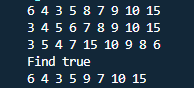
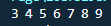
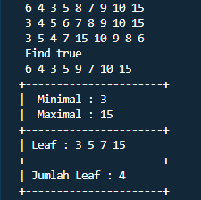
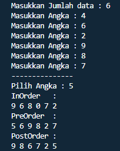

## Nama : Andika Ainur Wibowo
## NIM : 2141720238
## Kelas : TI-1F
## No Absen : 07

## Pertemuan 14 Tree

**Praktikum 1**

Source Code node
```java
package SourceCode;
public class Node{
    int data;
    Node left;
    Node right;

    public Node() {
    }
    public Node(int data) {
        this.left = null;
        this.data = data;
        this.right = null;
    }
}
```

Source Code BinaryTree
```java
package SourceCode;
public class BinaryTree {
    Node root;

    public BinaryTree(){
    root = null;
    }
    boolean isEmpty(){
    return root == null;
    }
    //tugas no 1
    public Node addNode(Node current, int data) {
        if (current == null) {
            return new Node(data);
        }
        if (data < current.data) {
            current.left = addNode(current.left, data);
        }else if (data > current.data){
            current.right =  addNode(current.right, data);
        }else{
            return current;
        }
        return current;
    }
    void add(int data){
        if (isEmpty()){//tree is empty
         root = new Node(data);
            }else{
                Node current = root;
                while(true){
                    if(data<current.data){
                        if(current.left!=null){
                             current = current.left;
                        }else{
                        current.left = new Node(data);
                        break;
                    }
                }else if(data>current.data){
                    if (current.right!=null) {
                    current = current.right;
                    }else{
                    current.right = new Node(data);
                    break;
                }
                }else{//data is already exist
                break;
                }
            }
        }
    }
    boolean find(int data){
        boolean hasil = false;
        Node current = root;
        while(current!= null){
            if (current.data==data) {
            hasil = true;
            break;
        }else if (data<current.data){
            current=current.left;
             }else{
                current=current.right;
            }
        }
        return hasil;
    } 
    void traversePreOrder(Node node){
        if (node != null){
        System.out.print(" " + node.data);
        traversePreOrder(node.left);
        traversePreOrder(node.right);
        }
    }
    void traversePostOrder(Node node){
        if (node != null){
            traversePostOrder(node.left);
            traversePostOrder(node.right);
            System.out.print(" " + node.data);
        }
    }
    void traverseInOrder(Node node){
        if (node != null){
            traverseInOrder(node.left);
            System.out.print(" " + node.data);
            traverseInOrder(node.right);
        }
    }
    Node getSuccessor(Node del){
        Node successor = del.right;
        Node successorParent = del;
        while(successor.left != null){
            successorParent = successor;
            successor=successor.left;
        }
        if (successor!=del.right) {
            successorParent.left = successor.right;
            successor.right = del.right;
        }
        return successor;
    }
    void delete(int data){
        if (isEmpty()) {
            System.out.println("Tree is Empty");
             return;
        }
     //find node (current) that will be deleted
    Node parent = root;
    Node current = root;
    boolean isLeftChild = false;
        while (current!=null) {
            if(current.data == data){
                break;
                    }else if (data<current.data) {
                        parent = current;
                        current = current.left;
                        isLeftChild = true;
                    }else if (data>current.data) {
                        parent = current;
                        current = current.right;
                        isLeftChild = false;
                     }
                }
                //deletion
                if (current==null) {
                System.out.println("Couldn't find data!");
                return;
            }else{
                //if there is no child, simply delete it
            if (current.left==null && current.right==null) {
                    if (current==root) {
                            root = null;
                        }else{
                            if (isLeftChild) {
                                parent.left = null;
                            }else{
                                parent.right = null;
                            }
                        }
    
                    }else if (current.left==null) {//if there is 1 child (right)
                        if (current==root) {
                            root = current.right;
                        }else{
                            if (isLeftChild) {
                                parent.left = current.right;
                            }else{
                                parent.right = current.right;
                            }
                        }
                    }else if (current.right==null) {//if there is 1 child (left)
                        if(current==root){
                            root = current.left;
                        }else{
                            if (isLeftChild) {
                                parent.left = current.left;
                            }else{
                                parent.right = current.left;
                            }
                        }                    
                     }else{//if there is 2 childs
                        Node successor = getSuccessor(current);
                        if (current==root) {
                            root = successor;
                        }else{
                            if (isLeftChild) {
                                parent.left = successor;
                            }else{
                                parent.right = successor;
                            }
                            successor.left = current.left;
                        }
                    }
                }
    }
}
```

Source Code BinaryTreeMain
```java
package SourceCode;

public class BinaryTreeMain {
    public static void main(String[] args) {
        BinaryTree bt = new BinaryTree();
        bt.add(6);
        bt.add(4);
        bt.add(8);
        bt.add(3);
        bt.add(5);
        bt.add(7);
        bt.add(9);
        bt.add(10);
        bt.add(15);
        bt.traversePreOrder(bt.root);
        System.out.println("");
        bt.traverseInOrder(bt.root);
        System.out.println("");
        bt.traversePostOrder(bt.root);
        System.out.println("");
        System.out.println(" Find " + bt.find(5));
        bt.delete(8);
        bt.traversePreOrder(bt.root);
        System.out.println("");
    }
}
```

Output Program



**Pertanyaan Praktikum 1**

1. Mengapa dalam binary search tree proses pencarian data bisa lebih efektif 
dilakukan dibanding binary tree biasa?

    **karena dalam binary search tree left-child harus lebih kecil daripada right-child dan parentnya, dimana hal tersebut dapat memudahkan dalam pencarian data.**

2. Untuk apakah di class Node, kegunaan dari atribut left dan right?

    **atribut left dan right digunakan untuk menyimpan indeks yang mengarah ke left-child atau nilai yang lebih kecil dari root dan indeks yang mengarah ke right-child atau nilai yang lebih besar dari root.**

3. a. Untuk apakah kegunaan dari atribut root di dalam class BinaryTree?
   b. Ketika objek tree pertama kali dibuat, apakah nilai dari root?

   **A. Untuk menyimpan data yang pertama kali masuk.**

   **B. Ketika objek tree pertama kali dibuat, nilai dari root adalah Null**

4. Ketika tree masih kosong, dan akan ditambahkan sebuah node baru, proses apa 
yang akan terjadi?

    **Proses Add**

5. Perhatikan method add(), di dalamnya terdapat baris program seperti di bawah 
ini. Jelaskan secara detil untuk apa baris program tersebut?
    if(data<current.data){
 if(current.left!=null){
 current = current.left;
 }else{
 current.left = new Node(data);
 break;
 }}

    **apabila data yang dimasukkan nilainya lebih kecil dari data yang sudah ada dan current left bersifat tidak kosong, maka atribut current akan menyimpan nilai dari current left atau current left akan menjadi parent dari data yang baru dimasukkan, sedangkan jika current left bersifat kosong maka data yang baru dimasukkan akan menjadi current left atau left-child.**
 
**Praktikum 2**

Source Code BinaryTreeArray
```java
package SourceCode;

public class BinaryTreeArray {
    int [] data;
    int idxLast;
    public BinaryTreeArray(){
        data = new int [10];
    }
    void populateData(int data[], int idxLast){
        this.data = data;
        this.idxLast = idxLast;
    }
    void traverseInOrder(int idxStart){
        if(idxStart<=idxLast){
            traverseInOrder(2*idxStart+1);
            System.out.print(data[idxStart]+" ");
            traverseInOrder(2*idxStart+2);
        }
    }
}
```

Source Code BinaryTreeArrayMain
```java
package SourceCode;
import java.util.Scanner;
public class BinaryTreeArrayMain {
    public static void main(String[] args) {
        Scanner sc = new Scanner(System.in);
        BinaryTreeArray bta = new BinaryTreeArray();
        int [] data = {6,4,8,3,5,7,9,0,0,0};
        int idxLast = 6;
        bta.populateData(data, idxLast);
        bta.traverseInOrder(0);
```

Output Program




**Pertanyaan Praktikum 2**
1. Apakah kegunaan dari atribut data dan idxLast yang ada di class BinaryTreeArray?

    **atribut data digunakan untuk menyimpan data array, sedangkan idxLast sebagai untuk menyimpan batas index.**

2. Apakah kegunaan dari method populateData()?

    **sebagai method yang digunakan untuk menginisialisasi
    atribut data dan idxlast**

3. Apakah kegunaan dari method traverseInOrder()?

    **untuk mencetak semua node-node yang ada pada tree.**

4. Jika suatu node binary tree disimpan dalam array indeks 2, maka di indeks berapakah posisi left child dan rigth child masin-masing?

    **Left child = indeks ke 5**

    **Right child = indeks ke 6**

5. Apa kegunaan statement int idxLast = 6 pada praktikum 2 percobaan nomor 4?

    **Untuk menunjukkan idxLast atau batas indeksnya adalah 6**


**Tugas**
1. Buat method di dalam class BinaryTree yang akan menambahkan node dengan cara rekursif.
```java
//tugas no1
    public Node addNode(Node current, int data) {
        if (current == null) {
            return new Node(data);
        }
        if (data < current.data) {
            current.left = addNode(current.left, data);
        }else if (data > current.data){
            current.right =  addNode(current.right, data);
        }else{
            return current;
        }
        return current;
    }
```
2. Buat method di dalam class BinaryTree untuk menampilkan nilai paling kecil dan yang paling besar yang ada di dalam tree.
```java
//tugas no2
void max(){
        Node current = root;
        while (current.right != null) {
            current =  current.right;
        }
        System.out.println(current.data);
    }
    void min(){
        Node current = root;
        while (current.left != null) {
            current=current.left;
        }
        System.out.println(current.data);
    }
```
Output




3. Buat method di dalam class BinaryTree untuk menampilkan data yang ada di leaf.
```java
//tugas no3
    void leaf (Node root){
        if (root == null) {
            return;
        }
        if (root.left == null && root.right == null) {
            System.out.println(root.data + " ");
            return;
        }
        if (root.left != null) {
            leaf(root.left);
        }
        if (root.right != null) {
            leaf(root.right);
        }
    }
```
Output


4. Buat method di dalam class BinaryTree untuk menampilkan berapa jumlah leaf yang ada di dalam tree.
```java
//tugas no4
    int countLeaf(){
        return countLeaf(root);
    }
    int countLeaf(Node node){
       if (node == null) {
           return 0;
       } 
       if (node.left == null && node.right == null) {
           return 1;
       }else{
           return countLeaf(node.left) + countLeaf(node.right);
       }
    }
}
```
Output


5. Modifikasi class BinaryTreeArray, dan tambahkan : 
• method add(int data) untuk memasukan data ke dalam tree 
• method traversePreOrder() dan traversePostOrder()
```java
    //Tugas no 5
    void add(int value, int id) {
        data[id] = value;
    }

    void updateData(int data[]) {
        this.data = data;
    }

    void traversePreOrder(int idxStart) {
        if (idxStart <= idxLast) {
            if (data[idxStart] == 0) {
                System.out.print(idxLast + " ");
            } else {
                System.out.print(data[idxStart] + " ");
            }
            traversePreOrder(2*idxStart+1);
            traversePreOrder(2*idxStart+2);
        }
    }

    void traversePostOrder(int idxStart) {
        if (idxStart <= idxLast) {
            traversePostOrder(2*idxStart+1);
            traversePostOrder(2*idxStart+2);
            if (data[idxStart] == 0) {
                System.out.print(idxLast +" ");
            } else {
                System.out.print(data[idxStart] +" ");
            }
        }
    }
}
```
Output

