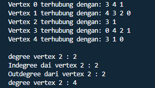
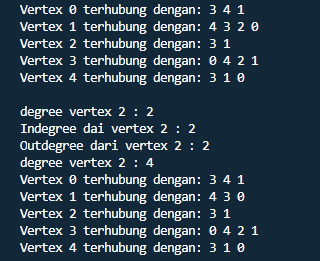
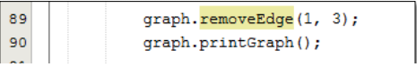
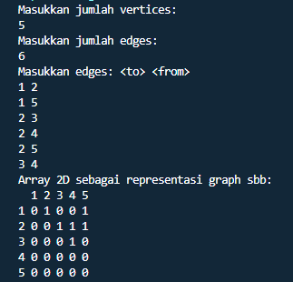
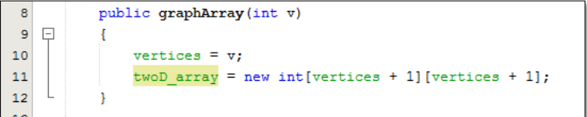
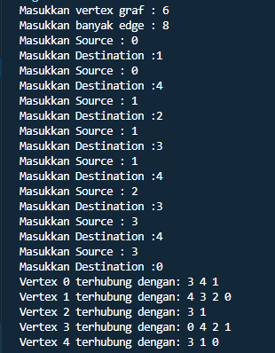
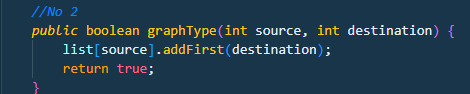
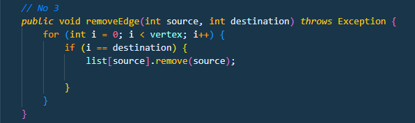
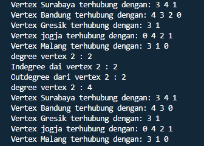

## Nama : Andika Ainur Wibowo
## NIM : 2141720238
## Kelas : TI-1F
## No Absen : 07

## Pertemuan 15 Graph

**Praktikum 1**

SourceCode Node
```java
package SourceCode.Praktikum;

public class Node {
        int data;
        Node prev;
        Node next;
    
        Node(Node prev, int data, Node next) {
    
            this.prev = prev;
            this.data = data;
            this.next = next;
    }  
}
```

SourceCode LinkedList
```java
package SourceCode.Praktikum;

public class LinkedList {
    Node head;
    int size;
 
    public LinkedList(){
        head = null;
        size = 0;
    }
 
    public boolean isEmpty(){
        return head == null;
    }
 
    public void addFirst(int item) {
        if (isEmpty()) {
            head = new Node(null, item, null);
        } else {
            Node newNode = new Node(null, item, head);
            head.prev = newNode;
            head = newNode;
        }
        size++;
    }
 
    public void addLast(int item) {
        if (isEmpty()) {
            addFirst(item);
        } else {
            Node current = head;
            while (current.next != null) {
                current = current.next;
            }
            Node newNode = new Node(current, item, null);
            current.next = newNode;
            size++;
        }
    }
 
    public void add(int item, int index) throws Exception {
        if (isEmpty()) {
            addFirst(item);
        } else if (index < 0 || index > size) {
            throw new Exception("Nilai Indeks di luar batas");
        } else {
            Node current = head;
            int i = 0;
            while (i< index) {
                current = current.next;
                i++;
            }
            if (current.prev == null) {
                Node newNode = new Node(null, item, current);
                current.prev = newNode;
                head = newNode;
            } else {
                Node newNode = new Node(current.prev, item, current);
                newNode.prev = current.prev;
                newNode.next = current;
                current.prev.next = newNode;
                current.prev = newNode;
            }
        }
        size++;
    }
 
    public int size() {
        return size;
    }
 
    public void clear() {
        head = null;
        size = 0;
    }
 
    public void print() {
        if (!isEmpty()) {
            Node tmp = head;
            while (tmp != null) {
                System.out.print(tmp.data + "\t");
                tmp = tmp.next;
            }
            System.out.println("\nberhasil diisi");
        } else {
            System.out.println("Linked Lists Kosong");
        }
    }
 
    public void removeFirst() throws Exception {
        if (isEmpty()) {
            throw new Exception("Linked List masing kosong, tidak dapat dihapus!");
        } else if (size == 1) {
            removeLast();
        } else {
            head = head.next;
            head.prev = null;
            size--;
        }
    }
 
    public void removeLast() throws Exception {
        if (isEmpty()) {
            throw new Exception("Linked List masih kosong, tidak dapat dihapus!");
        } else if (head.next == null) {
            head = null;
            size--;
            return;
        }
        Node current = head;
        while (current.next.next != null) {
            current = current.next;
        }
        current.next = null;
        size--;
    }
 
    public void remove(int index) throws Exception {
        if (isEmpty() || index >= size) {
            throw new Exception("Nilai indeks di luar batas");
        } else if (index == 0) {
            removeFirst();
        } else {
            Node current = head;
            int i = 0;
            while (i< index) {
                current = current.next;
                i++;
            }
            if (current.next == null) {
                current.prev.next = null;
            } else if (current.prev == null) {
                current = current.next;
                current.prev = null;
                head = current;
            } else {
                current.prev.next = current.next;
                current.next.prev = current.prev;
            }
            size--;
        }
    }
 
    public int getFirst() throws Exception {
        if (isEmpty()) {
            throw new Exception("Linked List kosong");
        }
        return head.data;
    }
 
    public int getLast() throws Exception {
        if (isEmpty()) {
            throw new Exception("Linked List kosong");
        }
        Node tmp = head;
        while (tmp.next != null) {
            tmp = tmp.next;
        }
        return tmp.data;
    }
 
    public int get(int index) throws Exception {
        if (isEmpty() ||  index >= size) {
            throw new Exception("Nilai indeks di luar batas.");
        }
        Node tmp = head;
        for (int i = 0; i< index; i++) {
            tmp = tmp.next;
        }
        return tmp.data;
    }
}
```

SourceCode Graph
```java
package SourceCode.Praktikum;

public class Graph {
    int vertex;
    LinkedList list[];
 
    public Graph(int vertex) {
        this.vertex = vertex;
        list = new LinkedList[vertex];
        for (int i = 0;  i< vertex; i++) {
            list[i] = new LinkedList();
        }
    }
 
    public void addEdge(int source, int destination) {
        list[source].addFirst(destination);
        list[destination].addFirst(source);
    }
 
    public void degree(int source) throws Exception {
        System.out.println("degree vertex " + source + " : " + list[source].size());
        int k, totalIn = 0, totalOut = 0;
        for (int i = 0; i< vertex; i++) {
            for (int j = 0; j < list[i].size(); j++) {
                if (list[i].get(j) == source)
                    ++totalIn;
            }
                //outDegree
            for (k = 0; k < list[source].size(); k++) {
                list[source].get(k);
            }
            totalOut = k;
        }
        System.out.println("Indegree dai vertex " + source + " : " + totalIn);
        System.out.println("Outdegree dari vertex " + source + " : " + totalOut);
        System.out.println("degree vertex " + source + " : " + (totalIn + totalOut));
    }
 
    public void removeEdge(int source, int destination) throws Exception {
        for (int i = 0; i< vertex; i++) {
            if (i == destination) {
                list[source].remove(destination);
            }
        }
    }
 
    public void removeAllEdges() {
        for (int i = 0; i< vertex; i++) {
            list[i].clear();
        }
        System.out.println("Graph berhasil dikosongkan");
    }
 
    public void printGraph() throws Exception {
        for (int i = 0; i< vertex; i++) {
            if (list[i].size() > 0) {
                System.out.print("Vertex " + i + " terhubung dengan: ");
                for (int j = 0; j < list[i].size(); j++) {
                    System.out.print(list[i].get(j) + " ");
                }
                System.out.println("");
            }
        }
        System.out.println(" ");
    }
 
    public static void main (String[] args) throws Exception {
        Graph graph = new Graph(6);
        graph.addEdge(0, 1);
        graph.addEdge(0, 4);
        graph.addEdge(1, 2);
        graph.addEdge(1, 3);
        graph.addEdge(1, 4);
        graph.addEdge(2, 3);
        graph.addEdge(3, 4);
        graph.addEdge(3, 0);
        graph.printGraph();
        graph.degree(2); 
        graph.removeEdge(1, 2);
        graph.printGraph();
    }
}
```

Output langkah 11 praktikum 1 




Output langkah 13 praktikum 1





**Pertanyaan Praktikum 1**

1. Sebutkan beberapa jenis (minimal 3) algoritma yang menggunakan dasar Graph, dan apakah kegunaan algoritma-algoritma tersebut?

    **Algoritma Hopcroft-Karp (untuk penjodoham maksimum)**
    **Algoritma Hungaria (untuk penjodohan sempurna)**
    **Algoritma Brent (untuk menentukan adanya jalur pada graf)**
    **Algoritma Floyd (untuk menentukan adanya jalur pada graf)**

2. Pada class Graph terdapat array bertipe LinkedList, yaitu LinkedList list[]. Apakah tujuan pembuatan variabel tersebut ? 

    **Untuk memanggil fungsi linked list dan mengisi list yang berupa vertex pada linked list tersebut.**

3. Apakah alasan pemanggilan method addFirst() untuk menambahkan data, bukan method add jenis lain pada linked list ketika digunakan pada method addEdge pada class Graph?

    **Alasannya adalah Untuk mengenalkan vertex tersebut dan koneksinya**

4. Bagaimana cara mendeteksi prev pointer pada saat akan melakukan penghapusan suatu edge pada graph ?

    **Caranya ialah ketika i == destination maka akan di lihat source dari i atau dengan cara melakukan looping vertex. Jadi,jika vertex lebih besar dari (i) dan destination sama dengan (i) maka edge akan otomatis dihapus.**

5. Kenapa pada praktikum 2.1.1 langkah ke-12 untuk menghapus path yang bukan merupakan lintasan pertama kali menghasilkan output yang salah ? Bagaimana solusinya ?

    

    **Karena pada removeEdge yang dihapus adalah berdasarkan indeksnya hal tersebut mengakibatkan hasil output yang salah. Solusinya ialah melihat indeks dari value yang akan kita hapus hasil modifikasi list[source].remove(destination-2);**


**Praktikum 2**

SourceCode Prak2_Node
```java
package SourceCode.Praktikum;

public class Prak2_Node {
    int data;
    Node prev, next;
 
    Prak2_Node(Node prev, int data, Node next){
        this.prev = prev;
        this.data = data;
        this.next = next;
    }
}
```

SourceCode Prak2_LinkedList
```java
package SourceCode.Praktikum;

public class Prak2_LinkedList {
    Node head;
    int size;
 
    public Prak2_LinkedList(){
        head = null;
        size = 0;
    }
 
    public boolean isEmpty(){
        return head == null;
    }
 
    public void addFirst(int item) {
        if (isEmpty()) {
            head = new Node(null, item, null);
        } else {
            Node newNode = new Node(null, item, head);
            head.prev = newNode;
            head = newNode;
        }
        size++;
    }
 
    public void addLast(int item) {
        if (isEmpty()) {
            addFirst(item);
        } else {
            Node current = head;
            while (current.next != null) {
                current = current.next;
            }
            Node newNode = new Node(current, item, null);
            current.next = newNode;
            size++;
        }
    }
 
    public void add(int item, int index) throws Exception {
        if (isEmpty()) {
            addFirst(item);
        } else if (index < 0 || index > size) {
            throw new Exception("Nilai Indeks di luar batas");
        } else {
            Node current = head;
            int i = 0;
            while (i< index) {
                current = current.next;
                i++;
            }
            if (current.prev == null) {
                Node newNode = new Node(null, item, current);
                current.prev = newNode;
                head = newNode;
            } else {
                Node newNode = new Node(current.prev, item, current);
                newNode.prev = current.prev;
                newNode.next = current;
                current.prev.next = newNode;
                current.prev = newNode;
            }
        }
        size++;
    }
 
    public int size() {
        return size;
    }
 
    public void clear() {
        head = null;
        size = 0;
    }
 
    public void print() {
        if (!isEmpty()) {
            Node tmp = head;
            while (tmp != null) {
                System.out.print(tmp.data + "\t");
                tmp = tmp.next;
            }
            System.out.println("\nberhasil diisi");
        } else {
            System.out.println("Linked Lists Kosong");
        }
    }
 
    public void removeFirst() throws Exception {
        if (isEmpty()) {
            throw new Exception("Linked List masing kosong, tidak dapat dihapus!");
        } else if (size == 1) {
            removeLast();
        } else {
            head = head.next;
            head.prev = null;
            size--;
        }
    }
 
    public void removeLast() throws Exception {
        if (isEmpty()) {
            throw new Exception("Linked List masih kosong, tidak dapat dihapus!");
        } else if (head.next == null) {
            head = null;
            size--;
            return;
        }
        Node current = head;
        while (current.next.next != null) {
            current = current.next;
        }
        current.next = null;
        size--;
    }
 
    public void remove(int index) throws Exception {
        if (isEmpty() || index >= size) {
            throw new Exception("Nilai indeks di luar batas");
        } else if (index == 0) {
            removeFirst();
        } else {
            Node current = head;
            int i = 0;
            while (i< index) {
                current = current.next;
                i++;
            }
            if (current.next == null) {
                current.prev.next = null;
            } else if (current.prev == null) {
                current = current.next;
                current.prev = null;
                head = current;
            } else {
                current.prev.next = current.next;
                current.next.prev = current.prev;
            }
            size--;
        }
    }
 
    public int getFirst() throws Exception {
        if (isEmpty()) {
            throw new Exception("Linked List kosong");
        }
        return head.data;
    }
 
    public int getLast() throws Exception {
        if (isEmpty()) {
            throw new Exception("Linked List kosong");
        }
        Node tmp = head;
        while (tmp.next != null) {
            tmp = tmp.next;
        }
        return tmp.data;
    }
 
    public int get(int index) throws Exception {
        if (isEmpty() ||  index >= size) {
            throw new Exception("Nilai indeks di luar batas.");
        }
        Node tmp = head;
        for (int i = 0; i< index; i++) {
            tmp = tmp.next;
        }
        return tmp.data;
    }
}
```

SourceCode graphArray
```java
package SourceCode.Praktikum;
import java.util.Scanner;
public class graphArray {

    private final int vertices;
    private final int[][] twoD_array;
 
    public graphArray(int v) {
        vertices = v;
        twoD_array = new int[vertices + 1][vertices + 1];
    }
 
    public void makeEdge(int to, int from, int edge) {
        try {
            twoD_array[to][from] = edge;
        }
        catch (ArrayIndexOutOfBoundsException index) {
            System.out.println("Vertex tidak ada");
        }
    }

    public int getEdge(int to, int from) {
        try {
            return twoD_array[to][from];
        }
        catch (ArrayIndexOutOfBoundsException index) {
            System.out.println("Vertex tidak ada");
        }
        return -1;
    }
 
    public static void main (String args[]) {
        int v, e, count = 1, to = 0, from = 0;
        Scanner sc = new Scanner(System.in);
        graphArray graph;
        try {
            System.out.println("Masukkan jumlah vertices: ");
            v = sc.nextInt();
            System.out.println("Masukkan jumlah edges: ");
            e = sc.nextInt();
            graph = new graphArray(v);
            System.out.println("Masukkan edges: <to> <from>");
            while (count <= e) {
                to = sc.nextInt();
                from = sc.nextInt();

                graph.makeEdge(to, from, 1);
                count++;
            }
            System.out.println("Array 2D sebagai representasi graph sbb: ");
            System.out.print("  ");
            for (int i = 1; i<= v; i++) {
                System.out.print(i + " ");
            }
            System.out.println();
            for (int i = 1; i<= v; i++) {
                System.out.print(i + " ");
                for (int j = 1; j <= v; j++) {
                    System.out.print(graph.getEdge(i, j) + " ");
                }
                System.out.println();
            }
        } catch (Exception E) {
            System.out.println("Error. Silakan cek kembali\n" + E.getMessage());
        }
        sc.close();
    }
}
```

Output Program



**Pertanyaan Praktikum 2**

1. Apakah perbedaan degree/derajat pada directed dan undirected graph?

    **Perbedaannya kalau pada directed degreeIn dengan DegreeOutnya berbeda namun pada undirected degreeIn dengan DegreeOut nya sama. Dapat di bedakan juga dari bobotnya juga karena pada directed graph degree mempengaruhi bobot pada edge antar vertex. Semisal pada A ke B bobotnya 7 , namun B ke A belum tentu memiliki bobot 7. Sedangkan undirected graph degree tidak mempengaruhi bobot.**

2. Pada implementasi graph menggunakan adjacency matriks. Kenapa jumlah vertices harus 
ditambahkan dengan 1 pada indeks array berikut?


    **Karena index di mulai dari 0, sehingga perlu di tambah dengan 1.**

3. Apakah kegunaan method getEdge() ?

    **Kegunaannya ialah digunakan untuk menampilkan suatu lintasan yang di perlukan**

4. Termasuk jenis graph apakah uji coba pada praktikum 2.2?

    **Termasuk kedalam graph Directed**

5. Mengapa pada method main harus menggunakan try-catch Exception ?

    **Hal tersebut bertujuan untuk penanganan saat proses error**


**Tugas**

1. SourceCode modifikasi
```java
    public static void main(String[] args) throws Exception {
        Scanner sc = new Scanner(System.in);
        System.out.print("Masukkan vertex graf : ");
        int vertex = sc.nextInt();

        Graph graph = new Graph(vertex);

        System.out.print("Masukkan banyak edge : ");
        int edge = sc.nextInt();

        for (int i = 0; i < edge; i++) {
            System.out.print("Masukkan Source : ");
            int source = sc.nextInt();
            System.out.print("Masukkan Destination :");
            int des = sc.nextInt();

            graph.addEdge(source, des);

        }
        graph.printGraph();
        sc.close();
    }
```

Output Program



2. Hasil modifikasi



3. Hasil Modifikasi



4. SourceCode modifikasi
```java
    //No 4
    public void printGraph() throws Exception {
        String namaKota = "";
        for (int i = 0; i < vertex; i++) {
            if (list[i].size() > 0) {
                if (i == 0) {
                    namaKota = "Surabaya";
                } else if (i == 1) {
                    namaKota = "Bandung";
                } else if (i == 2) {
                    namaKota = "Gresik";
                } else if (i == 3) {
                    namaKota = "jogja";
                } else if (i == 4) {
                    namaKota = "Malang";
                } else {
                    namaKota = "Jakarta";
                }
                System.out.print("Vertex " + namaKota + " terhubung dengan: ");
                for (int j = 0; j < list[i].size(); j++) {
                    System.out.print(list[i].get(j) + " ");
                }
                System.out.println("");
            }
        }
    }
```

Output Program



