## Nama : Andika Ainur Wibowo
## NIM : 2141720238
## Kelas : TI-1F
## No Absen : 07

## Pertemuan 16 Collection

**Praktikum 1**

Hasil Output 

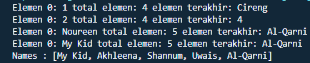

**Pertanyaan Praktikum 1**

1. Perhatikan baris kode 25-36, mengapa semua jenis data bisa ditampung ke dalam sebuah 
Arraylist?

    **Karena arrayList dapat menampung data secara dinamis, karena pada kode program di baris 25-36 tidak diberikan kurung sudut yang menyimpan secara spesifik data yang akan di simpan di dalamnya, sehingga arraylist tersebut bersifat sintak umum yang dapat meyimpan segala jenis tipe data.**

2. Modifikasi baris kode 25-36 seingga data yang ditampung hanya satu jenis atau spesifik tipe 
tertentu!

    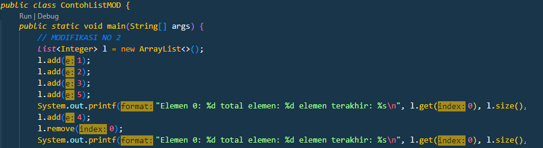

3. Ubah kode pada baris kode 38 menjadi seperti ini
    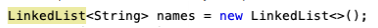

    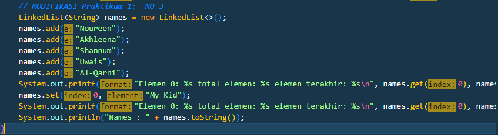
    Hasil Output
    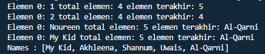

4. Tambahkan juga baris berikut ini, untuk memberikan perbedaan dari tampilan yang sebelumnya
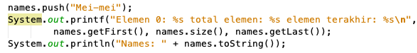

    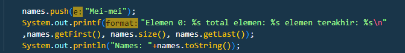

5. Dari penambahan kode tersebut, silakan dijalankan dan apakah yang dapat Anda jelaskan!

    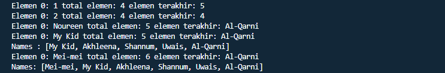

    **Akan terjadi penambahan data baru dan pada baris baru dengan nama Mei mei sehingga total elemen akan bertambah juga menjadi 6 dan untuk elemen terakhir tetap sama AlQarni, Untuk urutan nama sendiri Mei mei menempati urutan pertama sebagai data terbaru yang di inputkan.**

**Praktikum 2**

Hasil Output

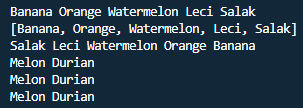

**Pertanyaan Praktikum 2**

1. Apakah perbedaan fungsi push() dan add() pada objek fruits?

    **Perbedaan fungsi push() dan add() pada objek fruits yakni push lebih spesifik pada stack sedangkan untuk yang add lebih spesifik di ininterface nya yang merupakan list**

2. Silakan hilangkan baris 43 dan 44, apakah yang akan terjadi? Mengapa bisa demikian?

    **Yang terjadi yakni Data “Melon” dan “Durian” tidak ada. Karena saat kita mengakses fungsi push(), artinya kita akan menambahkan data “Melon” dan “Durian”**

3. Jelaskan fungsi dari baris 46-49?

    **fungsi dari baris 46-49 yakni untuk menginisialisasi method iterator dengan type data String. Statement hasNext() digunakan untuk mengecek apakah iterator memiliki elemen selanjutnya. Jika bersifat true, maka variable fruit akan menyimpan nilai selanjutnya. Kemudian ditampilkan elemen tersebut**

4. Silakan ganti baris kode 25, Stack<String> menjadi List<String> dan apakah yang terjadi? 
Mengapa bisa demikian?

    **Ketika baris kode 25 di ganti menjadi List<String> maka akan terjadi eror saat program di lakukan running, karena collection List tidak memiliki method yang terdapat pada collection Stack.**

5. Ganti elemen terakhir dari dari objek fruits menjadi “Strawberry”!

    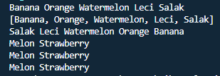

6. Tambahkan 3 buah seperti “Mango”,”guava”, dan “avocado” kemudian dilakukan sorting!

    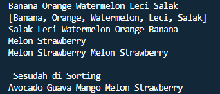

**Praktikum 3**
Hasil Output

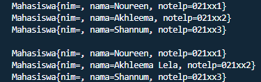

**Pertanyaan Praktikum 3**

1. Pada fungsi tambah() yang menggunakan unlimited argument itu menggunakan konsep apa? 
Dan kelebihannya apa?
    **Array.aslist. Kelebihannya ini memungkinkan metode untuk mengambil sejumlah argumen. Mereka dapat diakses sebagai array dalam metode.**

2. Pada fungsi linearSearch() di atas, silakan diganti dengan fungsi binarySearch() dari collection!

3. Tambahkan fungsi sorting baik secara ascending ataupun descending pada class tersebut!

**Tugas**

Output Tugas no 1

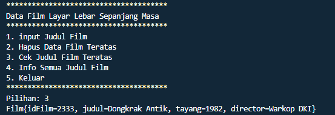

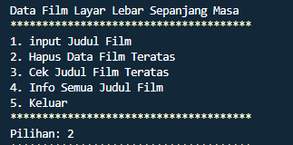

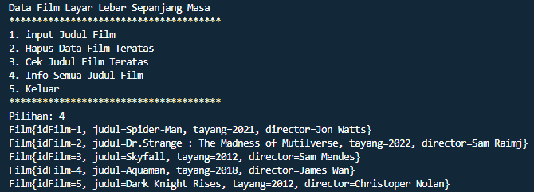

Output Tugas no 2

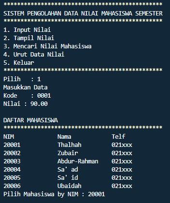

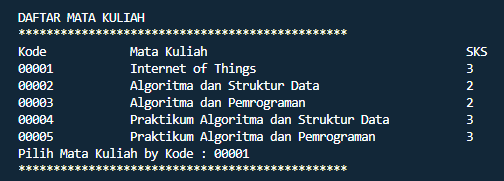

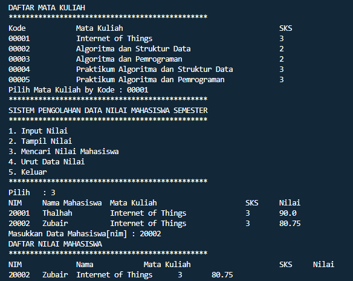

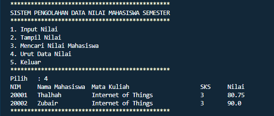
